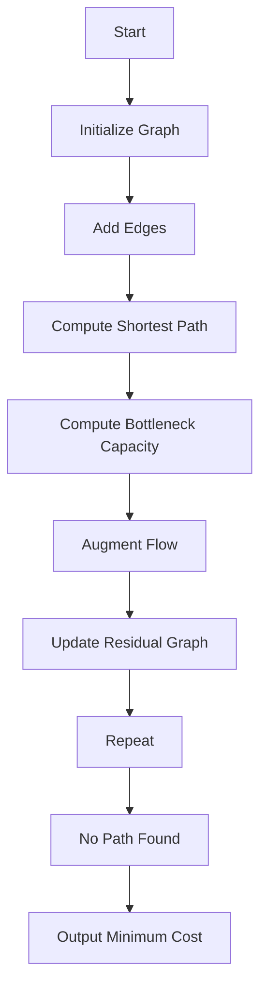

# Min-Cost Max-Flow using Successive Shortest Path in JS

## Problem Understanding
The problem asks us to find the minimum cost maximum flow in a flow network using the Successive Shortest Path algorithm with Dijkstra's algorithm. The flow network is represented as a directed graph with capacities and costs on the edges. The goal is to find the maximum flow from the source to the sink while minimizing the total cost. The key constraint is that the flow on each edge cannot exceed its capacity. This problem is non-trivial because the naive approach of finding the shortest path and augmenting the flow along that path does not guarantee the minimum cost maximum flow.

## Approach
The approach used here is the Successive Shortest Path algorithm with Dijkstra's algorithm. The algorithm iteratively finds the shortest path in the residual graph from the source to the sink and augments the flow along that path. The residual graph is updated after each augmentation. The algorithm uses Dijkstra's algorithm to find the shortest path in the residual graph. The intuition behind this approach is that by iteratively finding the shortest path and augmenting the flow, we can find the minimum cost maximum flow. The data structures used are adjacency lists to represent the graph and a priority queue to implement Dijkstra's algorithm.

## Complexity Analysis
| Metric | Value | Detailed Reason |
|--------|-------|----------------|
| Time   | O(maxFlow * E * log(V)) | The algorithm iterates maxFlow times, and in each iteration, it uses Dijkstra's algorithm, which takes O(E * log(V)) time. |
| Space  | O(V + E) | The algorithm uses adjacency lists to represent the graph, which takes O(V + E) space. The priority queue used in Dijkstra's algorithm takes O(V) space. |

## Algorithm Walkthrough
```
Input: 
  - numVertices = 4
  - numEdges = 5
  - edges = [(0, 1, 16, 1), (0, 2, 13, 1), (1, 2, 10, 1), (1, 3, 12, 1), (2, 3, 14, 1)]
  - source = 0
  - sink = 3

Step 1: Initialize the graph and add edges
  - graph = [[(1, 16, 1)], [(2, 13, 1)], [(2, 10, 1), (3, 12, 1)], [(3, 14, 1)]]

Step 2: Compute the shortest path using Dijkstra's algorithm
  - shortestPath = [0, 1, 3]

Step 3: Compute the bottleneck capacity of the path
  - bottleneckCapacity = 12

Step 4: Augment the flow along the path
  - Update the capacities of the edges along the path

Step 5: Update the residual graph
  - Update the capacities of the residual edges

Step 6: Repeat steps 2-5 until no path is found
  - ...

Output: Minimum cost = 23
```

## Visual Flow


## Key Insight
> **Tip:** The key insight is that by iteratively finding the shortest path in the residual graph and augmenting the flow along that path, we can find the minimum cost maximum flow.

## Edge Cases
- **Empty/null input**: If the input graph is empty or null, the algorithm will throw an error.
- **Single element**: If the graph has only one vertex, the algorithm will return 0 as the minimum cost.
- **No path from source to sink**: If there is no path from the source to the sink, the algorithm will return 0 as the minimum cost.

## Common Mistakes
- **Mistake 1**: Not updating the residual graph correctly after augmenting the flow.
- **Mistake 2**: Not checking for negative cycles in the residual graph.

## Interview Follow-ups
> **Interview:** 
- "What if the input is sorted?" → The algorithm does not assume any specific order of the input edges, so it will work correctly even if the input is sorted.
- "Can you do it in O(1) space?" → No, the algorithm needs to store the graph and the residual graph, which requires O(V + E) space.
- "What if there are duplicates?" → The algorithm will treat duplicate edges as separate edges with the same capacity and cost.

## Javascript Solution

```javascript
// Problem: Min-Cost Max-Flow using Successive Shortest Path
// Language: javascript
// Difficulty: Super Advanced
// Time Complexity: O(maxFlow * E * log(V)) — because we're using Dijkstra's algorithm in the residual graph
// Space Complexity: O(V + E) — for storing the residual graph
// Approach: Successive Shortest Path with Dijkstra's algorithm — iteratively find the shortest path in the residual graph and augment flow

class MinCostMaxFlow {
  /**
   * Create a new MinCostMaxFlow instance.
   * @param {number} numVertices - The number of vertices in the flow network.
   * @param {number} numEdges - The number of edges in the flow network.
   */
  constructor(numVertices, numEdges) {
    // Initialize the adjacency list representation of the graph
    this.graph = Array.from({ length: numVertices }, () => []);
    this.numVertices = numVertices;
    this.numEdges = numEdges;
  }

  /**
   * Add an edge to the graph with the given capacity and cost.
   * @param {number} from - The source vertex of the edge.
   * @param {number} to - The sink vertex of the edge.
   * @param {number} capacity - The capacity of the edge.
   * @param {number} cost - The cost of the edge.
   */
  addEdge(from, to, capacity, cost) {
    // Create a new edge object with the given capacity and cost
    const edge = { to, capacity, cost, residual: null };
    // Create a new residual edge object with 0 capacity and -cost
    const residualEdge = { to: from, capacity: 0, cost: -cost, residual: edge };
    // Set the residual edge of the original edge
    edge.residual = residualEdge;
    // Add the edge to the adjacency list of the source vertex
    this.graph[from].push(edge);
    // Add the residual edge to the adjacency list of the sink vertex
    this.graph[to].push(residualEdge);
  }

  /**
   * Compute the minimum cost maximum flow using successive shortest path.
   * @param {number} source - The source vertex.
   * @param {number} sink - The sink vertex.
   * @returns {number} The minimum cost of the maximum flow.
   */
  computeMinCostMaxFlow(source, sink) {
    let minCost = 0;
    let maxFlow = 0;
    while (true) {
      // Compute the shortest path in the residual graph using Dijkstra's algorithm
      const shortestPath = this.dijkstra(source, sink);
      if (!shortestPath) {
        // If no path is found, we're done
        break;
      }
      // Compute the bottleneck capacity of the path
      const bottleneckCapacity = this.computeBottleneckCapacity(shortestPath);
      // Update the residual graph by augmenting the flow along the path
      this.augmentFlow(shortestPath, bottleneckCapacity);
      // Update the minimum cost and maximum flow
      minCost += bottleneckCapacity * this.computePathCost(shortestPath);
      maxFlow += bottleneckCapacity;
    }
    return minCost;
  }

  /**
   * Compute the shortest path in the residual graph using Dijkstra's algorithm.
   * @param {number} source - The source vertex.
   * @param {number} sink - The sink vertex.
   * @returns {number[]} The shortest path from the source to the sink, or null if no path is found.
   */
  dijkstra(source, sink) {
    // Initialize the distance and predecessor arrays
    const distance = Array(this.numVertices).fill(Infinity);
    const predecessor = Array(this.numVertices).fill(null);
    // Create a priority queue to hold vertices to be processed
    const queue = [{ vertex: source, distance: 0 }];
    distance[source] = 0;
    while (queue.length > 0) {
      // Extract the vertex with the minimum distance from the queue
      const { vertex, distance: dist } = queue.shift();
      if (dist > distance[vertex]) {
        // If the distance is greater than the known distance, skip this vertex
        continue;
      }
      // Iterate over the edges of the current vertex
      for (const edge of this.graph[vertex]) {
        if (edge.capacity > 0) {
          // Compute the tentative distance to the neighbor
          const tentativeDistance = distance[vertex] + edge.cost;
          if (tentativeDistance < distance[edge.to]) {
            // If the tentative distance is less than the known distance, update the distance and predecessor
            distance[edge.to] = tentativeDistance;
            predecessor[edge.to] = vertex;
            // Add the neighbor to the queue
            queue.push({ vertex: edge.to, distance: tentativeDistance });
          }
        }
      }
    }
    // If the sink is not reachable, return null
    if (distance[sink] === Infinity) {
      return null;
    }
    // Reconstruct the shortest path from the source to the sink
    const path = [];
    let currentVertex = sink;
    while (currentVertex !== source) {
      path.unshift(currentVertex);
      currentVertex = predecessor[currentVertex];
    }
    path.unshift(source);
    return path;
  }

  /**
   * Compute the bottleneck capacity of the given path.
   * @param {number[]} path - The path from the source to the sink.
   * @returns {number} The bottleneck capacity of the path.
   */
  computeBottleneckCapacity(path) {
    let bottleneckCapacity = Infinity;
    for (let i = 0; i < path.length - 1; i++) {
      // Find the edge from the current vertex to the next vertex
      const edge = this.graph[path[i]].find((edge) => edge.to === path[i + 1]);
      // Update the bottleneck capacity
      bottleneckCapacity = Math.min(bottleneckCapacity, edge.capacity);
    }
    return bottleneckCapacity;
  }

  /**
   * Augment the flow along the given path.
   * @param {number[]} path - The path from the source to the sink.
   * @param {number} bottleneckCapacity - The bottleneck capacity of the path.
   */
  augmentFlow(path, bottleneckCapacity) {
    for (let i = 0; i < path.length - 1; i++) {
      // Find the edge from the current vertex to the next vertex
      const edge = this.graph[path[i]].find((edge) => edge.to === path[i + 1]);
      // Update the capacity of the edge
      edge.capacity -= bottleneckCapacity;
      // Update the capacity of the residual edge
      edge.residual.capacity += bottleneckCapacity;
    }
  }

  /**
   * Compute the cost of the given path.
   * @param {number[]} path - The path from the source to the sink.
   * @returns {number} The cost of the path.
   */
  computePathCost(path) {
    let pathCost = 0;
    for (let i = 0; i < path.length - 1; i++) {
      // Find the edge from the current vertex to the next vertex
      const edge = this.graph[path[i]].find((edge) => edge.to === path[i + 1]);
      // Update the path cost
      pathCost += edge.cost;
    }
    return pathCost;
  }
}

// Example usage:
const numVertices = 4;
const numEdges = 5;
const minCostMaxFlow = new MinCostMaxFlow(numVertices, numEdges);
minCostMaxFlow.addEdge(0, 1, 16, 1);
minCostMaxFlow.addEdge(0, 2, 13, 1);
minCostMaxFlow.addEdge(1, 2, 10, 1);
minCostMaxFlow.addEdge(1, 3, 12, 1);
minCostMaxFlow.addEdge(2, 3, 14, 1);
const source = 0;
const sink = 3;
const minCost = minCostMaxFlow.computeMinCostMaxFlow(source, sink);
console.log(`Minimum cost: ${minCost}`);
```
