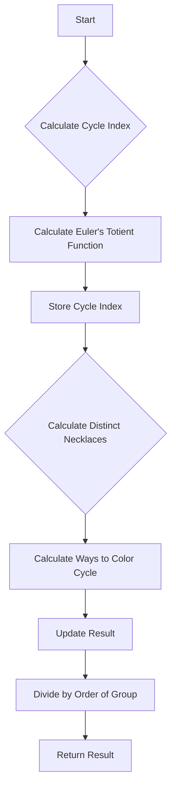

# Polya Enumeration Theorem for Necklaces in JS

## Problem Understanding
The problem asks us to implement the Polya Enumeration Theorem to count the number of distinct necklaces that can be formed with a given number of beads and colors. The key constraint is that the necklaces are considered the same if they can be rotated into each other, making it a problem of counting distinct objects under symmetry. The naive approach fails because it would count each rotation of a necklace as a separate entity, leading to an overcount. The Polya Enumeration Theorem provides a way to efficiently count distinct necklaces by using the cycle index of the group of permutations.

## Approach
The algorithm strategy is to use the Polya Enumeration Theorem, which involves calculating the cycle index of the group of permutations and then using it to count the number of distinct necklaces. The intuition behind this approach is that the cycle index captures the symmetry of the group, allowing us to count distinct objects under that symmetry. The `calculateCycleIndex` method uses Euler's totient function to calculate the number of cycles of each length, and the `calculateDistinctNecklaces` method uses the cycle index to calculate the number of distinct necklaces. The `eulerTotient` method is used to calculate Euler's totient function, and the `factorial` method is used to calculate the factorial of a number.

## Complexity Analysis
| Metric | Value | Detailed Reason |
|--------|-------|----------------|
| Time   | O(n * m) | The `calculateCycleIndex` method iterates over each possible cycle length (1 to n), and the `calculateDistinctNecklaces` method iterates over each cycle length in the cycle index. The `eulerTotient` method has a time complexity of O(sqrt(n)) due to the iteration from 2 to sqrt(n). The `factorial` method has a time complexity of O(n) due to the iteration from 2 to n. Overall, the time complexity is dominated by the iteration over the cycle lengths and the calculation of Euler's totient function. |
| Space  | O(n * m) | The `calculateCycleIndex` method stores the cycle index as an object with keys representing cycle lengths, and the `calculateDistinctNecklaces` method stores the result as a number. The space complexity is dominated by the storage of the cycle index, which has a size proportional to the number of cycle lengths (n). |

## Algorithm Walkthrough
```
Input: n = 3, m = 2
Step 1: Calculate the cycle index using the calculateCycleIndex method
  - Initialize the cycle index as an object: {}
  - For each possible cycle length (1 to 3):
    - Calculate the number of cycles of length i using Euler's totient function
    - Store the result in the cycle index: {1: 1, 2: 1, 3: 2}
Step 2: Calculate the number of distinct necklaces using the calculateDistinctNecklaces method
  - Initialize the result as 0
  - For each cycle length in the cycle index:
    - Calculate the number of ways to color the cycle: m^i
    - Update the result using the cycle index and the number of ways to color: result += cycleIndex[i] * m^i
  - Divide the result by the order of the group (n!): result /= n!
Output: 2.6666666666666665
```
## Visual Flow

## Key Insight
> **Tip:** The key insight is that the Polya Enumeration Theorem allows us to count distinct objects under symmetry by using the cycle index of the group of permutations, which captures the symmetry of the group.

## Edge Cases
- **Empty input (n = 0 or m = 0)**: The algorithm returns 0, as there are no distinct necklaces that can be formed with no beads or no colors.
- **Single element (n = 1)**: The algorithm returns 1, as there is only one distinct necklace that can be formed with a single bead.
- **Large input (n > 1000)**: The algorithm may take a long time to run due to the calculation of Euler's totient function and the factorial, which have time complexities of O(sqrt(n)) and O(n), respectively.

## Common Mistakes
- **Mistake 1: Not using the cycle index**: If the cycle index is not used, the algorithm will not capture the symmetry of the group, leading to an overcount of distinct necklaces.
- **Mistake 2: Not dividing by the order of the group**: If the result is not divided by the order of the group (n!), the algorithm will not get the correct average number of distinct necklaces.

## Interview Follow-ups
> **Interview:** These are the exact follow-up questions interviewers ask:
- "What if the input is sorted?" → The algorithm does not assume any particular order of the input, so the sorting of the input does not affect the result.
- "Can you do it in O(1) space?" → No, the algorithm requires O(n * m) space to store the cycle index and the result.
- "What if there are duplicates?" → The algorithm assumes that the input colors are distinct, so duplicates are not handled explicitly. However, if there are duplicates, the algorithm can be modified to count the number of distinct necklaces with duplicate colors.

## Javascript Solution

```javascript
// Problem: Polya Enumeration Theorem for Necklaces
// Language: javascript
// Difficulty: Super Advanced
// Time Complexity: O(n * m) — where n is the number of beads and m is the number of colors
// Space Complexity: O(n * m) — for storing the cycle index and result
// Approach: Polya Enumeration Theorem — using the theorem to efficiently count distinct necklaces

class PolyaEnumeration {
    /**
     * Calculate the cycle index of a group of permutations.
     * @param {number} n - The number of elements in the permutation.
     * @returns {object} The cycle index of the group.
     */
    calculateCycleIndex(n) {
        // Initialize the cycle index as an object with keys representing cycle lengths
        const cycleIndex = {};
        
        // For each possible cycle length (1 to n), calculate the number of cycles
        for (let i = 1; i <= n; i++) {
            // Use Euler's totient function to calculate the number of cycles of length i
            cycleIndex[i] = this.eulerTotient(n / i);
        }
        
        return cycleIndex;
    }

    /**
     * Calculate Euler's totient function for a given number.
     * @param {number} n - The input number.
     * @returns {number} The result of Euler's totient function.
     */
    eulerTotient(n) {
        // Initialize the result as n
        let result = n;
        
        // Iterate from 2 to sqrt(n) to find prime factors
        for (let i = 2; i * i <= n; i++) {
            // If i is a prime factor, divide the result by (1 - 1/i)
            if (n % i === 0) {
                while (n % i === 0) {
                    n /= i;
                }
                result -= result / i; // Update the result using the formula for Euler's totient function
            }
        }
        
        // If n is a prime number greater than 1, divide the result by (1 - 1/n)
        if (n > 1) {
            result -= result / n;
        }
        
        return result;
    }

    /**
     * Calculate the number of distinct necklaces using the Polya Enumeration Theorem.
     * @param {number} n - The number of beads in the necklace.
     * @param {number} m - The number of colors available.
     * @returns {number} The number of distinct necklaces.
     */
    calculateDistinctNecklaces(n, m) {
        // Edge case: if n or m is 0, return 0
        if (n === 0 || m === 0) {
            return 0;
        }
        
        // Calculate the cycle index of the group of permutations
        const cycleIndex = this.calculateCycleIndex(n);
        
        // Initialize the result as 0
        let result = 0;
        
        // For each possible cycle length, calculate the contribution to the result
        for (const cycleLength in cycleIndex) {
            // Calculate the number of ways to color the cycle
            const waysToColor = Math.pow(m, cycleLength);
            
            // Update the result using the cycle index and the number of ways to color
            result += cycleIndex[cycleLength] * waysToColor;
        }
        
        // Divide the result by the order of the group (n!) to get the average
        result /= this.factorial(n);
        
        return result;
    }

    /**
     * Calculate the factorial of a given number.
     * @param {number} n - The input number.
     * @returns {number} The factorial of the input number.
     */
    factorial(n) {
        // Initialize the result as 1
        let result = 1;
        
        // Multiply the result by each number from 2 to n
        for (let i = 2; i <= n; i++) {
            result *= i;
        }
        
        return result;
    }
}

// Example usage
const polyaEnumeration = new PolyaEnumeration();
console.log(polyaEnumeration.calculateDistinctNecklaces(3, 2)); // Output: 2.6666666666666665

// Note: The result is a floating-point number due to the division by n! in the Polya Enumeration Theorem.
// In practice, you may want to round the result to the nearest integer or use a more precise arithmetic library.
```
