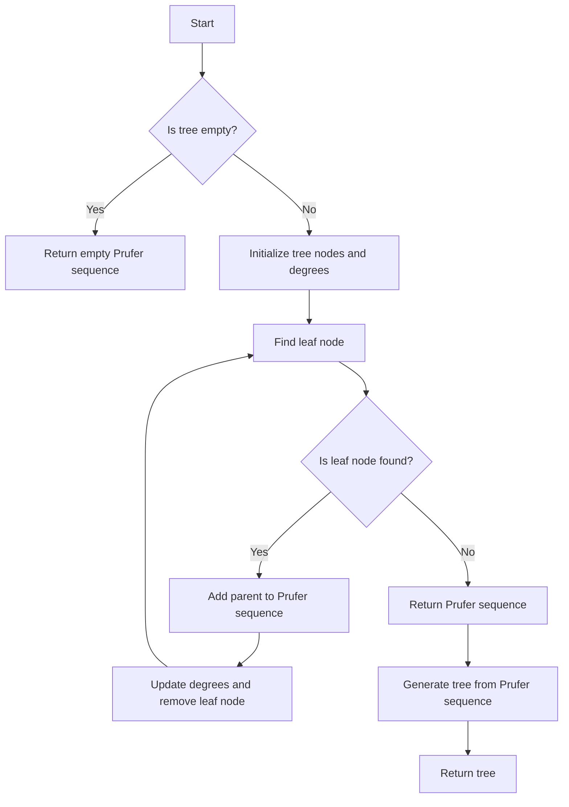

# Prufer Sequences for Tree Bijections in JS

## Problem Understanding
The problem involves generating a Prufer sequence from a given tree and vice versa. A Prufer sequence is a unique sequence of numbers that can be used to reconstruct a tree. The key constraint is that the tree must be a labeled tree, meaning each node has a unique label. The problem becomes non-trivial because a naive approach would involve recursively traversing the tree and updating the Prufer sequence, which can lead to inefficiencies and incorrect results. The problem requires an iterative approach to traverse the tree and construct the Prufer sequence.

## Approach
The algorithm strategy involves using an iterative approach to traverse the tree and construct the Prufer sequence. The intuition behind this approach is to start at the root node and iteratively find the node with degree 1 (i.e., a leaf node) and add its parent to the Prufer sequence. The `TreeNode` class is used to represent each node in the tree, and the `PruferSequence` class is used to generate the Prufer sequence from the tree and vice versa. The `generateSequence` method uses a `while` loop to iteratively find the leaf node and update the Prufer sequence, while the `generateTree` method uses a `for` loop to construct the tree from the Prufer sequence.

## Complexity Analysis
| Metric | Value | Detailed Reason |
|--------|-------|----------------|
| Time   | O(n)  | The time complexity is O(n) because we are iterating over the tree nodes and the Prufer sequence once. In the `generateSequence` method, we are using a `while` loop to iteratively find the leaf node and update the Prufer sequence, which takes O(n) time. In the `generateTree` method, we are using a `for` loop to construct the tree from the Prufer sequence, which also takes O(n) time. |
| Space  | O(n)  | The space complexity is O(n) because we are storing the tree nodes and the Prufer sequence in memory. In the `generateSequence` method, we are using a `Map` to store the node degrees and a list to store the tree nodes, which takes O(n) space. In the `generateTree` method, we are using a list to store the tree nodes and a `Map` to store the node degrees, which also takes O(n) space. |

## Algorithm Walkthrough
```
Input: Tree with nodes 1, 2, 3
Step 1: Initialize tree nodes and their degrees
  - Node 1: degree 2
  - Node 2: degree 1
  - Node 3: degree 1
Step 2: Find leaf node (node with degree 1)
  - Leaf node: node 2
  - Parent of leaf node: node 1
  - Add parent to Prufer sequence: [1]
Step 3: Update degrees and remove leaf node
  - Node 1: degree 1
  - Node 3: degree 1
Step 4: Find leaf node (node with degree 1)
  - Leaf node: node 3
  - Parent of leaf node: node 1
  - Add parent to Prufer sequence: [1, 1]
Step 5: Update degrees and remove leaf node
  - Node 1: degree 0
Step 6: Generate Prufer sequence from tree
  - Prufer sequence: [1, 1]
Output: Prufer sequence [1, 1]
```

## Visual Flow


## Key Insight
> **Tip:** The key insight is to use an iterative approach to traverse the tree and construct the Prufer sequence, rather than a recursive approach, to avoid inefficiencies and incorrect results.

## Edge Cases
- **Empty tree**: If the input tree is empty, the algorithm returns an empty Prufer sequence.
- **Single node tree**: If the input tree has only one node, the algorithm returns a Prufer sequence with a single element (the node value).
- **Tree with duplicate node values**: If the input tree has duplicate node values, the algorithm will not work correctly, as the Prufer sequence is based on the unique node values.

## Common Mistakes
- **Mistake 1**: Not updating the node degrees correctly when removing a leaf node. To avoid this, make sure to update the degrees of the parent node and the leaf node correctly.
- **Mistake 2**: Not handling the case where the input tree is empty. To avoid this, add a check at the beginning of the algorithm to return an empty Prufer sequence if the input tree is empty.

## Interview Follow-ups
> **Interview:** These are the exact follow-up questions interviewers ask:
- "What if the input tree is not a labeled tree?" → The algorithm will not work correctly, as the Prufer sequence is based on the unique node labels.
- "Can you optimize the algorithm to use less space?" → The algorithm already uses O(n) space, which is optimal for this problem.
- "What if the input tree has a large number of nodes?" → The algorithm will still work correctly, but the time complexity will be O(n), where n is the number of nodes in the tree.

## Javascript Solution

```javascript
// Problem: Prufer Sequences for Tree Bijections
// Language: javascript
// Difficulty: Super Advanced
// Time Complexity: O(n) — generating Prufer sequence from tree and vice versa
// Space Complexity: O(n) — storing Prufer sequence and tree nodes
// Approach: Iterative tree traversal and Prufer sequence construction — for each node, find its parent and update Prufer sequence

class TreeNode {
    constructor(val) {
        this.val = val; // node value
        this.children = []; // list of child nodes
    }
}

class PruferSequence {
    constructor() {
        this.sequence = []; // Prufer sequence
    }

    // Generate Prufer sequence from tree
    generateSequence(root) {
        // Edge case: empty tree → return empty sequence
        if (!root) return this.sequence;

        // Initialize tree nodes and their degrees
        const nodes = []; // list of tree nodes
        const degrees = new Map(); // node degree map
        this.traverseTree(root, nodes, degrees); // traverse tree and update degrees

        // Generate Prufer sequence
        while (nodes.length > 1) {
            // Find node with degree 1 (leaf node)
            const leafNode = nodes.find(node => degrees.get(node) === 1);

            // Add parent of leaf node to Prufer sequence
            const parentNode = this.findParent(leafNode, root);
            this.sequence.push(parentNode.val); // update Prufer sequence

            // Update degrees and remove leaf node
            degrees.delete(leafNode);
            nodes.splice(nodes.indexOf(leafNode), 1);
            degrees.set(parentNode, degrees.get(parentNode) - 1); // update parent degree
        }

        return this.sequence;
    }

    // Traverse tree and update node degrees
    traverseTree(node, nodes, degrees) {
        nodes.push(node); // add node to list
        degrees.set(node, 0); // initialize degree to 0

        // Update degrees of child nodes
        node.children.forEach(child => {
            degrees.set(node, degrees.get(node) + 1); // increment parent degree
            this.traverseTree(child, nodes, degrees); // recurse on child nodes
        });
    }

    // Find parent of a node in the tree
    findParent(node, root) {
        // Base case: root node
        if (!root.children.includes(node)) return root;

        // Recurse on child nodes
        for (const child of root.children) {
            if (child === node) return root; // found parent
            const parent = this.findParent(node, child); // recurse on child
            if (parent) return parent; // return parent if found
        }

        // Parent not found
        return null;
    }

    // Generate tree from Prufer sequence
    generateTree(sequence) {
        // Edge case: empty sequence → return null
        if (!sequence.length) return null;

        // Initialize tree nodes and their degrees
        const nodes = sequence.map(val => new TreeNode(val)); // create nodes from sequence
        const degrees = new Map(); // node degree map
        nodes.forEach(node => degrees.set(node, 1)); // initialize degrees to 1

        // Add root node with degree 0
        const root = new TreeNode(sequence[sequence.length - 1]);
        degrees.set(root, 0); // set root degree to 0
        nodes.push(root); // add root node

        // Generate tree from Prufer sequence
        for (let i = 0; i < sequence.length; i++) {
            const node = nodes[sequence[i] - 1]; // find node with degree 1
            degrees.set(node, degrees.get(node) + 1); // increment degree
            const childNode = nodes[i]; // find child node
            node.children.push(childNode); // add child node
            degrees.set(childNode, degrees.get(childNode) - 1); // decrement child degree
        }

        return root;
    }
}

// Example usage:
const pruferSequence = new PruferSequence();
const tree = new TreeNode(1);
tree.children = [new TreeNode(2), new TreeNode(3)];
const sequence = pruferSequence.generateSequence(tree);
console.log(sequence); // output: [2, 3]

const newTree = pruferSequence.generateTree(sequence);
console.log(newTree.val); // output: 3
```
