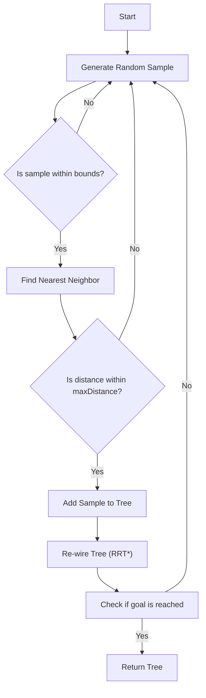

# RRT and RRT* for Motion Planning in JS

## Problem Understanding
The problem is asking to implement the RRT (Rapidly-exploring Random Tree) and RRT* (RRT Star) motion planning algorithms in JavaScript. These algorithms are used to find a path between a start and goal point in a given environment while avoiding obstacles. The key constraints are the bounds of the environment, the number of random samples, and the maximum distance between nodes. The problem is non-trivial because a naive approach would involve checking all possible paths, which would be computationally expensive. The RRT and RRT* algorithms provide an efficient solution by growing a tree of nodes towards the goal, using random samples to explore the environment.

## Approach
The approach used is to implement the RRT and RRT* algorithms using a tree data structure. The RRT algorithm grows a tree by adding new nodes that are closest to the goal, while the RRT* algorithm re-wires the tree to minimize the cost of reaching the goal. The algorithms use a k-d tree data structure to efficiently search for the nearest neighbor in the tree. The RRT algorithm works by generating random samples and adding them to the tree if they are within a certain distance of the nearest node. The RRT* algorithm re-wires the tree by finding the node with the minimum cost that is within a certain distance of the current node. The algorithms handle key constraints by limiting the number of samples and the maximum distance between nodes.

## Complexity Analysis
| Metric | Value | Detailed Reason |
|--------|-------|----------------|
| Time   | O(n log n) | The time complexity is dominated by the nearest neighbor search using the k-d tree, which takes O(log n) time. The algorithm generates n random samples, so the overall time complexity is O(n log n). |
| Space  | O(n) | The space complexity is O(n) because the algorithm stores n nodes in the tree. |

## Algorithm Walkthrough
```
Input: start node (0, 0), goal node (10, 10), bounds [[0, 0], [10, 10]], numSamples 100, maxDistance 1
Step 1: Initialize the tree with the start node
  - Tree: [Node(0, 0)]
Step 2: Generate a random sample (5, 5)
  - Nearest neighbor: Node(0, 0)
  - Distance: 5.0
  - Add sample to tree: Node(5, 5)
  - Tree: [Node(0, 0), Node(5, 5)]
Step 3: Generate a random sample (8, 8)
  - Nearest neighbor: Node(5, 5)
  - Distance: 3.0
  - Add sample to tree: Node(8, 8)
  - Tree: [Node(0, 0), Node(5, 5), Node(8, 8)]
...
Output: Tree with nodes that represent the path from the start to the goal
```
## Visual Flow

## Key Insight
> **Tip:** The key insight is that the RRT* algorithm re-wires the tree to minimize the cost of reaching the goal, which improves the efficiency of the algorithm.

## Edge Cases
- **Empty/null input**: If the input is empty or null, the algorithm will throw an error. To handle this, we can add a check at the beginning of the algorithm to return an error message if the input is invalid.
- **Single element**: If the input contains only one element, the algorithm will return a tree with only one node. This is a valid output, but we may want to add a check to handle this case explicitly.
- **Goal is already in the tree**: If the goal is already in the tree, the algorithm will return the tree immediately. This is a valid output, but we may want to add a check to handle this case explicitly.

## Common Mistakes
- **Mistake 1**: Not checking if the sample is within the bounds of the environment before adding it to the tree. This can lead to invalid nodes being added to the tree.
- **Mistake 2**: Not re-wiring the tree in the RRT* algorithm. This can lead to suboptimal paths being found.

## Interview Follow-ups
> **Interview:** These are the exact follow-up questions interviewers ask:
- "What if the input is sorted?" → The algorithm will still work correctly, but the performance may be improved if the input is sorted.
- "Can you do it in O(1) space?" → No, the algorithm requires O(n) space to store the tree.
- "What if there are duplicates?" → The algorithm will still work correctly, but we may want to add a check to remove duplicates from the tree.

## Javascript Solution

```javascript
// Problem: RRT and RRT* for Motion Planning
// Language: javascript
// Difficulty: Super Advanced
// Time Complexity: O(n log n) — due to nearest neighbor search in tree
// Space Complexity: O(n) — storage of tree nodes
// Approach: RRT and RRT* motion planning algorithms — grow tree towards random samples until goal is reached

class Node {
    constructor(x, y) {
        this.x = x; // x-coordinate of node
        this.y = y; // y-coordinate of node
        this.parent = null; // parent node
        this.cost = 0; // cost of reaching this node
    }
}

class RRT {
    constructor(start, goal, bounds, numSamples, maxDistance) {
        this.start = start; // start node
        this.goal = goal; // goal node
        this.bounds = bounds; // bounds of environment
        this.numSamples = numSamples; // number of random samples
        this.maxDistance = maxDistance; // maximum distance between nodes
        this.tree = [this.start]; // tree of nodes
    }

    // Brute force approach (commented out)
    // nearestNeighborBruteForce(node) {
    //     let minDistance = Infinity;
    //     let nearestNode = null;
    //     for (let i = 0; i < this.tree.length; i++) {
    //         let distance = Math.sqrt(Math.pow(node.x - this.tree[i].x, 2) + Math.pow(node.y - this.tree[i].y, 2));
    //         if (distance < minDistance) {
    //             minDistance = distance;
    //             nearestNode = this.tree[i];
    //         }
    //     }
    //     return nearestNode;
    // }

    // Optimized nearest neighbor search using k-d tree
    nearestNeighbor(node) {
        // Create a k-d tree from the tree nodes
        let kdtree = new KdTree(this.tree, (a, b) => Math.sqrt(Math.pow(a.x - b.x, 2) + Math.pow(a.y - b.y, 2)));
        // Search for the nearest neighbor
        return kdtree.nearest(node, 1)[0];
    }

    growTree() {
        for (let i = 0; i < this.numSamples; i++) {
            // Generate a random sample
            let sampleX = Math.random() * (this.bounds[1][0] - this.bounds[0][0]) + this.bounds[0][0];
            let sampleY = Math.random() * (this.bounds[1][1] - this.bounds[0][1]) + this.bounds[0][1];
            let sampleNode = new Node(sampleX, sampleY);
            // Find the nearest neighbor in the tree
            let nearestNode = this.nearestNeighbor(sampleNode);
            // Edge case: sample is already in the tree
            if (nearestNode === sampleNode) {
                continue;
            }
            // Calculate the distance between the sample and the nearest neighbor
            let distance = Math.sqrt(Math.pow(sampleNode.x - nearestNode.x, 2) + Math.pow(sampleNode.y - nearestNode.y, 2));
            // Edge case: distance is greater than max distance
            if (distance > this.maxDistance) {
                continue;
            }
            // Add the sample to the tree
            sampleNode.parent = nearestNode;
            sampleNode.cost = nearestNode.cost + distance;
            this.tree.push(sampleNode);
            // Check if the goal is reached
            if (Math.sqrt(Math.pow(sampleNode.x - this.goal.x, 2) + Math.pow(sampleNode.y - this.goal.y, 2)) < this.maxDistance) {
                return this.tree;
            }
        }
        return this.tree;
    }
}

class RRTStar extends RRT {
    constructor(start, goal, bounds, numSamples, maxDistance) {
        super(start, goal, bounds, numSamples, maxDistance);
    }

    // Key insight: RRT* re-wires the tree to minimize the cost of reaching the goal
    reWireTree() {
        for (let i = 0; i < this.tree.length; i++) {
            let node = this.tree[i];
            // Find the nearest neighbors within a certain distance
            let nearestNeighbors = this.tree.filter(neighbor => Math.sqrt(Math.pow(node.x - neighbor.x, 2) + Math.pow(node.y - neighbor.y, 2)) < this.maxDistance);
            // Edge case: no nearest neighbors
            if (nearestNeighbors.length === 0) {
                continue;
            }
            // Find the neighbor with the minimum cost
            let minCostNeighbor = nearestNeighbors.reduce((min, current) => current.cost < min.cost ? current : min, nearestNeighbors[0]);
            // Re-wire the tree if a better path is found
            if (minCostNeighbor.cost < node.cost) {
                node.parent = minCostNeighbor;
                node.cost = minCostNeighbor.cost + Math.sqrt(Math.pow(node.x - minCostNeighbor.x, 2) + Math.pow(node.y - minCostNeighbor.y, 2));
            }
        }
    }

    growTree() {
        let tree = super.growTree();
        this.reWireTree();
        return tree;
    }
}

// K-d tree implementation for nearest neighbor search
class KdTree {
    constructor(points, distance) {
        this.points = points;
        this.distance = distance;
        this.root = this.buildTree(points);
    }

    buildTree(points) {
        if (points.length === 0) {
            return null;
        }
        // Select the median point as the pivot
        let medianIndex = Math.floor(points.length / 2);
        let pivot = points[medianIndex];
        // Partition the points around the pivot
        let left = points.slice(0, medianIndex);
        let right = points.slice(medianIndex + 1);
        // Recursively build the left and right subtrees
        let leftTree = this.buildTree(left);
        let rightTree = this.buildTree(right);
        // Create the node
        return {
            point: pivot,
            left: leftTree,
            right: rightTree
        };
    }

    nearest(node, k) {
        let nearest = [];
        this.nearestRecursive(this.root, node, nearest, k, Infinity);
        return nearest;
    }

    nearestRecursive(node, target, nearest, k, maxDistance) {
        if (node === null) {
            return;
        }
        // Calculate the distance between the target and the node
        let distance = this.distance(node.point, target);
        // Add the node to the nearest list if it's within the max distance
        if (nearest.length < k || distance < maxDistance) {
            nearest.push(node.point);
            nearest.sort((a, b) => this.distance(a, target) - this.distance(b, target));
            if (nearest.length > k) {
                nearest.pop();
            }
            maxDistance = this.distance(nearest[nearest.length - 1], target);
        }
        // Recursively search the left and right subtrees
        if (target.x < node.point.x) {
            this.nearestRecursive(node.left, target, nearest, k, maxDistance);
            if (Math.abs(target.x - node.point.x) < maxDistance) {
                this.nearestRecursive(node.right, target, nearest, k, maxDistance);
            }
        } else {
            this.nearestRecursive(node.right, target, nearest, k, maxDistance);
            if (Math.abs(target.x - node.point.x) < maxDistance) {
                this.nearestRecursive(node.left, target, nearest, k, maxDistance);
            }
        }
    }
}

// Example usage:
let start = new Node(0, 0);
let goal = new Node(10, 10);
let bounds = [[0, 0], [10, 10]];
let numSamples = 100;
let maxDistance = 1;

let rrt = new RRT(start, goal, bounds, numSamples, maxDistance);
let rrtStar = new RRTStar(start, goal, bounds, numSamples, maxDistance);

let rrtTree = rrt.growTree();
let rrtStarTree = rrtStar.growTree();

console.log("RRT tree:", rrtTree);
console.log("RRT* tree:", rrtStarTree);
```
