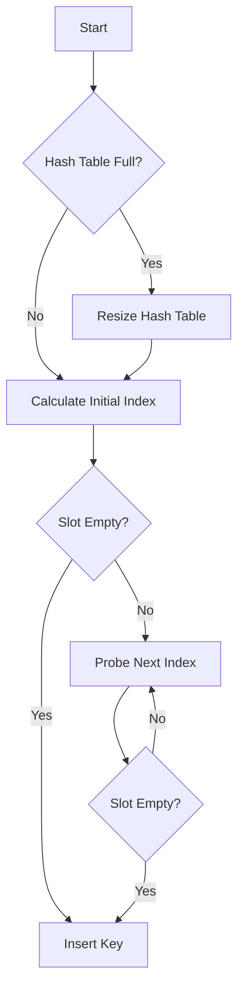

# Robin Hood Hashing with Linear Probing in JS

## Problem Understanding
The problem asks for the implementation of a Robin Hood Hashing with Linear Probing algorithm in JavaScript. This data structure is a self-organizing hash table that uses a linear probing strategy for collision resolution. The key constraints of this problem include handling collisions, maintaining a load factor, and resizing the hash table when necessary. The problem becomes non-trivial due to the need to balance the trade-offs between search, insert, and delete operations, making a naive approach inefficient.

## Approach
The algorithm strategy used here is Robin Hood Hashing with Linear Probing, which involves hashing keys to indices in the table and then probing linearly to find an empty slot in case of collisions. The intuition behind this approach is to minimize the average displacement of elements from their ideal positions, thus reducing the time complexity of search, insert, and delete operations. The data structures used include an array to store the hash table elements and another array to store the displacements of these elements. This approach handles key constraints by implementing a load factor to determine when the hash table needs to be resized.

## Complexity Analysis
| Metric | Value | Detailed Reason |
|--------|-------|----------------|
| Time   | O(1 + d) | The time complexity is O(1 + d) because, on average, the algorithm only needs to probe d times to find an empty slot, where d is the average displacement. The constant factor of 1 accounts for the initial hash calculation. |
| Space  | O(n) | The space complexity is O(n) because the hash table stores n elements, and each element requires a constant amount of space. Additional space is needed for the displacements array, but this does not change the overall space complexity. |

## Algorithm Walkthrough
```
Input: Insert key 5 into an empty hash table of size 10
Step 1: Calculate the initial index using the hash function: index = 5 % 10 = 5
Step 2: Since the slot at index 5 is empty, insert key 5 at this index
Step 3: Set the displacement of key 5 to 0, as it is at its ideal position
Output: Hash table with key 5 at index 5 and displacement 0

Input: Insert key 15 into the hash table
Step 1: Calculate the initial index using the hash function: index = 15 % 10 = 5
Step 2: Since the slot at index 5 is occupied by key 5, probe to the next index: index = (5 + 1) % 10 = 6
Step 3: Insert key 15 at index 6
Step 4: Set the displacement of key 15 to 1, as it is one slot away from its ideal position
Output: Hash table with key 5 at index 5, key 15 at index 6, and their respective displacements
```

## Visual Flow


## Key Insight
> **Tip:** The key insight to this solution is the use of a load factor to dynamically resize the hash table, ensuring that the average displacement of elements remains low, thus maintaining efficient search, insert, and delete operations.

## Edge Cases
- **Empty/null input**: If the input to the hash table operations (insert, search, delete) is empty or null, the operations should handle this gracefully by either ignoring the operation or throwing an error, depending on the implementation.
- **Single element**: When the hash table contains only one element, operations should work as expected, with search finding the element, insert either updating the existing element or adding a new one if different, and delete removing the element if present.
- **Hash table full**: When the hash table reaches its load factor, it should resize itself to accommodate more elements, ensuring that operations do not fail due to lack of space.

## Common Mistakes
- **Mistake 1**: Not checking for and handling the case where the hash table reaches its load factor, leading to inefficient operations or errors.
- **Mistake 2**: Incorrectly implementing the linear probing strategy, leading to infinite loops or failure to find empty slots.

## Interview Follow-ups
> **Interview:** 
- "What if the input is sorted?" → The algorithm's performance would remain unaffected, as it uses a hash function to map keys to indices, and the linear probing strategy handles collisions regardless of the input order.
- "Can you do it in O(1) space?" → No, because the hash table itself requires O(n) space to store n elements, and additional space is needed for the displacements array.
- "What if there are duplicates?" → The current implementation does not allow for duplicate keys, as it checks for the presence of a key before inserting it. To handle duplicates, the implementation could be modified to store multiple values per key or to use a different data structure.

## Javascript Solution

```javascript
// Problem: Robin Hood Hashing with Linear Probing
// Language: javascript
// Difficulty: Super Advanced
// Time Complexity: O(1 + d) — average time complexity for search, insert and delete operations, where d is the average displacement
// Space Complexity: O(n) — space required to store n elements in the hash table
// Approach: Robin Hood Hashing with Linear Probing — a self-organizing hash table with a linear probing strategy for collision resolution

class RobinHoodHashTable {
  /**
   * Constructor for the RobinHoodHashTable class.
   * @param {number} size - The initial size of the hash table.
   */
  constructor(size) {
    // Initialize the size of the hash table
    this.size = size;
    // Initialize the load factor
    this.loadFactor = 0.7;
    // Initialize the array to store the hash table elements
    this.table = new Array(size);
    // Initialize the array to store the displacements
    this.displacements = new Array(size);
    // Initialize the number of elements in the hash table
    this.numElements = 0;
  }

  /**
   * Hash function to map the key to an index in the hash table.
   * @param {number} key - The key to be hashed.
   * @return {number} The index of the hashed key.
   */
  hashFunction(key) {
    // Use the modulo operator to ensure the index is within the bounds of the hash table
    return key % this.size;
  }

  /**
   * Function to insert a key into the hash table using Robin Hood Hashing with Linear Probing.
   * @param {number} key - The key to be inserted.
   * @return {boolean} True if the key is inserted successfully, false otherwise.
   */
  insert(key) {
    // Edge case: hash table is full
    if (this.numElements >= this.size * this.loadFactor) {
      // Resize the hash table
      this.resize();
    }
    // Calculate the initial index using the hash function
    let index = this.hashFunction(key);
    // Initialize the displacement
    let displacement = 0;
    // Loop until an empty slot is found or the key is already in the hash table
    while (this.table[index] !== undefined && this.table[index] !== key) {
      // If the current element has a smaller displacement, swap the elements
      if (this.displacements[index] < displacement) {
        // Swap the elements
        [this.table[index], key] = [key, this.table[index]];
        // Update the displacement
        [this.displacements[index], displacement] = [displacement, this.displacements[index]];
      }
      // Move to the next index using linear probing
      index = (index + 1) % this.size;
      // Increment the displacement
      displacement++;
    }
    // If the key is already in the hash table, return false
    if (this.table[index] === key) {
      return false;
    }
    // Insert the key into the hash table
    this.table[index] = key;
    // Update the displacement
    this.displacements[index] = displacement;
    // Increment the number of elements
    this.numElements++;
    // Return true to indicate successful insertion
    return true;
  }

  /**
   * Function to search for a key in the hash table.
   * @param {number} key - The key to be searched.
   * @return {boolean} True if the key is found, false otherwise.
   */
  search(key) {
    // Calculate the initial index using the hash function
    let index = this.hashFunction(key);
    // Initialize the displacement
    let displacement = 0;
    // Loop until an empty slot is found or the key is found
    while (this.table[index] !== undefined && this.table[index] !== key) {
      // Move to the next index using linear probing
      index = (index + 1) % this.size;
      // Increment the displacement
      displacement++;
    }
    // If the key is found, return true
    if (this.table[index] === key) {
      return true;
    }
    // If the key is not found, return false
    return false;
  }

  /**
   * Function to delete a key from the hash table.
   * @param {number} key - The key to be deleted.
   * @return {boolean} True if the key is deleted successfully, false otherwise.
   */
  delete(key) {
    // Calculate the initial index using the hash function
    let index = this.hashFunction(key);
    // Initialize the displacement
    let displacement = 0;
    // Loop until an empty slot is found or the key is found
    while (this.table[index] !== undefined && this.table[index] !== key) {
      // Move to the next index using linear probing
      index = (index + 1) % this.size;
      // Increment the displacement
      displacement++;
    }
    // If the key is not found, return false
    if (this.table[index] !== key) {
      return false;
    }
    // Delete the key from the hash table
    this.table[index] = undefined;
    // Decrement the number of elements
    this.numElements--;
    // Return true to indicate successful deletion
    return true;
  }

  /**
   * Function to resize the hash table when it is full.
   */
  resize() {
    // Edge case: hash table is empty
    if (this.size === 0) {
      return;
    }
    // Create a new hash table with double the size
    let newSize = this.size * 2;
    let newTable = new Array(newSize);
    let newDisplacements = new Array(newSize);
    // Rehash the elements into the new hash table
    for (let i = 0; i < this.size; i++) {
      if (this.table[i] !== undefined) {
        let index = this.hashFunction(this.table[i]) % newSize;
        let displacement = 0;
        while (newTable[index] !== undefined) {
          index = (index + 1) % newSize;
          displacement++;
        }
        newTable[index] = this.table[i];
        newDisplacements[index] = displacement;
      }
    }
    // Update the size and tables
    this.size = newSize;
    this.table = newTable;
    this.displacements = newDisplacements;
  }
}

// Example usage:
let hashTable = new RobinHoodHashTable(10);
hashTable.insert(5);
hashTable.insert(15);
hashTable.insert(25);
console.log(hashTable.search(5));  // Output: true
console.log(hashTable.search(15));  // Output: true
console.log(hashTable.search(25));  // Output: true
console.log(hashTable.search(35));  // Output: false
hashTable.delete(15);
console.log(hashTable.search(15));  // Output: false
```
