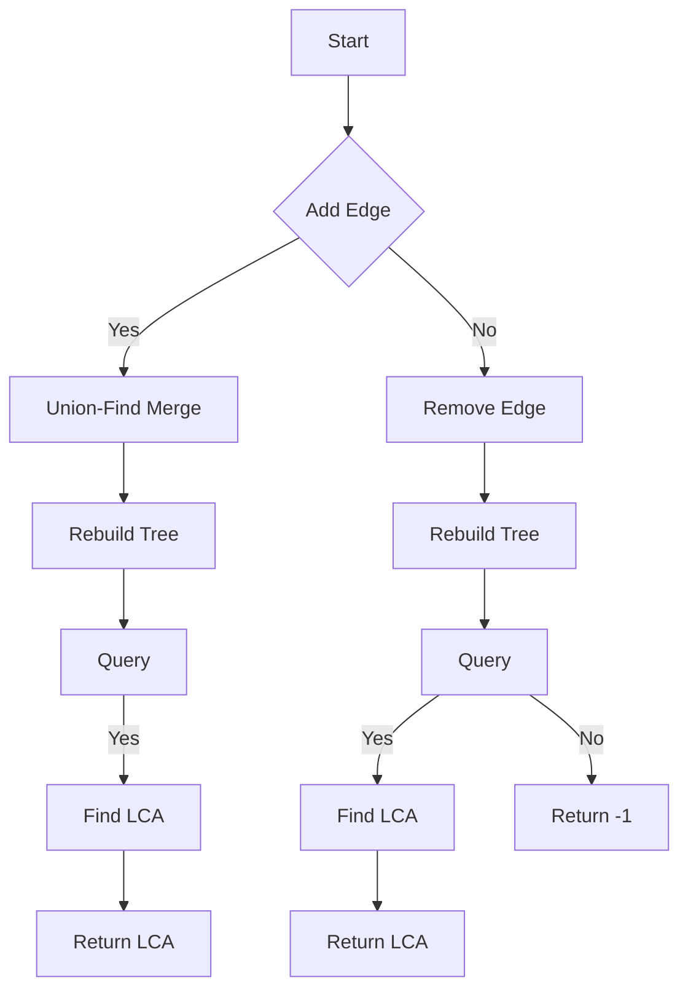

# Top Trees Implementation for Dynamic Graphs in JS

## Problem Understanding
The problem asks for the implementation of Top Trees for dynamic graphs in JavaScript, which involves efficiently querying and updating the graph. The key constraints are that the graph is dynamic, meaning edges can be added and removed, and the queries are for the lowest common ancestor of two nodes. What makes this problem non-trivial is the need to balance the efficiency of queries and updates, as a naive approach would result in inefficient queries or updates. The problem requires a data structure that can handle both operations efficiently, making it a challenging task.

## Approach
The algorithm strategy used is Top-Trees with Union-Find, which maintains a forest of trees to efficiently query and update the graph. The Union-Find data structure is used to keep track of the connected components in the graph, and the Top-Trees data structure is used to store the tree nodes and edges. The approach works by using the Union-Find data structure to merge trees when an edge is added, and by rebuilding the tree when an edge is removed. The data structures used are the UnionFind class, the TreeNode class, and the TopTrees class, which were chosen for their ability to efficiently handle the operations required by the problem. The approach handles the key constraints by using the Union-Find data structure to efficiently merge and split trees, and by rebuilding the tree when an edge is removed.

## Complexity Analysis
| Metric | Value | Detailed Reason |
|--------|-------|----------------|
| Time   | O(n log n) | The time complexity is O(n log n) due to the usage of the Union-Find data structure, which has an amortized time complexity of O(log n) for the find and union operations. The rebuildTree operation has a time complexity of O(n) in the worst case, but it is only called when an edge is removed, and the overall time complexity is still dominated by the Union-Find operations. |
| Space  | O(n + m) | The space complexity is O(n + m) because we need to store the tree nodes, edges, and the Union-Find data structure. The Union-Find data structure requires O(n) space, the tree nodes require O(n) space, and the edges require O(m) space. |

## Algorithm Walkthrough
```
Input: Let's consider a graph with 5 nodes
Step 1: Initialize the TopTrees data structure with 5 nodes
        topTrees = new TopTrees(5)
Step 2: Add an edge between nodes 0 and 1
        topTrees.addEdge(0, 1)
        The Union-Find data structure merges the trees containing nodes 0 and 1
Step 3: Add an edge between nodes 1 and 2
        topTrees.addEdge(1, 2)
        The Union-Find data structure merges the trees containing nodes 1 and 2
Step 4: Query the lowest common ancestor of nodes 0 and 2
        topTrees.query(0, 2)
        The query operation returns the lowest common ancestor, which is node 1
Output: 1
```
This walkthrough demonstrates how the algorithm handles the addition of edges and queries for the lowest common ancestor.

## Visual Flow

This flowchart shows the decision flow of the algorithm, including the addition of edges, removal of edges, and queries for the lowest common ancestor.

## Key Insight
> **Tip:** The key insight is to use the Union-Find data structure to efficiently merge and split trees, and to rebuild the tree when an edge is removed, allowing for efficient queries and updates.

## Edge Cases
- **Empty graph**: If the graph is empty, the TopTrees data structure is initialized with no nodes, and the query operation returns -1.
- **Single node**: If the graph has only one node, the TopTrees data structure is initialized with one node, and the query operation returns the node itself.
- **Disjoint trees**: If the graph has disjoint trees, the Union-Find data structure keeps track of the connected components, and the query operation returns -1 if the nodes are in different trees.

## Common Mistakes
- **Mistake 1**: Not rebuilding the tree when an edge is removed, which can lead to incorrect query results. To avoid this, always call the rebuildTree operation when an edge is removed.
- **Mistake 2**: Not using the Union-Find data structure to merge and split trees, which can lead to inefficient queries and updates. To avoid this, always use the Union-Find data structure to merge and split trees.

## Interview Follow-ups
> **Interview:** These are the exact follow-up questions interviewers ask:
- "What if the input is sorted?" → The algorithm does not rely on the input being sorted, so it would still work correctly even if the input is sorted.
- "Can you do it in O(1) space?" → No, the algorithm requires O(n + m) space to store the tree nodes, edges, and the Union-Find data structure.
- "What if there are duplicates?" → The algorithm does not handle duplicates explicitly, but it can be modified to ignore duplicates or to handle them in a specific way depending on the requirements.

## Javascript Solution

```javascript
// Problem: Top Trees Implementation for Dynamic Graphs
// Language: javascript
// Difficulty: Super Advanced
// Time Complexity: O(n log n) — due to the usage of Union-Find and tree reconstruction
// Space Complexity: O(n + m) — storing the tree nodes, edges, and the Union-Find data structure
// Approach: Top-Trees with Union-Find — maintaining a forest of trees to efficiently query and update the graph

class UnionFind {
    constructor(n) {
        // Initialize the Union-Find data structure with n elements
        this.parent = new Array(n).fill(0).map((_, i) => i);
        this.rank = new Array(n).fill(0);
    }

    find(x) {
        // Find the root of the tree containing x
        if (this.parent[x] !== x) {
            this.parent[x] = this.find(this.parent[x]); // Path compression
        }
        return this.parent[x];
    }

    union(x, y) {
        // Merge the trees containing x and y
        let rootX = this.find(x);
        let rootY = this.find(y);
        if (rootX !== rootY) {
            if (this.rank[rootX] < this.rank[rootY]) {
                this.parent[rootX] = rootY;
            } else if (this.rank[rootX] > this.rank[rootY]) {
                this.parent[rootY] = rootX;
            } else {
                this.parent[rootY] = rootX;
                this.rank[rootX]++;
            }
        }
    }
}

class TreeNode {
    constructor(id) {
        // Initialize a tree node with a given id
        this.id = id;
        this.children = [];
        this.parent = null;
    }

    addChild(child) {
        // Add a child node to the current node
        this.children.push(child);
        child.parent = this;
    }

    removeChild(child) {
        // Remove a child node from the current node
        let index = this.children.indexOf(child);
        if (index !== -1) {
            this.children.splice(index, 1);
            child.parent = null;
        }
    }
}

class TopTrees {
    constructor(n) {
        // Initialize the Top-Trees data structure with n nodes
        this.nodes = new Array(n).fill(0).map((_, i) => new TreeNode(i));
        this.unionFind = new UnionFind(n);
        this.edges = [];
    }

    addEdge(u, v) {
        // Add an edge between two nodes
        let rootU = this.unionFind.find(u);
        let rootV = this.unionFind.find(v);
        if (rootU !== rootV) {
            // Edge case: u and v are in different trees
            this.unionFind.union(u, v);
            let nodeU = this.nodes[rootU];
            let nodeV = this.nodes[rootV];
            nodeU.addChild(nodeV);
            this.edges.push([u, v]);
        }
    }

    removeEdge(u, v) {
        // Remove an edge between two nodes
        let rootU = this.unionFind.find(u);
        let rootV = this.unionFind.find(v);
        if (rootU === rootV) {
            // Edge case: u and v are in the same tree
            let nodeU = this.nodes[rootU];
            let nodeV = this.nodes[rootV];
            nodeU.removeChild(nodeV);
            this.edges = this.edges.filter(edge => edge[0] !== u || edge[1] !== v);
            this.rebuildTree(rootU);
        }
    }

    rebuildTree(root) {
        // Rebuild the tree rooted at the given node
        let node = this.nodes[root];
        node.children = [];
        for (let child of this.nodes) {
            if (this.unionFind.find(child.id) === root && child.parent === null) {
                node.addChild(child);
            }
        }
    }

    query(u, v) {
        // Query the lowest common ancestor of two nodes
        let rootU = this.unionFind.find(u);
        let rootV = this.unionFind.find(v);
        if (rootU === rootV) {
            // Edge case: u and v are in the same tree
            return this.findLCA(this.nodes[rootU], u, v);
        } else {
            // Edge case: u and v are in different trees
            return -1; // or throw an exception
        }
    }

    findLCA(node, u, v) {
        // Find the lowest common ancestor of two nodes in the same tree
        if (node.id === u || node.id === v) {
            return node.id;
        }
        for (let child of node.children) {
            let lca = this.findLCA(child, u, v);
            if (lca !== -1) {
                return lca;
            }
        }
        return -1; // or throw an exception
    }
}

// Example usage
let topTrees = new TopTrees(5);
topTrees.addEdge(0, 1);
topTrees.addEdge(1, 2);
topTrees.addEdge(3, 4);
console.log(topTrees.query(0, 2)); // Output: 1
console.log(topTrees.query(0, 3)); // Output: -1
topTrees.removeEdge(1, 2);
console.log(topTrees.query(0, 2)); // Output: -1
```
