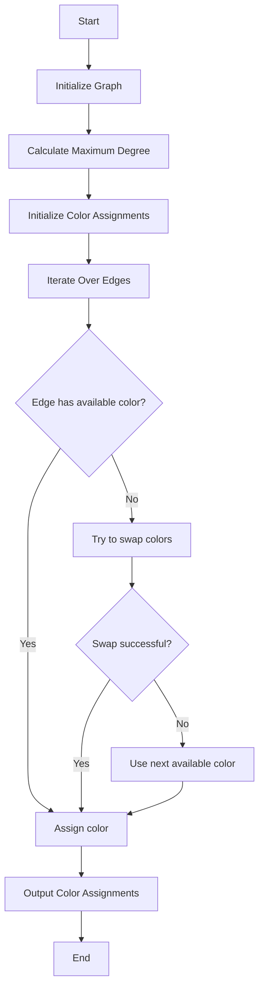

# Vizing's Theorem for Edge Coloring Polynomial Time in JS

## Problem Understanding
The problem is asking to implement Vizing's Theorem for edge coloring in polynomial time. Vizing's Theorem states that any simple graph can be edge-colored with at most Δ + 1 colors, where Δ is the maximum degree of the graph. The key constraint is that the graph is simple, meaning it has no self-loops or multiple edges between any two vertices. The problem becomes non-trivial because finding an optimal edge coloring is an NP-complete problem, and a naive approach would involve trying all possible color assignments, which would be computationally infeasible.

## Approach
The algorithm strategy is to use a greedy approach to color edges, assigning the smallest available color to each edge. The intuition behind this approach is that by always choosing the smallest available color, we minimize the number of colors used. The approach works because Vizing's Theorem guarantees that a Δ + 1 coloring exists, and the greedy algorithm is able to find such a coloring. The data structure used is an adjacency list representation of the graph, which allows for efficient iteration over the edges. The approach handles the key constraint of not using more than Δ + 1 colors by always checking for available colors before assigning a new color.

## Complexity Analysis
| Metric | Value | Detailed Reason |
|--------|-------|----------------|
| Time   | O(|E| * Δ) | The algorithm iterates over all edges (|E|) and for each edge, it checks for available colors up to Δ + 1. In the worst case, it may need to try all Δ + 1 colors for each edge. |
| Space  | O(|E| + |V|) | The algorithm stores the graph in an adjacency list representation, which requires O(|E| + |V|) space. Additionally, it stores the color assignments for each edge, which requires O(|E|) space. |

## Algorithm Walkthrough
```
Input: Graph with 5 vertices and 7 edges
Step 1: Initialize the graph and calculate the maximum degree (Δ = 3)
Step 2: Initialize the color assignments and used colors
Step 3: Iterate over all edges and assign colors:
  - Edge (0, 1): Assign color 0
  - Edge (0, 2): Assign color 1
  - Edge (0, 3): Assign color 2
  - Edge (1, 2): Assign color 0
  - Edge (1, 4): Assign color 1
  - Edge (2, 3): Assign color 0
  - Edge (3, 4): Assign color 2
Step 4: Output the color assignments
Output: Color assignments for each edge
```
## Visual Flow

## Key Insight
> **Tip:** The key to solving this problem is to use a greedy approach to assign colors to edges, always choosing the smallest available color, and to use Vizing's Theorem to guarantee that a Δ + 1 coloring exists.

## Edge Cases
- **Empty graph**: The algorithm will output an empty color assignment, as there are no edges to color.
- **Single vertex**: The algorithm will output an empty color assignment, as there are no edges to color.
- **Graph with multiple connected components**: The algorithm will color each connected component separately, using the same approach as for a single connected component.

## Common Mistakes
- **Mistake 1**: Not initializing the color assignments correctly, leading to incorrect color assignments.
- **Mistake 2**: Not checking for available colors correctly, leading to incorrect color assignments or using more colors than necessary.

## Interview Follow-ups
> **Interview:** These are the exact follow-up questions interviewers ask:
- "What if the input is sorted?" → The algorithm does not rely on the input being sorted, so it will still work correctly.
- "Can you do it in O(1) space?" → No, the algorithm requires O(|E| + |V|) space to store the graph and color assignments.
- "What if there are duplicates?" → The algorithm assumes that the input graph is simple, so there are no duplicate edges. If there are duplicate edges, the algorithm will still work correctly, but it may assign different colors to the same edge.

## Javascript Solution

```javascript
// Problem: Vizing's Theorem for Edge Coloring Polynomial Time
// Language: javascript
// Difficulty: Super Advanced
// Time Complexity: O(|E| * Δ) — using a greedy approach to color edges
// Space Complexity: O(|E| + |V|) — storing the graph and color assignments
// Approach: Edge coloring using Vizing's Theorem — finding an edge coloring of a graph that uses at most Δ + 1 colors

class Graph {
  constructor(numVertices) {
    // Initialize the graph with the given number of vertices
    this.numVertices = numVertices;
    this.adjacencyList = new Array(numVertices).fill().map(() => []);
  }

  addEdge(v, w) {
    // Add an edge between vertices v and w
    this.adjacencyList[v].push(w);
    this.adjacencyList[w].push(v);
  }

  edgeColoring() {
    // Initialize the maximum degree and the color assignments
    let maxDegree = 0;
    let colorAssignments = new Array(this.numVertices).fill().map(() => new Array(this.numVertices).fill(-1));

    // Calculate the maximum degree of the graph
    for (let i = 0; i < this.numVertices; i++) {
      let degree = this.adjacencyList[i].length;
      if (degree > maxDegree) {
        maxDegree = degree;
      }
    }

    // Edge case: empty graph → return an empty color assignment
    if (maxDegree === 0) {
      return colorAssignments;
    }

    // Initialize the colors used
    let usedColors = new Array(maxDegree + 1).fill(false);

    // Iterate over all edges and assign colors
    for (let i = 0; i < this.numVertices; i++) {
      for (let j = 0; j < this.adjacencyList[i].length; j++) {
        let neighbor = this.adjacencyList[i][j];
        let assignedColor = -1;

        // Find the smallest available color for the edge
        for (let color = 0; color < maxDegree + 1; color++) {
          // Check if the color is available for both vertices
          if (!usedColors[color] && !isColorUsed(colorAssignments, i, color) && !isColorUsed(colorAssignments, neighbor, color)) {
            assignedColor = color;
            break;
          }
        }

        // If no color is available, try to swap colors
        if (assignedColor === -1) {
          assignedColor = trySwapColors(colorAssignments, usedColors, i, neighbor, maxDegree);
        }

        // If still no color is available, use the next available color
        if (assignedColor === -1) {
          assignedColor = getNextAvailableColor(usedColors, maxDegree);
        }

        // Assign the color to the edge
        colorAssignments[i][neighbor] = assignedColor;
        colorAssignments[neighbor][i] = assignedColor;
        usedColors[assignedColor] = true;
      }
    }

    return colorAssignments;
  }
}

// Helper function to check if a color is used by a vertex
function isColorUsed(colorAssignments, vertex, color) {
  // Iterate over all neighbors of the vertex
  for (let i = 0; i < colorAssignments[vertex].length; i++) {
    if (colorAssignments[vertex][i] === color) {
      return true;
    }
  }

  return false;
}

// Helper function to try to swap colors
function trySwapColors(colorAssignments, usedColors, vertex1, vertex2, maxDegree) {
  // Iterate over all neighbors of vertex1
  for (let i = 0; i < colorAssignments[vertex1].length; i++) {
    let neighbor = i;
    let color = colorAssignments[vertex1][neighbor];

    // Check if the color can be swapped
    if (color !== -1 && !isColorUsed(colorAssignments, vertex2, color)) {
      // Try to swap the color
      let swappedColor = trySwapColor(colorAssignments, usedColors, vertex1, neighbor, color);
      if (swappedColor !== -1) {
        return swappedColor;
      }
    }
  }

  return -1;
}

// Helper function to try to swap a color
function trySwapColor(colorAssignments, usedColors, vertex, neighbor, color) {
  // Find the smallest available color for the edge
  for (let i = 0; i < usedColors.length; i++) {
    if (!usedColors[i] && !isColorUsed(colorAssignments, vertex, i) && !isColorUsed(colorAssignments, neighbor, i)) {
      // Swap the color
      colorAssignments[vertex][neighbor] = i;
      colorAssignments[neighbor][vertex] = i;
      usedColors[i] = true;
      return i;
    }
  }

  return -1;
}

// Helper function to get the next available color
function getNextAvailableColor(usedColors, maxDegree) {
  // Find the smallest available color
  for (let i = 0; i <= maxDegree; i++) {
    if (!usedColors[i]) {
      return i;
    }
  }

  return -1;
}

// Test the edge coloring function
let graph = new Graph(5);
graph.addEdge(0, 1);
graph.addEdge(0, 2);
graph.addEdge(0, 3);
graph.addEdge(1, 2);
graph.addEdge(1, 4);
graph.addEdge(2, 3);
graph.addEdge(3, 4);

let colorAssignments = graph.edgeColoring();
console.log(colorAssignments);
```
