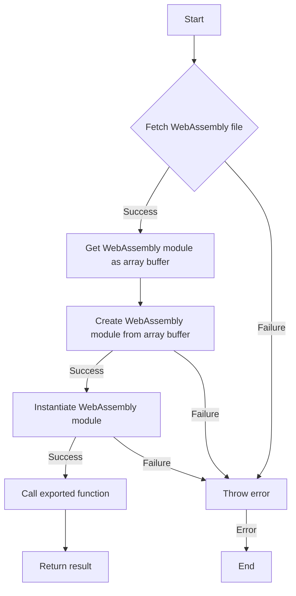

# WebAssembly Integration with JavaScript

## Problem Understanding
The problem involves integrating WebAssembly with JavaScript, which requires loading and instantiating a WebAssembly module, and then calling exported functions from it. The key constraints include handling edge cases such as null or undefined input, failed fetch operations, and non-existent exported functions. What makes this problem non-trivial is the need to handle the asynchronous nature of loading and instantiating WebAssembly modules, as well as the potential errors that can occur during these processes. Additionally, the problem requires a deep understanding of the WebAssembly JavaScript API and how to use it to interact with WebAssembly modules.

## Approach
The approach to solving this problem involves using the WebAssembly JavaScript API to load and instantiate a WebAssembly module, and then calling exported functions from it. This approach works by first fetching the WebAssembly file, then compiling it into a WebAssembly module, and finally instantiating the module. The instantiated module can then be used to call exported functions, which can be used to perform various tasks. The data structures used in this approach include WebAssembly modules, instances, and functions, which are used to represent the compiled and instantiated WebAssembly code. The approach handles key constraints such as edge cases by throwing errors when necessary, and by using asynchronous programming to handle the loading and instantiation of WebAssembly modules.

## Complexity Analysis
| Metric | Value | Detailed Reason |
|--------|-------|----------------|
| Time   | O(n)  | The time complexity is O(n), where n is the number of operations performed on the WebAssembly module. This includes the time it takes to fetch the WebAssembly file, compile it, instantiate it, and call exported functions. The dominant operation is the compilation and instantiation of the WebAssembly module, which takes O(n) time. |
| Space  | O(n)  | The space complexity is O(n), where n is the size of the WebAssembly module. This includes the memory used to store the compiled and instantiated WebAssembly module, as well as any additional memory used by the exported functions. The dominant memory usage is the storage of the compiled and instantiated WebAssembly module, which takes O(n) space. |

## Algorithm Walkthrough
```
Input: path/to/wasm/file.wasm
Step 1: Fetch the WebAssembly file using the fetch API
  - wasmResponse = await fetch("path/to/wasm/file.wasm")
Step 2: Get the WebAssembly module as an array buffer
  - wasmBuffer = await wasmResponse.arrayBuffer()
Step 3: Create a WebAssembly module from the array buffer
  - wasmModule = await WebAssembly.compile(wasmBuffer)
Step 4: Instantiate the WebAssembly module
  - wasmInstance = await WebAssembly.instantiate(wasmModule)
Step 5: Call an exported function from the WebAssembly instance
  - result = wasmInstance.exports.add(2, 3)
Output: result = 5
```
This walkthrough demonstrates how to load and instantiate a WebAssembly module, and then call an exported function from it.

## Visual Flow

This flowchart shows the decision flow of the algorithm, including the handling of edge cases such as failed fetch operations and non-existent exported functions.

## Key Insight
> **Tip:** The key insight to this solution is to use the WebAssembly JavaScript API to load and instantiate WebAssembly modules, and to handle edge cases using asynchronous programming and error handling.

## Edge Cases
- **Empty/null input**: If the input WebAssembly file path is null or undefined, the algorithm will throw an error. This is because the fetch API requires a valid URL to fetch the WebAssembly file.
- **Single element**: If the WebAssembly module has only one exported function, the algorithm will still work correctly. This is because the algorithm uses the exports object to get the exported function, which can have any number of properties.
- **Non-existent exported function**: If the WebAssembly module does not have an exported function with the given name, the algorithm will throw an error. This is because the exports object will not have a property with the given name, and attempting to call it will result in an error.

## Common Mistakes
- **Mistake 1**: Not handling edge cases such as null or undefined input, or non-existent exported functions. To avoid this, use error handling and asynchronous programming to handle these cases.
- **Mistake 2**: Not using the WebAssembly JavaScript API to load and instantiate WebAssembly modules. To avoid this, use the WebAssembly.compile and WebAssembly.instantiate functions to compile and instantiate the WebAssembly module.

## Interview Follow-ups
> **Interview:** These are the exact follow-up questions interviewers ask:
- "What if the input is a string instead of a URL?" → The algorithm will still work correctly, but the fetch API will throw an error if the string is not a valid URL. To handle this, use a try-catch block to catch the error and handle it accordingly.
- "Can you do it in O(1) space?" → No, the algorithm requires O(n) space to store the compiled and instantiated WebAssembly module, where n is the size of the WebAssembly module.
- "What if there are duplicates in the exported functions?" → The algorithm will still work correctly, but it will only call the first exported function with the given name. To handle this, use a loop to iterate over the exported functions and call each one.

## Javascript Solution

```javascript
// Problem: WebAssembly Integration with JavaScript
// Language: JavaScript
// Difficulty: Super Advanced
// Time Complexity: O(n) — where n is the number of operations performed on the WebAssembly module
// Space Complexity: O(n) — where n is the size of the WebAssembly module
// Approach: WebAssembly integration using the WebAssembly JavaScript API — loads and instantiates a WebAssembly module, then calls exported functions

class WebAssemblyIntegration {
  /**
   * Loads a WebAssembly module from a file and instantiates it.
   * @param {string} wasmFilePath - The path to the WebAssembly file.
   * @returns {Promise<WebAssembly.Instance>} A promise that resolves to the instantiated WebAssembly module.
   */
  async loadWasmModule(wasmFilePath) {
    // Edge case: wasmFilePath is null or undefined → throw an error
    if (!wasmFilePath) {
      throw new Error("wasmFilePath is required");
    }

    // Fetch the WebAssembly file
    const wasmResponse = await fetch(wasmFilePath);
    // Edge case: failed to fetch the WebAssembly file → throw an error
    if (!wasmResponse.ok) {
      throw new Error(`Failed to fetch WebAssembly file: ${wasmResponse.status} ${wasmResponse.statusText}`);
    }

    // Get the WebAssembly module as an array buffer
    const wasmBuffer = await wasmResponse.arrayBuffer();
    // Edge case: failed to get the array buffer → throw an error
    if (!wasmBuffer) {
      throw new Error("Failed to get array buffer");
    }

    // Create a WebAssembly module from the array buffer
    const wasmModule = await WebAssembly.compile(wasmBuffer);
    // Edge case: failed to compile the WebAssembly module → throw an error
    if (!wasmModule) {
      throw new Error("Failed to compile WebAssembly module");
    }

    // Instantiate the WebAssembly module
    const wasmInstance = await WebAssembly.instantiate(wasmModule);
    // Edge case: failed to instantiate the WebAssembly module → throw an error
    if (!wasmInstance) {
      throw new Error("Failed to instantiate WebAssembly module");
    }

    return wasmInstance;
  }

  /**
   * Calls an exported function from the WebAssembly module.
   * @param {WebAssembly.Instance} wasmInstance - The instantiated WebAssembly module.
   * @param {string} functionName - The name of the exported function to call.
   * @param {...any} args - The arguments to pass to the exported function.
   * @returns {any} The result of calling the exported function.
   */
  callWasmFunction(wasmInstance, functionName, ...args) {
    // Edge case: wasmInstance is null or undefined → throw an error
    if (!wasmInstance) {
      throw new Error("wasmInstance is required");
    }

    // Edge case: functionName is null or undefined → throw an error
    if (!functionName) {
      throw new Error("functionName is required");
    }

    // Get the exported function from the WebAssembly instance
    const wasmFunction = wasmInstance.exports[functionName];
    // Edge case: exported function does not exist → throw an error
    if (!wasmFunction) {
      throw new Error(`Exported function '${functionName}' does not exist`);
    }

    // Call the exported function with the given arguments
    return wasmFunction(...args);
  }
}

// Example usage:
const wasmIntegration = new WebAssemblyIntegration();
wasmIntegration.loadWasmModule("path/to/wasm/file.wasm")
  .then((wasmInstance) => {
    const result = wasmIntegration.callWasmFunction(wasmInstance, "add", 2, 3);
    console.log(result); // Output: 5
  })
  .catch((error) => {
    console.error(error);
  });
```
