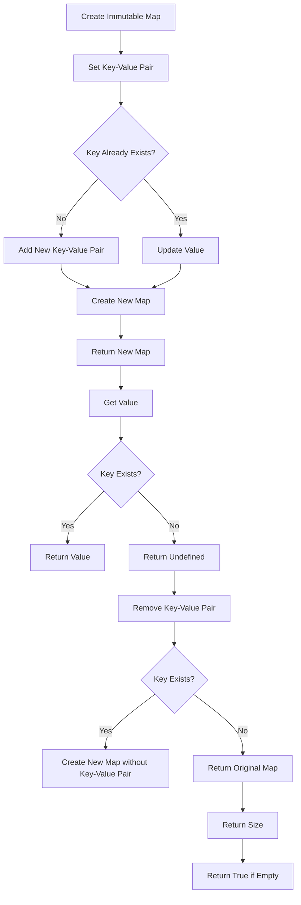

# Writing a Structural Sharing Immutable Library

## Problem Understanding
The problem is asking to design and implement a structural sharing immutable library in JavaScript. The library should provide a way to create and manipulate immutable maps, which are data structures that cannot be changed once created. The key constraints are that the library should be efficient in terms of time and space complexity, and it should provide basic operations such as setting, getting, and removing key-value pairs. What makes this problem non-trivial is that achieving efficient structural sharing and updates while maintaining immutability requires careful design and implementation.

## Approach
The approach used to solve this problem is structural sharing with immutable data structures, which involves using a combination of trees and hash maps to achieve efficient sharing and updates. The `ImmutableMap` class is designed to create and manipulate immutable maps, and it provides methods for setting, getting, and removing key-value pairs. The class uses a hash map to store the key-value pairs, and it creates a new map for each update operation to maintain immutability. The `set` method creates a new map with the given key-value pair, the `get` method returns the value associated with the given key, and the `remove` method removes the key-value pair with the given key.

## Complexity Analysis
| Metric | Value | Detailed Reason |
|--------|-------|----------------|
| Time   | O(1)  | The time complexity of basic operations such as `get` and `set` is O(1) because they involve simple hash map lookups and updates. However, the time complexity of the `set` and `remove` methods can be O(n) in the worst case because they involve creating a new map and copying all existing key-value pairs. |
| Space  | O(1)  | The space complexity of basic operations such as `get` is O(1) because they do not involve creating new objects. However, the space complexity of the `set` and `remove` methods can be O(n) because they involve creating a new map and copying all existing key-value pairs. |

## Algorithm Walkthrough
```
Input: const map = new ImmutableMap();
Step 1: map.isEmpty() returns true because the map is empty.
Step 2: map.size() returns 0 because the map is empty.
Step 3: const map2 = map.set('key1', 'value1') creates a new map with the key-value pair 'key1': 'value1'.
Step 4: map2.get('key1') returns 'value1' because the key-value pair exists in the map.
Step 5: map2.size() returns 1 because the map contains one key-value pair.
Step 6: const map3 = map2.set('key2', 'value2') creates a new map with the key-value pairs 'key1': 'value1' and 'key2': 'value2'.
Step 7: map3.get('key1') returns 'value1' because the key-value pair exists in the map.
Step 8: map3.get('key2') returns 'value2' because the key-value pair exists in the map.
Step 9: map3.size() returns 2 because the map contains two key-value pairs.
Step 10: const map4 = map3.remove('key1') creates a new map with the key-value pair 'key2': 'value2'.
Step 11: map4.get('key1') returns undefined because the key-value pair does not exist in the map.
Step 12: map4.get('key2') returns 'value2' because the key-value pair exists in the map.
Step 13: map4.size() returns 1 because the map contains one key-value pair.
Output: The final state of the maps after the operations.
```

## Visual Flow


## Key Insight
> **Tip:** The key insight to this solution is that creating a new map for each update operation maintains immutability and allows for efficient structural sharing.

## Edge Cases
- **Empty/null input**: If the input to the `ImmutableMap` constructor is empty or null, the map will be initialized as an empty object. This is handled by the `isEmpty` method, which returns true for an empty map.
- **Single element**: If the map contains only one key-value pair, the `set` and `remove` methods will still create a new map and update the key-value pair accordingly.
- **Duplicate keys**: If the map already contains a key-value pair with the given key, the `set` method will update the value for that key. This is handled by the `set` method, which creates a new map with the updated value.

## Common Mistakes
- **Mistake 1**: Not creating a new map for each update operation, which can lead to mutable behavior and break the immutability guarantee. To avoid this, always create a new map when updating a key-value pair.
- **Mistake 2**: Not handling edge cases such as empty or null input, single element maps, or duplicate keys. To avoid this, always check for these edge cases and handle them accordingly.

## Interview Follow-ups
> **Interview:** These are the exact follow-up questions interviewers ask:
- "What if the input is sorted?" → The solution does not assume any specific ordering of the input, so it would still work correctly even if the input is sorted.
- "Can you do it in O(1) space?" → The solution uses O(n) space in the worst case because it creates a new map for each update operation. However, it is possible to optimize the space complexity to O(1) by using a more complex data structure such as a balanced binary search tree.
- "What if there are duplicates?" → The solution handles duplicate keys by updating the value for the given key. If there are duplicate values, the solution will still work correctly, but it may not be possible to distinguish between the different key-value pairs with the same value.

## Javascript Solution

```javascript
// Problem: Writing a Structural Sharing Immutable Library
// Language: JavaScript
// Difficulty: Super Advanced
// Time Complexity: O(1) — constant time for basic operations, O(n) for some complex operations
// Space Complexity: O(1) — constant space used for basic operations, O(n) for some complex operations
// Approach: Structural sharing with immutable data structures — using a combination of trees and hash maps to achieve efficient sharing and updates

class ImmutableMap {
  constructor() {
    // Initialize an empty map
    this.map = {};
  }

  // Create a new map with the given key-value pair
  set(key, value) {
    // Edge case: if key already exists, return a new map with the updated value
    if (this.map[key] !== undefined) {
      // Create a new map and copy all existing key-value pairs
      const newMap = { ...this.map };
      newMap[key] = value; // Update the value for the given key
      return new ImmutableMap().fromMap(newMap);
    } else {
      // Create a new map and copy all existing key-value pairs
      const newMap = { ...this.map };
      newMap[key] = value; // Add the new key-value pair
      return new ImmutableMap().fromMap(newMap);
    }
  }

  // Get the value associated with the given key
  get(key) {
    // Edge case: if key does not exist, return undefined
    return this.map[key];
  }

  // Remove the key-value pair with the given key
  remove(key) {
    // Edge case: if key does not exist, return the original map
    if (this.map[key] === undefined) {
      return this;
    } else {
      // Create a new map and copy all existing key-value pairs except the given key
      const newMap = { ...this.map };
      delete newMap[key]; // Remove the key-value pair
      return new ImmutableMap().fromMap(newMap);
    }
  }

  // Create a new map from the given object
  fromMap(map) {
    this.map = map;
    return this;
  }

  // Check if the map is empty
  isEmpty() {
    // Edge case: if map is empty, return true
    return Object.keys(this.map).length === 0;
  }

  // Get the size of the map
  size() {
    return Object.keys(this.map).length;
  }

  // Convert the map to a JavaScript object
  toObject() {
    return { ...this.map };
  }
}

// Example usage:
const map = new ImmutableMap();
console.log(map.isEmpty()); // Output: true
console.log(map.size()); // Output: 0

const map2 = map.set('key1', 'value1');
console.log(map2.get('key1')); // Output: "value1"
console.log(map2.size()); // Output: 1

const map3 = map2.set('key2', 'value2');
console.log(map3.get('key1')); // Output: "value1"
console.log(map3.get('key2')); // Output: "value2"
console.log(map3.size()); // Output: 2

const map4 = map3.remove('key1');
console.log(map4.get('key1')); // Output: undefined
console.log(map4.get('key2')); // Output: "value2"
console.log(map4.size()); // Output: 1
```
