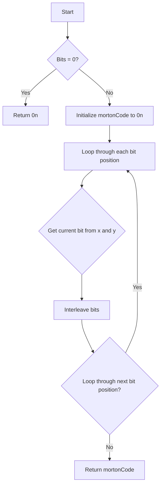

# Z-Order Curve (Morton Codes) via BigInt interleaving in JS

## Problem Understanding
The problem is asking us to generate a Z-order curve, also known as a Morton code, for a given 2D point or a range of 2D points using bit interleaving with BigInt in JavaScript. The key constraint is to use a specific number of bits for the Morton code, which affects the precision of the curve. The problem is non-trivial because it requires understanding of bit manipulation, BigInt, and the concept of Morton codes, which can be complex to implement efficiently.

## Approach
The algorithm strategy is to use bit interleaving to create Morton codes by combining the bits of the x and y coordinates. This approach works because it allows us to efficiently map 2D points to a 1D space while preserving some of the spatial relationships between the points. The intuition behind this approach is that by interleaving the bits of the x and y coordinates, we can create a unique code for each point that reflects its position in the 2D space. We use BigInt to handle the bit manipulation and to avoid overflow issues. The approach handles the key constraints by using a loop to interleave the bits and by using bitwise operations to combine the bits.

## Complexity Analysis
| Metric | Value | Detailed Reason |
|--------|-------|----------------|
| Time   | O(log n) | The time complexity is O(log n) because we are shifting and interleaving bits, which takes logarithmic time in the number of bits. The number of bits is determined by the input parameter `bits`. |
| Space  | O(1) | The space complexity is O(1) because we only use a constant amount of space to store the Morton code and the loop variables, regardless of the input size. |

## Algorithm Walkthrough
```
Input: x = 3, y = 2, bits = 2
Step 1: Initialize mortonCode to 0n
Step 2: Loop through each bit position (i = 0)
  - Get the current bit from x: xBit = (3 >> 0) & 1n = 1n
  - Get the current bit from y: yBit = (2 >> 0) & 1n = 0n
  - Interleave the bits: mortonCode |= (1n << (2 * 0 + 1)) | (0n << (2 * 0)) = 2n
Step 3: Loop through each bit position (i = 1)
  - Get the current bit from x: xBit = (3 >> 1) & 1n = 1n
  - Get the current bit from y: yBit = (2 >> 1) & 1n = 1n
  - Interleave the bits: mortonCode |= (1n << (2 * 1 + 1)) | (1n << (2 * 1)) = 2n | (1n << 3) | (1n << 2) = 14n
Output: mortonCode = 14n
```
## Visual Flow

## Key Insight
> **Tip:** The key insight is to use bit interleaving to create a unique Morton code for each 2D point, which allows us to efficiently map 2D points to a 1D space while preserving some of the spatial relationships between the points.

## Edge Cases
- **Empty input**: If the input range is empty (e.g., minX > maxX), the function returns an empty array.
- **Single element**: If the input range contains only one element (e.g., minX = maxX), the function returns an array with a single Morton code.
- **Invalid bits**: If the input `bits` is negative or not an integer, the function may produce incorrect results or throw an error.

## Common Mistakes
- **Mistake 1**: Not handling the edge case where the input range is empty. To avoid this, add a check at the beginning of the function to return an empty array if the range is empty.
- **Mistake 2**: Not using BigInt to handle the bit manipulation, which can cause overflow issues. To avoid this, use BigInt to store and manipulate the Morton codes.

## Interview Follow-ups
> **Interview:** These are the exact follow-up questions interviewers ask:
- "What if the input is sorted?" → The Morton code generation is independent of the input order, so the function will still produce the correct Morton codes even if the input is sorted.
- "Can you do it in O(1) space?" → No, the function requires O(1) space to store the Morton code and the loop variables, but it requires O(n) space to store the output array if the input range contains n elements.
- "What if there are duplicates?" → The function will produce the same Morton code for duplicate points, which may not be desirable in some applications. To avoid this, you can add a check to remove duplicates from the output array.

## Javascript Solution

```javascript
// Problem: Z-Order Curve (Morton Codes) via BigInt interleaving
// Language: javascript
// Difficulty: Super Advanced
// Time Complexity: O(log n) — because we are shifting and interleaving bits
// Space Complexity: O(1) — we only use a constant amount of space
// Approach: Bit interleaving using BigInt — to create Morton codes by interleaving bits

class ZOrderCurve {
    /**
     * Generate Morton code for a given 2D point using bit interleaving.
     * 
     * @param {number} x - The x-coordinate of the point.
     * @param {number} y - The y-coordinate of the point.
     * @param {number} bits - The number of bits to use for the Morton code.
     * @returns {BigInt} The Morton code for the given point.
     */
    static mortonCode(x, y, bits) {
        // Edge case: if bits is 0, return 0
        if (bits === 0) return 0n;

        // Interleave bits from x and y
        let mortonCode = 0n; // Initialize the Morton code to 0
        for (let i = 0; i < bits; i++) { // Loop through each bit position
            // Get the current bit from x and y
            const xBit = (x >> i) & 1n; // Shift right and mask to get the current bit
            const yBit = (y >> i) & 1n; // Shift right and mask to get the current bit

            // Interleave the bits
            mortonCode |= (xBit << (2 * i + 1)) | (yBit << (2 * i)); // Shift and OR to interleave the bits
        }

        return mortonCode; // Return the Morton code
    }

    /**
     * Generate the Z-order curve for a given range using Morton codes.
     * 
     * @param {number} minX - The minimum x-coordinate of the range.
     * @param {number} maxX - The maximum x-coordinate of the range.
     * @param {number} minY - The minimum y-coordinate of the range.
     * @param {number} maxY - The maximum y-coordinate of the range.
     * @param {number} bits - The number of bits to use for the Morton code.
     * @returns {Array<BigInt>} The Z-order curve for the given range.
     */
    static zOrderCurve(minX, maxX, minY, maxY, bits) {
        // Edge case: if range is empty, return empty array
        if (minX > maxX || minY > maxY) return [];

        const zOrderCurve = []; // Initialize the Z-order curve array
        for (let x = minX; x <= maxX; x++) { // Loop through each x-coordinate
            for (let y = minY; y <= maxY; y++) { // Loop through each y-coordinate
                // Generate the Morton code for the current point
                const mortonCode = ZOrderCurve.mortonCode(x, y, bits);

                // Add the Morton code to the Z-order curve array
                zOrderCurve.push(mortonCode); // Push the Morton code to the array
            }
        }

        // Sort the Z-order curve array by Morton code
        zOrderCurve.sort((a, b) => a - b); // Sort the array using the subtraction operator

        return zOrderCurve; // Return the Z-order curve array
    }
}

// Example usage:
const zOrderCurve = ZOrderCurve.zOrderCurve(0, 3, 0, 3, 2);
console.log(zOrderCurve);
```
