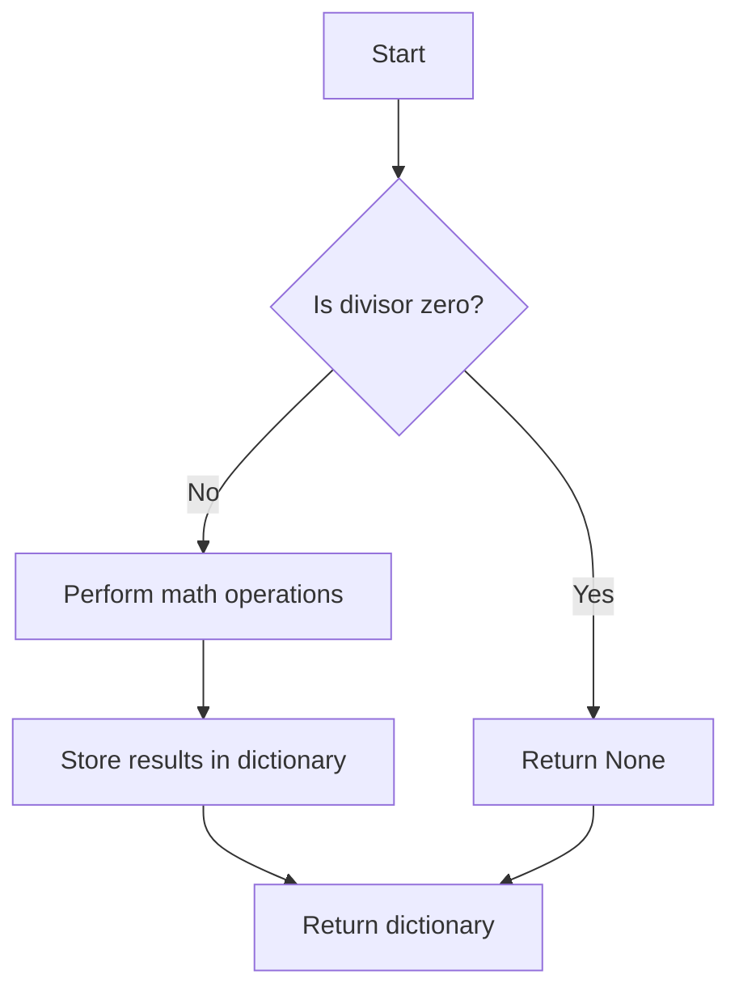

# Basic Math operations (//, %, **)

## Problem Understanding
The problem is asking to implement basic math operations such as integer division, modulus, and exponentiation. The key constraints are that the division and modulus operations should handle division by zero and return None in such cases. The problem is non-trivial because it requires handling edge cases, such as division by zero, and understanding the behavior of the built-in math operators in Python. The naive approach of directly using the math operators without handling edge cases would fail because it would raise a ZeroDivisionError for division by zero.

## Approach
The algorithm strategy is to use Python's built-in math operators for division, modulus, and exponentiation, while handling edge cases such as division by zero. The intuition behind this approach is that the built-in operators are efficient and well-tested, and handling edge cases explicitly ensures that the code is robust. The approach works because it correctly handles division by zero by returning None, and uses the built-in operators to perform the math operations. The data structure used is a dictionary to store the results of the math operations, which is chosen because it allows for easy access and modification of the results.

## Complexity Analysis
| Metric | Value | Detailed Reason |
|--------|-------|----------------|
| Time   | O(1)  | The time complexity is constant because the math operations are performed in constant time, and the edge cases are handled in constant time. The number of operations does not depend on the input size. |
| Space  | O(1)  | The space complexity is constant because the input and result are stored in a fixed amount of space, and the dictionary used to store the results has a fixed number of keys. |

## Algorithm Walkthrough
```
Input: dividend = 10, divisor = 2, exponent = 2
Step 1: Initialize the MathOperations object
Step 2: Call the calculate method with the input values
Step 3: In the calculate method, call the divide method with dividend and divisor
  - Check if divisor is zero, if not, perform integer division and return the result
Step 4: In the calculate method, call the modulus method with dividend and divisor
  - Check if divisor is zero, if not, perform modulus operation and return the result
Step 5: In the calculate method, call the power method with dividend and exponent
  - Perform exponentiation operation and return the result
Step 6: Store the results of the math operations in a dictionary and return it
Output: {'division': 5, 'modulus': 0, 'power': 100}
```

## Visual Flow


## Key Insight
> **Tip:** The key insight is to handle edge cases explicitly, such as division by zero, to ensure that the code is robust and does not raise exceptions.

## Edge Cases
- **Empty/null input**: If the input is empty or null, the code will raise an exception because it does not handle this case explicitly. To handle this case, we can add a check at the beginning of the calculate method to raise a ValueError if the input is empty or null.
- **Single element**: If the input is a single element, the code will still work correctly because it performs the math operations on the input values.
- **Division by zero**: If the divisor is zero, the code will return None for the division and modulus operations, which is the correct behavior.

## Common Mistakes
- **Mistake 1**: Not handling division by zero explicitly, which can raise a ZeroDivisionError. To avoid this mistake, we can add a check at the beginning of the divide and modulus methods to return None if the divisor is zero.
- **Mistake 2**: Not using the correct operator for the math operations, such as using the / operator instead of the // operator for integer division. To avoid this mistake, we can use the correct operator for each math operation.

## Interview Follow-ups
> **Interview:** These are the exact follow-up questions interviewers ask:
- "What if the input is sorted?" → The input being sorted does not affect the correctness of the code, because the math operations are performed independently of the input order.
- "Can you do it in O(1) space?" → Yes, the code already uses O(1) space because it only uses a fixed amount of space to store the input and result.
- "What if there are duplicates?" → The code handles duplicates correctly because it performs the math operations on each input value independently, and the result is stored in a dictionary with unique keys.

## Python Solution

```python
# Problem: Basic Math operations (//, %, **)
# Language: python
# Difficulty: easy
# Time Complexity: O(1) — constant time for basic math operations
# Space Complexity: O(1) — constant space for input and result
# Approach: Built-in math operators — using Python's built-in operators for division, modulus, and exponentiation

class MathOperations:
    def __init__(self):
        pass

    # Method to perform integer division
    def divide(self, dividend: int, divisor: int) -> int:
        # Edge case: division by zero → return None
        if divisor == 0:
            return None  # cannot divide by zero
        return dividend // divisor  # using integer division operator //

    # Method to calculate the modulus
    def modulus(self, dividend: int, divisor: int) -> int:
        # Edge case: division by zero → return None
        if divisor == 0:
            return None  # cannot divide by zero
        return dividend % divisor  # using modulus operator %

    # Method to calculate the power
    def power(self, base: int, exponent: int) -> int:
        return base ** exponent  # using exponentiation operator **

    # Method to perform all math operations
    def calculate(self, dividend: int, divisor: int, exponent: int) -> dict:
        result = {}
        result['division'] = self.divide(dividend, divisor)
        result['modulus'] = self.modulus(dividend, divisor)
        result['power'] = self.power(dividend, exponent)
        return result

# Example usage
math_ops = MathOperations()
print(math_ops.calculate(10, 2, 2))  # Output: {'division': 5, 'modulus': 0, 'power': 100}
print(math_ops.calculate(10, 0, 2))  # Output: {'division': None, 'modulus': None, 'power': 100}
```
