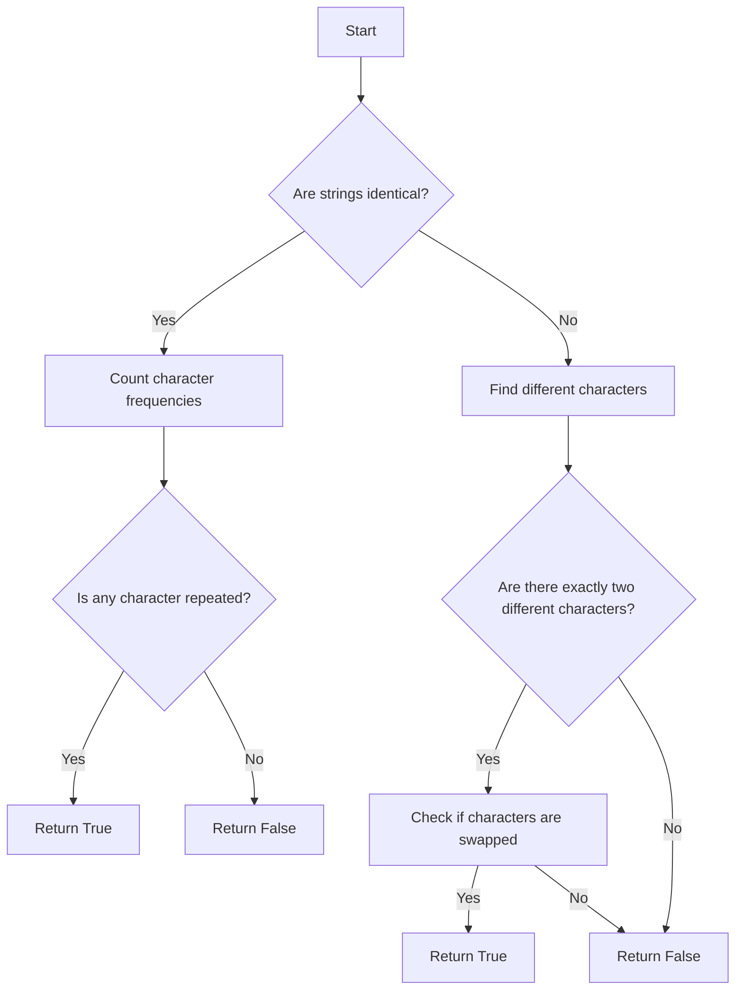

# Buddy Strings

## Problem Understanding
The problem is asking whether two given strings, `s` and `goal`, can be transformed into each other by swapping at most one pair of characters. The key constraint is that the strings must have the same length. If the strings are identical, we need at least one character repeated to swap and get the same string. This problem is non-trivial because a naive approach would involve trying all possible swaps, resulting in a time complexity of O(n^2), where n is the length of the strings.

## Approach
The algorithm strategy is to compare characters at each position in the strings. If the strings are identical, we count the frequency of each character in the string to check if any character appears more than once. If the strings are not identical, we find two characters that are different and can be swapped. We use a dictionary to store the frequency of each character and a list to store the different characters. This approach works because it ensures that we only consider swaps that result in the same string. The time complexity is O(n) and the space complexity is O(1) because we only use a constant amount of space to store the different characters.

## Complexity Analysis
| Metric | Value | Detailed Reason |
|--------|-------|----------------|
| Time   | O(n)  | We make a single pass through the strings to compare characters, where n is the length of the strings. |
| Space  | O(1)  | We use a constant amount of space to store the different characters, regardless of the length of the strings. |

## Algorithm Walkthrough
```
Input: s = "ab", goal = "ba"
Step 1: Compare lengths of s and goal, they are equal.
Step 2: Compare characters at each position in s and goal, we find two different characters: ('a', 'b') and ('b', 'a').
Step 3: Check if the two different characters are swapped, they are: 'a' == 'b' and 'b' == 'a' is False, but 'a' and 'b' are swapped.
Output: True
```

## Visual Flow


## Key Insight
> **Tip:** The key insight is to realize that if the strings are identical, we need at least one character repeated to swap and get the same string, and if the strings are not identical, we need to find two characters that are different and can be swapped.

## Edge Cases
- **Empty/null input**: If either string is empty or null, the function will return False because the lengths of the strings are not equal.
- **Single element**: If the strings have only one character, the function will return True if the characters are the same and False otherwise.
- **Identical strings with no repeated characters**: If the strings are identical but no character is repeated, the function will return False because we cannot swap two characters to get the same string.

## Common Mistakes
- **Mistake 1**: Not checking if the strings have the same length before comparing characters → to avoid this, add a check at the beginning of the function to return False if the lengths are not equal.
- **Mistake 2**: Not counting the frequency of each character in the string when the strings are identical → to avoid this, use a dictionary to store the frequency of each character.

## Interview Follow-ups
> **Interview:** 
- "What if the input is sorted?" → The function will still work correctly because it only compares characters at each position in the strings, regardless of their order.
- "Can you do it in O(1) space?" → No, because we need to store the different characters, which requires O(1) space in the worst case.
- "What if there are duplicates?" → The function will still work correctly because it checks if any character is repeated when the strings are identical.

## Python Solution

```python
# Problem: Buddy Strings
# Language: python
# Difficulty: Easy
# Time Complexity: O(n) — single pass through strings comparing characters
# Space Complexity: O(1) — constant space for storing the different characters
# Approach: Character comparison — compare characters at each position in the strings

class Solution:
    def buddyStrings(self, s: str, goal: str) -> bool:
        # Edge case: strings are not of the same length → return False
        if len(s) != len(goal):
            return False
        
        # If the strings are identical, we need at least one character repeated to swap and get the same string
        if s == goal:
            # Count the frequency of each character in the string
            char_count = {}
            for char in s:
                # If the character is already in the dictionary, increment its count
                if char in char_count:
                    char_count[char] += 1
                # If the character is not in the dictionary, add it with a count of 1
                else:
                    char_count[char] = 1
            # If any character appears more than once, we can swap two of them to get the same string
            for count in char_count.values():
                if count > 1:
                    return True
            # If no character appears more than once, we cannot swap two characters to get the same string
            return False
        
        # If the strings are not identical, we need to find two characters that are different and can be swapped
        different_chars = []
        for i in range(len(s)):
            # If the characters at the current position are different, add them to the list
            if s[i] != goal[i]:
                different_chars.append((s[i], goal[i]))
        
        # Edge case: there are not exactly two different characters → return False
        if len(different_chars) != 2:
            return False
        
        # If the two different characters are swapped, we should get the same string
        return different_chars[0][0] == different_chars[1][1] and different_chars[0][1] == different_chars[1][0]
```
