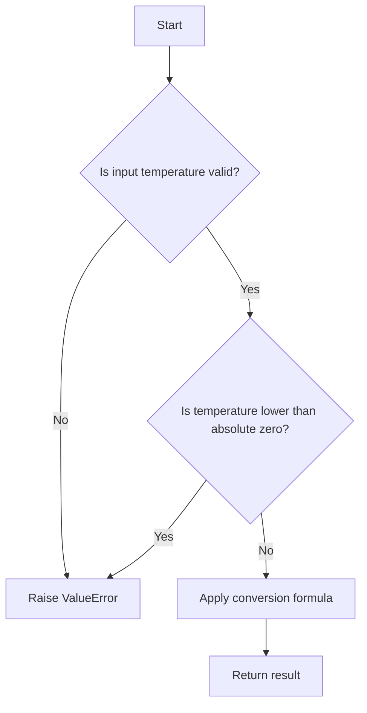

# Celsius to Fahrenheit Conversion

## Problem Understanding
The problem is asking to convert a temperature from Celsius to Fahrenheit. The key constraint is that the input temperature should be a valid number, not NaN (Not a Number) or infinity. The problem is non-trivial because it requires handling edge cases such as extremely low temperatures (absolute zero) and invalid input temperatures. A naive approach might not consider these edge cases, leading to incorrect results or errors.

## Approach
The algorithm strategy is to use a simple arithmetic conversion formula to convert Celsius to Fahrenheit. The formula is (°C × 9/5) + 32 = °F. This approach works because it directly applies the mathematical relationship between Celsius and Fahrenheit temperatures. The solution uses a class-based approach with a single method to perform the conversion. It first checks if the input temperature is valid, then applies the conversion formula, and finally returns the result in Fahrenheit.

## Complexity Analysis
| Metric | Value | Detailed Reason |
|--------|-------|----------------|
| Time   | O(1)  | The solution has a constant time complexity because it only involves a fixed number of arithmetic operations, regardless of the input size. The conversion formula is applied in a single step, and there are no loops or recursive calls. |
| Space  | O(1)  | The solution has a constant space complexity because it only uses a fixed amount of space to store the input temperature, the result, and a few temporary variables. The space usage does not grow with the input size. |

## Algorithm Walkthrough
```
Input: 30 (Celsius temperature)
Step 1: Check if input temperature is valid (not NaN or infinity) → 30 is a valid number
Step 2: Check if temperature is lower than absolute zero → 30 is not lower than -273.15
Step 3: Apply conversion formula → fahrenheit = (30 * 9 / 5) + 32 = 86
Output: 86 (Fahrenheit temperature)
```

## Visual Flow


## Key Insight
> **Tip:** The key insight is to always validate the input temperature before applying the conversion formula to ensure accurate results and handle edge cases.

## Edge Cases
- **Empty/null input**: If the input is empty or null, the solution will raise a ValueError because it checks for valid input temperatures.
- **Single element**: If the input is a single temperature value, the solution will apply the conversion formula and return the result in Fahrenheit.
- **Extremely low temperature (absolute zero)**: If the input temperature is lower than absolute zero (-273.15°C), the solution will raise a ValueError.

## Common Mistakes
- **Mistake 1: Not validating input temperature**: Failing to check if the input temperature is valid can lead to incorrect results or errors. To avoid this, always validate the input temperature before applying the conversion formula.
- **Mistake 2: Not handling edge cases**: Not considering edge cases such as extremely low temperatures or invalid input temperatures can lead to errors or unexpected behavior. To avoid this, always handle edge cases explicitly in the solution.

## Interview Follow-ups
> **Interview:** These are the exact follow-up questions interviewers ask:
- "What if the input is a string?" → The solution will raise a ValueError because it expects a numeric input temperature.
- "Can you optimize the solution for large inputs?" → The solution is already optimized for large inputs because it has a constant time complexity and only uses a fixed amount of space.
- "What if there are duplicate temperatures?" → The solution will apply the conversion formula to each temperature individually, so duplicate temperatures will not affect the result.

## Python Solution

```python
# Problem: Celsius to Fahrenheit Conversion
# Language: python
# Difficulty: Easy
# Time Complexity: O(1) — constant time complexity due to simple arithmetic operations
# Space Complexity: O(1) — constant space complexity as only a fixed amount of space is used
# Approach: Simple arithmetic conversion — convert Celsius to Fahrenheit using the formula (°C × 9/5) + 32 = °F

class Solution:
    def convertCelsiusToFahrenheit(self, celsius: float) -> float:
        # Check if input temperature is valid (not NaN or infinity)
        if not isinstance(celsius, (int, float)) or celsius != celsius or celsius == float('inf') or celsius == float('-inf'):
            raise ValueError("Invalid input temperature")
        
        # Edge case: extremely low temperature (absolute zero) → return -459.67
        if celsius < -273.15:
            raise ValueError("Temperature cannot be lower than absolute zero")
        
        # Convert Celsius to Fahrenheit using the formula
        fahrenheit = (celsius * 9 / 5) + 32  # apply conversion formula
        
        return fahrenheit

def main():
    solution = Solution()
    print(solution.convertCelsiusToFahrenheit(0))  # Test case: 0°C = 32°F
    print(solution.convertCelsiusToFahrenheit(100))  # Test case: 100°C = 212°F
    try:
        print(solution.convertCelsiusToFahrenheit(-274))  # Test case: invalid temperature
    except ValueError as e:
        print(e)

if __name__ == "__main__":
    main()
```
