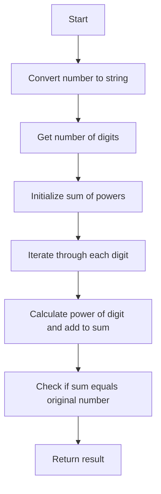

# Check Armstrong Number

## Problem Understanding
The problem is asking to determine whether a given number is an Armstrong number or not. An Armstrong number is a number that is equal to the sum of its own digits each raised to the power of the number of digits. For example, 153 is an Armstrong number because 1^3 + 5^3 + 3^3 = 153. The key constraints are that the input number can be positive or negative, but negative numbers cannot be Armstrong numbers. What makes this problem non-trivial is that it requires iterating through each digit of the number and performing a mathematical calculation, which cannot be done with a simple naive approach.

## Approach
The algorithm strategy is to convert the input number to a string to easily get the number of digits, then iterate through each digit in the number, calculate the power of the current digit raised to the power of the number of digits, and add it to a running sum. The intuition behind this approach is that it directly implements the definition of an Armstrong number. The mathematical reasoning is that if the sum of the powers of the digits is equal to the original number, then the number is an Armstrong number. The data structure used is a simple integer variable to store the sum of the powers, and a string to store the input number. This approach handles the key constraint of negative numbers by immediately returning False.

## Complexity Analysis
| Metric | Value | Detailed Reason |
|--------|-------|----------------|
| Time   | O(log n) | The algorithm iterates through each digit of the number, and the number of digits in a number is proportional to the logarithm of the number. The constant time operations inside the loop do not affect the overall time complexity. |
| Space  | O(1) | The algorithm uses a constant amount of space to store the input number, the number of digits, and the sum of the powers, regardless of the size of the input. The string conversion of the input number is also considered constant space because it is proportional to the number of digits, which is logarithmic in the size of the input. |

## Algorithm Walkthrough
```
Input: 153
Step 1: Convert the number to a string: num_str = "153", num_digits = 3
Step 2: Initialize sum_of_powers = 0
Step 3: Iterate through each digit in the number:
  - For digit "1": sum_of_powers += 1^3 = 1
  - For digit "5": sum_of_powers += 5^3 = 125, sum_of_powers = 126
  - For digit "3": sum_of_powers += 3^3 = 27, sum_of_powers = 153
Step 4: Check if the sum of the powers is equal to the original number: sum_of_powers == 153
Output: True
```
This example exercises the main logic path of the algorithm.

## Visual Flow

This flowchart shows the decision flow and data transformation of the algorithm.

## Key Insight
> **Tip:** The key insight is that an Armstrong number can be checked by iterating through each digit and calculating the power of the digit raised to the power of the number of digits, which directly implements the definition of an Armstrong number.

## Edge Cases
- **Empty/null input**: The algorithm will throw an error if the input is empty or null, because it tries to convert the input to a string. To handle this, we can add a check at the beginning of the function to return an error or a default value.
- **Single element**: If the input is a single digit, the algorithm will correctly return True if the digit is equal to itself raised to the power of 1, which is always the case. For example, the input 5 will return True because 5^1 = 5.
- **Negative number**: The algorithm correctly handles negative numbers by immediately returning False, because negative numbers cannot be Armstrong numbers by definition.

## Common Mistakes
- **Mistake 1**: Not handling negative numbers correctly. To avoid this, we can add a check at the beginning of the function to return False if the input is negative.
- **Mistake 2**: Not using the correct power of the digit. To avoid this, we can make sure to raise each digit to the power of the number of digits, not to the power of 1 or some other fixed value.

## Interview Follow-ups
> **Interview:** These are the exact follow-up questions interviewers ask:
- "What if the input is sorted?" → This does not apply to this problem, because the input is a single number, not a list of numbers.
- "Can you do it in O(1) space?" → No, we cannot do it in O(1) space, because we need to store the input number and the sum of the powers, which requires at least O(log n) space.
- "What if there are duplicates?" → This does not apply to this problem, because the input is a single number, not a list of numbers. However, if we were to check for Armstrong numbers in a list of numbers, we would need to handle duplicates correctly, for example by skipping them or counting them separately.

## Python Solution

```python
# Problem: Check Armstrong Number
# Language: python
# Difficulty: Easy
# Time Complexity: O(log n) — because we are iterating through each digit of the number
# Space Complexity: O(1) — constant space used to store the variables
# Approach: Mathematical calculation — for each number, check if it is an Armstrong number

class Solution:
    def isArmstrong(self, n: int) -> bool:
        # Edge case: negative numbers cannot be Armstrong numbers
        if n < 0:
            return False
        
        # Convert the number to a string to easily get the number of digits
        num_str = str(n)
        num_digits = len(num_str)  # get the number of digits
        
        # Initialize a variable to store the sum of the digits raised to the power of the number of digits
        sum_of_powers = 0
        
        # Iterate through each digit in the number
        for digit in num_str:
            # Calculate the power of the current digit and add it to the sum
            sum_of_powers += int(digit) ** num_digits  # raise the digit to the power of the number of digits
        
        # Check if the sum of the powers is equal to the original number
        return sum_of_powers == n  # return True if it is an Armstrong number, False otherwise

# Example usage:
solution = Solution()
print(solution.isArmstrong(153))  # True
print(solution.isArmstrong(370))  # True
print(solution.isArmstrong(123))  # False
```
