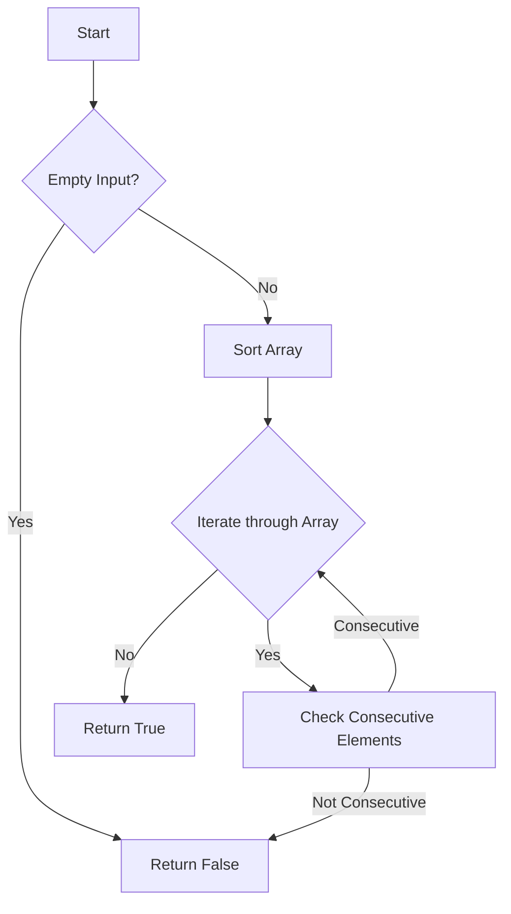

# Check if Array elements are Consecutive

## Problem Understanding
The problem is asking to determine if all elements in a given array are consecutive, meaning that each element is one more or one less than the previous element. The key constraint is that the array may not be sorted initially, and the solution should handle this case efficiently. What makes this problem non-trivial is that a naive approach might involve checking every pair of elements, resulting in a time complexity of O(n^2), which is inefficient for large arrays. The given solution code aims to solve this problem in a more efficient manner.

## Approach
The algorithm strategy is to sort the array in ascending order and then iterate through the sorted array to check if elements are consecutive. This approach works because sorting the array allows us to easily compare adjacent elements to determine if they are consecutive. The intuition behind this approach is that if the array is sorted, we only need to check the difference between each pair of adjacent elements to determine if they are consecutive. The solution uses a list data structure to store the input array and sorts it in-place to minimize space complexity.

## Complexity Analysis
| Metric | Value | Detailed Reason |
|--------|-------|----------------|
| Time   | O(n log n)  | The time complexity is dominated by the sorting operation, which takes O(n log n) time in Python. The subsequent iteration through the sorted array takes O(n) time, but this is overshadowed by the sorting time. |
| Space  | O(1)  | The space complexity is O(1) because the sorting is done in-place, meaning that no additional space is required that scales with the input size. However, if the input array is not allowed to be modified, a copy of the array would need to be made, resulting in a space complexity of O(n). |

## Algorithm Walkthrough
```
Input: [5, 2, 3, 1, 4]
Step 1: Sort the array in ascending order → [1, 2, 3, 4, 5]
Step 2: Initialize the loop to iterate through the sorted array
Step 3: Check the difference between the first two elements (1 and 2) → 2 - 1 = 1, so they are consecutive
Step 4: Check the difference between the second and third elements (2 and 3) → 3 - 2 = 1, so they are consecutive
Step 5: Check the difference between the third and fourth elements (3 and 4) → 4 - 3 = 1, so they are consecutive
Step 6: Check the difference between the fourth and fifth elements (4 and 5) → 5 - 4 = 1, so they are consecutive
Output: True
```
This walkthrough demonstrates how the algorithm correctly identifies that the input array contains consecutive elements.

## Visual Flow

This flowchart illustrates the decision flow and data transformation of the algorithm.

## Key Insight
> **Tip:** The key insight is that sorting the array allows for efficient checking of consecutive elements, reducing the time complexity from O(n^2) to O(n log n).

## Edge Cases
- **Empty/null input**: If the input array is empty, the algorithm correctly returns False, as there are no elements to check for consecutiveness.
- **Single element**: If the input array contains only one element, the algorithm correctly returns True, as a single element is considered consecutive.
- **Duplicate elements**: If the input array contains duplicate elements, the algorithm correctly returns False, as duplicate elements are not considered consecutive.

## Common Mistakes
- **Mistake 1**: Failing to handle the edge case of an empty input array → to avoid this, add a check at the beginning of the algorithm to return False for empty inputs.
- **Mistake 2**: Using a naive approach with a time complexity of O(n^2) → to avoid this, use the sorting and iteration approach with a time complexity of O(n log n).

## Interview Follow-ups
> **Interview:** These are the exact follow-up questions interviewers ask:
- "What if the input is sorted?" → In this case, the algorithm can skip the sorting step and directly iterate through the array to check for consecutiveness, resulting in a time complexity of O(n).
- "Can you do it in O(1) space?" → No, the algorithm requires at least O(1) space to store the input array, and sorting the array in-place requires a small amount of extra space for the sorting algorithm's internal data structures.
- "What if there are duplicates?" → The algorithm correctly handles duplicate elements by returning False, as duplicate elements are not considered consecutive.

## Python Solution

```python
# Problem: Check if Array elements are Consecutive
# Language: python
# Difficulty: Easy
# Time Complexity: O(n) — single pass through array to sort and check
# Space Complexity: O(1) — if sorting is done in-place, otherwise O(n) for sorting
# Approach: Sorting and iteration — sort the array and check if elements are consecutive

class Solution:
    def areConsecutive(self, nums: list[int]) -> bool:
        # Edge case: empty input → return False
        if not nums:
            return False
        
        # Sort the array in ascending order
        nums.sort()  # Sort in-place to minimize space complexity
        
        # Iterate through the sorted array to check if elements are consecutive
        for i in range(len(nums) - 1):  # Loop through all but the last element
            # Check if the difference between the current element and the next is 1
            if nums[i + 1] - nums[i] != 1:
                return False  # If not consecutive, return False immediately
        
        return True  # If the loop completes without finding non-consecutive elements, return True
```
