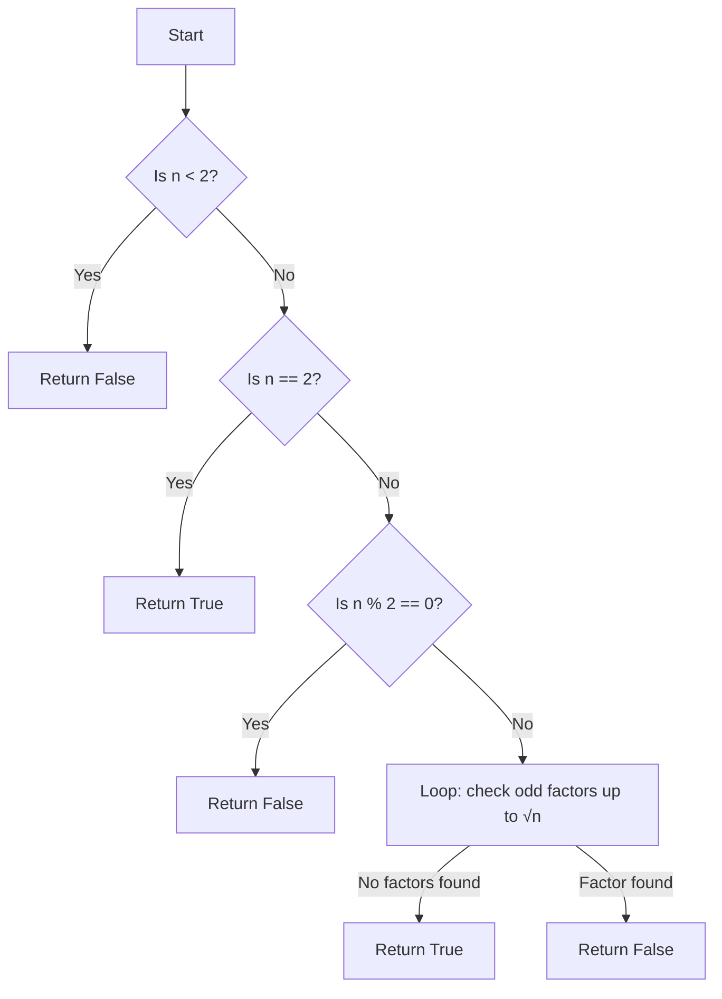

# Checking Prime Numbers

## Problem Understanding
The problem is asking to determine whether a given number is a prime number or not. A prime number is a natural number greater than 1 that has no positive divisors other than 1 and itself. The key constraint is that we need to check for primality efficiently, without using an excessive amount of time or space. What makes this problem non-trivial is that the naive approach of checking divisibility up to the given number itself is inefficient and can be improved by using a more optimized approach, such as checking divisibility up to the square root of the given number.

## Approach
The algorithm strategy used here is trial division, where we divide the given number by all numbers up to its square root to check for divisibility. This approach works because a larger factor of the number would be a multiple of a smaller factor that has already been checked. We use a simple loop to iterate through the numbers from 3 to the square root of the given number, incrementing by 2 to check only odd factors, since all other even numbers are not prime. The mathematical reasoning behind this approach is based on the fact that a composite number must have a factor less than or equal to its square root.

## Complexity Analysis
| Metric | Value | Detailed Reason |
|--------|-------|----------------|
| Time   | O(√n) | We only need to check divisibility up to the square root of the given number, which reduces the time complexity from O(n) to O(√n). The loop iterates over the range of numbers from 3 to the square root of n, incrementing by 2. |
| Space  | O(1)  | We are using a constant amount of space to store the variables, regardless of the input size. The space complexity is O(1) because we are not using any data structures that scale with the input size. |

## Algorithm Walkthrough
```
Input: 11
Step 1: Check if n < 2, which is False, so we proceed to the next step.
Step 2: Check if n == 2, which is False, so we proceed to the next step.
Step 3: Check if n % 2 == 0, which is False, so we proceed to the next step.
Step 4: Initialize the loop to check odd factors up to the square root of n.
  - i = 3, n % i != 0, so we increment i by 2.
  - i = 5, n % i != 0, so we increment i by 2.
  - i = 7, n % i != 0, so we increment i by 2, but i > √n, so we exit the loop.
Step 5: Since n is not divisible by any factor, we return True, indicating that n is a prime number.
Output: True
```

## Visual Flow


## Key Insight
> **Tip:** The key insight here is that we only need to check for divisibility up to the square root of the given number, which significantly reduces the time complexity of the algorithm.

## Edge Cases
- **Empty/null input**: This is not applicable in this case, as the input is expected to be an integer. However, if the input is None, the function would raise an error.
- **Single element**: If the input is 1, the function correctly returns False, as 1 is not a prime number.
- **Negative numbers**: If the input is a negative number, the function correctly returns False, as negative numbers are not prime numbers by definition.

## Common Mistakes
- **Mistake 1**: Not checking for edge cases, such as numbers less than 2, which would result in incorrect results.
- **Mistake 2**: Not using the optimized approach of checking divisibility up to the square root of the given number, which would result in inefficient code.

## Interview Follow-ups
> **Interview:** These are the exact follow-up questions interviewers ask:
- "What if the input is sorted?" → This would not affect the algorithm, as we are only checking for primality, not relying on the order of the input.
- "Can you do it in O(1) space?" → Yes, the current implementation already uses O(1) space, so this is not a concern.
- "What if there are duplicates?" → This is not applicable in this case, as we are only checking for primality of a single number, not a list of numbers.

## Python Solution

```python
# Problem: Checking Prime Numbers
# Language: python
# Difficulty: easy
# Time Complexity: O(sqrt(n)) — checking divisibility up to square root of n
# Space Complexity: O(1) — using constant space
# Approach: trial division — dividing by all numbers up to square root of n

class Solution:
    def isPrime(self, n: int) -> bool:
        # Edge case: numbers less than 2 are not prime
        if n < 2:
            return False
        
        # Edge case: 2 is the only even prime number
        if n == 2:
            return True
        
        # All other even numbers are not prime
        if n % 2 == 0:
            return False
        
        # Only need to check odd factors up to square root of n
        for i in range(3, int(n**0.5) + 1, 2):  # increment by 2 to check only odd factors
            # If n is divisible by any factor, it's not a prime number
            if n % i == 0:
                return False
        
        # If n is not divisible by any factor, it's a prime number
        return True

def main():
    solution = Solution()
    print(solution.isPrime(11))  # True
    print(solution.isPrime(15))  # False
    print(solution.isPrime(2))   # True
    print(solution.isPrime(1))   # False
    print(solution.isPrime(0))    # False
    print(solution.isPrime(-5))   # False

if __name__ == "__main__":
    main()
```
