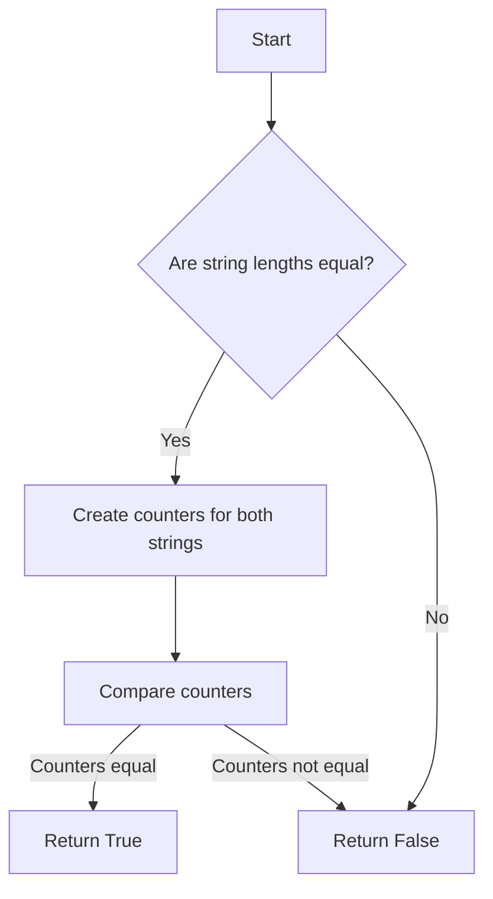

# Checking for Anagrams using Counter

## Problem Understanding
The problem is asking to determine if two given strings are anagrams of each other, meaning they contain the same characters with the same frequency, but possibly in a different order. A key constraint is that anagrams must have the same length, so strings of different lengths cannot be anagrams. This problem is non-trivial because a naive approach, such as comparing all possible permutations of one string against the other, would be inefficient. The problem requires an approach that efficiently compares the character frequencies between the two strings.

## Approach
The algorithm strategy used here is based on comparing the character frequencies between the two strings using the `Counter` class from the `collections` module. The intuition behind this approach is that if two strings are anagrams, they must have the same characters with the same frequency. By creating a counter for each string, which counts the frequency of each character, we can then compare these counters to determine if the strings are anagrams. This approach works because it effectively normalizes the order of characters, allowing for an efficient comparison of their frequencies. The `Counter` data structure is chosen because it provides a convenient way to count the frequency of characters in a string.

## Complexity Analysis
| Metric | Value | Detailed Reason |
|--------|-------|----------------|
| Time   | O(n)  | Creating the counters for both strings takes O(n) time, where n is the length of the strings. Comparing the two counters takes O(n) time in the worst case, when all characters are unique. Therefore, the overall time complexity is O(n) + O(n) = O(2n), which simplifies to O(n). |
| Space  | O(n)  | The counters store the frequency of each character in the strings, which can be at most n characters (when all characters are unique). Therefore, the space complexity is O(n). |

## Algorithm Walkthrough
```
Input: s = "listen", t = "silent"
Step 1: Check if the lengths of the strings are equal: len(s) == len(t) = True
Step 2: Create a counter for the first string: s_counter = Counter("listen") = {'l': 1, 'i': 1, 's': 1, 't': 1, 'e': 1, 'n': 1}
Step 3: Create a counter for the second string: t_counter = Counter("silent") = {'s': 1, 'i': 1, 'l': 1, 'e': 1, 'n': 1, 't': 1}
Step 4: Compare the two counters: s_counter == t_counter = True
Output: True
```
This example demonstrates how the algorithm correctly identifies "listen" and "silent" as anagrams.

## Visual Flow

This flowchart illustrates the decision-making process of the algorithm, including the edge case where the strings have different lengths.

## Key Insight
> **Tip:** The key insight is that comparing character frequencies between two strings using counters provides an efficient way to determine if they are anagrams, avoiding the need to compare all possible permutations.

## Edge Cases
- **Empty/null input**: If either string is empty or null, the algorithm will correctly return False, as empty or null strings cannot be anagrams of non-empty strings.
- **Single element**: If both strings have only one character, the algorithm will correctly return True if the characters are the same and False otherwise.
- **Strings with different lengths**: The algorithm correctly handles this case by returning False, as strings with different lengths cannot be anagrams.

## Common Mistakes
- **Mistake 1**: Not checking if the input strings have the same length before comparing their counters. This can lead to incorrect results if the strings have different lengths.
- **Mistake 2**: Not using a counter or similar data structure to compare character frequencies, instead trying to compare the strings directly. This can lead to inefficient algorithms with high time complexities.

## Interview Follow-ups
> **Interview:** 
- "What if the input is sorted?" → The algorithm would still work correctly, as the counters would still compare the character frequencies correctly, regardless of the order of the characters.
- "Can you do it in O(1) space?" → No, it's not possible to solve this problem in O(1) space, as we need to store the character frequencies in some data structure, which requires at least O(n) space.
- "What if there are duplicates?" → The algorithm handles duplicates correctly, as the counters will count the frequency of each character, including duplicates. This means that strings with different numbers of duplicates will be correctly identified as not being anagrams.

## Python Solution

```python
# Problem: Checking for Anagrams using Counter
# Language: python
# Difficulty: easy
# Time Complexity: O(n) — creating counters for both strings
# Space Complexity: O(n) — counters store frequency of characters
# Approach: Counter comparison — compare character frequencies between two strings

from collections import Counter

class Solution:
    def isAnagram(self, s: str, t: str) -> bool:
        # Edge case: strings of different lengths cannot be anagrams
        if len(s) != len(t):
            return False
        
        # Create a counter for the first string
        s_counter = Counter(s)  # count frequency of each character in s
        
        # Create a counter for the second string
        t_counter = Counter(t)  # count frequency of each character in t
        
        # Compare the two counters
        return s_counter == t_counter  # check if character frequencies match

    # Alternatively, we can directly compare the sorted strings
    def isAnagramAlternative(self, s: str, t: str) -> bool:
        # Edge case: strings of different lengths cannot be anagrams
        if len(s) != len(t):
            return False
        
        # Sort the characters in both strings and compare
        return sorted(s) == sorted(t)  # check if sorted characters match
```
