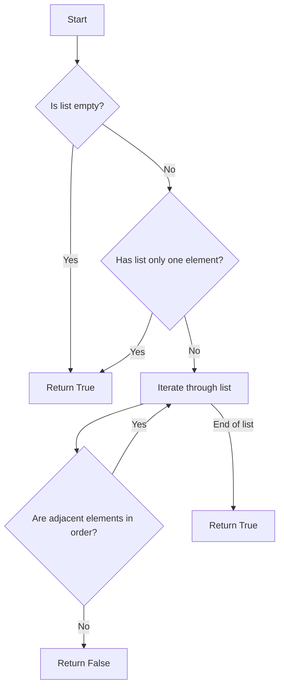

# Checking if List is Sorted

## Problem Understanding
The problem is asking to determine if a given list of integers is sorted in ascending order. The key constraint is that the solution should be efficient in terms of time and space complexity. What makes this problem non-trivial is that a naive approach, such as sorting the list and then comparing it to the original, would have a high time complexity due to the sorting operation. Additionally, the solution needs to handle edge cases such as empty lists, lists with a single element, and lists with duplicate elements.

## Approach
The algorithm strategy used here is an iterative comparison approach, where each pair of adjacent elements in the list is checked to ensure they are in order. This approach works because if any pair of adjacent elements is out of order, the entire list is not sorted. The intuition behind this approach is that a sorted list must satisfy the property that for any two adjacent elements, the first element is less than or equal to the second. The data structure used is simply the input list itself, as no additional data structures are needed to solve the problem. This approach handles key constraints such as empty lists and lists with a single element by explicitly checking for these cases and returning True, as these lists are considered sorted by definition.

## Complexity Analysis
| Metric | Value | Detailed Reason |
|--------|-------|----------------|
| Time   | O(n)  | The algorithm makes a single pass through the list, checking each pair of adjacent elements. The number of operations is directly proportional to the size of the input list, hence the linear time complexity. |
| Space  | O(1)  | The algorithm only uses a constant amount of space to store the loop variable and does not allocate any additional data structures that scale with the input size, hence the constant space complexity. |

## Algorithm Walkthrough
```
Input: [1, 2, 3, 4, 5]
Step 1: i = 0, nums[i] = 1, nums[i + 1] = 2, 1 <= 2, continue
Step 2: i = 1, nums[i] = 2, nums[i + 1] = 3, 2 <= 3, continue
Step 3: i = 2, nums[i] = 3, nums[i + 1] = 4, 3 <= 4, continue
Step 4: i = 3, nums[i] = 4, nums[i + 1] = 5, 4 <= 5, continue
Output: True
```
This walkthrough demonstrates how the algorithm iterates through the list, checking each pair of adjacent elements to determine if the list is sorted.

## Visual Flow

This flowchart illustrates the decision flow of the algorithm, including the handling of edge cases and the iterative comparison of adjacent elements.

## Key Insight
> **Tip:** The key insight to solving this problem efficiently is to recognize that a list is sorted if and only if each pair of adjacent elements is in order, allowing for a simple iterative comparison approach.

## Edge Cases
- **Empty/null input**: The algorithm returns True, as an empty list is considered sorted by definition.
- **Single element**: The algorithm returns True, as a list with a single element is considered sorted by definition.
- **List with duplicate elements**: The algorithm correctly handles lists with duplicate elements, as it checks for the condition that each element is less than or equal to the next, which allows for duplicates.

## Common Mistakes
- **Mistake 1**: Failing to handle edge cases such as empty lists or lists with a single element, which can lead to incorrect results or runtime errors.
- **Mistake 2**: Using a sorting algorithm to sort the list and then comparing it to the original, which would have a higher time complexity than necessary.

## Interview Follow-ups
> **Interview:** 
- "What if the input is sorted?" → The algorithm still works correctly and returns True, as it checks each pair of adjacent elements and finds them to be in order.
- "Can you do it in O(1) space?" → The algorithm already uses O(1) space, as it only uses a constant amount of space to store the loop variable and does not allocate any additional data structures.
- "What if there are duplicates?" → The algorithm correctly handles lists with duplicate elements, as it checks for the condition that each element is less than or equal to the next, which allows for duplicates.

## Python Solution

```python
# Problem: Checking if List is Sorted
# Language: python
# Difficulty: easy
# Time Complexity: O(n) — single pass through list
# Space Complexity: O(1) — only a constant amount of space is used
# Approach: iterative comparison — for each pair of adjacent elements, check if they are in order

class Solution:
    def is_sorted(self, nums: list[int]) -> bool:
        # Edge case: empty list → return True (considered sorted)
        if not nums:
            return True
        
        # Edge case: list with one element → return True (considered sorted)
        if len(nums) == 1:
            return True
        
        # Iterate over the list, checking each pair of adjacent elements
        for i in range(len(nums) - 1):  # -1 to avoid index out of range
            # If a pair of elements is out of order, return False
            if nums[i] > nums[i + 1]:
                return False
        
        # If the entire list is iterated over without finding any out of order pairs, return True
        return True

    def is_sorted_optimized(self, nums: list[int]) -> bool:
        # Use the built-in all() function with a generator expression to check if the list is sorted
        # This approach is more concise and arguably more "pythonic"
        return all(nums[i] <= nums[i + 1] for i in range(len(nums) - 1))  # all() returns True if all elements of the iterable are true

# Example usage:
solution = Solution()
print(solution.is_sorted([1, 2, 3, 4, 5]))  # True
print(solution.is_sorted([5, 4, 3, 2, 1]))  # False
print(solution.is_sorted([1]))  # True
print(solution.is_sorted([]))  # True
```
