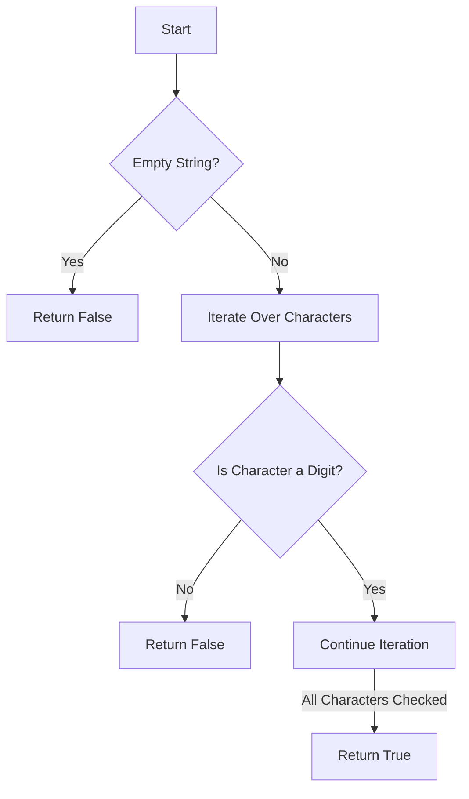

# Checking if String contains only Digits

## Problem Understanding
The problem asks to determine if a given string contains only digits. Key constraints include handling empty strings and strings with non-digit characters. What makes this problem non-trivial is the need to efficiently check each character in the string without using excessive resources, making a naive approach of checking every possible non-digit character inefficient. The problem requires a method to iterate through the string and verify the nature of each character.

## Approach
The algorithm strategy involves an iterator-based digit check, where each character in the string is examined to determine if it is a digit. This approach works because it leverages the built-in string method `isdigit()` to check if a character is a digit, ensuring accuracy and efficiency. The data structure used is the input string itself, which is iterated over directly, thus minimizing additional space usage. This approach handles key constraints by immediately returning `False` upon encountering a non-digit character, optimizing the process by potentially avoiding the need to check the entire string.

## Complexity Analysis
| Metric | Value | Detailed Reason |
|--------|-------|----------------|
| Time   | O(n)  | The algorithm iterates over the string once, where n is the length of the string. Each character is checked once using the `isdigit()` method, resulting in linear time complexity. |
| Space  | O(1)  | The algorithm uses a constant amount of space, as it only requires a fixed amount of space to store the input string reference and the loop variable, regardless of the input size. |

## Algorithm Walkthrough
```
Input: "12345"
Step 1: Initialize the loop to start checking each character in the string.
Step 2: Check the first character "1" using the `isdigit()` method, which returns True.
Step 3: Proceed to the next character "2" and check if it is a digit, which also returns True.
Step 4: Continue this process for all characters in the string ("3", "4", "5"), all of which are digits.
Output: True, because all characters in the string are digits.
```

## Visual Flow


## Key Insight
> **Tip:** The most important insight here is that using the `all()` function with a generator expression provides a concise and efficient way to check if all characters in a string are digits, leveraging Python's built-in functions for simplicity and readability.

## Edge Cases
- **Empty/null input**: If the input string is empty, the function immediately returns `False`, as there are no digits to check. This is handled by the initial `if not inputString` check.
- **Single element**: If the input string contains only a single character, the function checks if that character is a digit and returns `True` if it is, and `False` otherwise.
- **String with non-digit characters**: If the input string contains any non-digit characters, the function will return `False` as soon as it encounters the first non-digit character, thanks to the `if not char.isdigit()` condition.

## Common Mistakes
- **Mistake 1**: Not handling the edge case of an empty input string. To avoid this, always include a check at the beginning of the function to return `False` for empty strings.
- **Mistake 2**: Not using the `isdigit()` method correctly. To avoid this, ensure that `isdigit()` is called on each character individually, as it is a string method that checks if all characters in the string are digits.

## Interview Follow-ups
> **Interview:** Follow-up questions might include:
- "What if the input is sorted?" → This does not affect the algorithm since it checks each character individually regardless of the string's sorted status.
- "Can you do it in O(1) space?" → The current algorithm already achieves O(1) space complexity by only using a constant amount of space to store the loop variable and the input string reference.
- "What if there are duplicates?" → The presence of duplicate digits in the string does not affect the algorithm's functionality, as it checks each character individually and returns `True` only if all characters are digits.

## Python Solution

```python
# Problem: Checking if String contains only Digits
# Language: python
# Difficulty: easy
# Time Complexity: O(n) — single pass through string
# Space Complexity: O(1) — constant space used
# Approach: iterator-based digit check — for each character, check if it is a digit

class Solution:
    def containsOnlyDigits(self, inputString: str) -> bool:
        # Edge case: empty input → return False
        if not inputString:  
            return False
        
        # Iterate over each character in the string
        for char in inputString:  
            # Check if the character is not a digit
            if not char.isdigit():  # Using built-in string method to check if character is a digit
                return False  # If not a digit, return False immediately
        
        # If we've checked all characters and haven't returned False, the string contains only digits
        return True  # So, return True

    # Alternatively, using the all() function with a generator expression for a more concise solution
    def containsOnlyDigitsConcise(self, inputString: str) -> bool:
        # Edge case: empty input → return False
        if not inputString:  
            return False
        
        # Use all() function with a generator expression to check if all characters are digits
        return all(char.isdigit() for char in inputString)  # Returns True if all characters are digits, False otherwise
```
