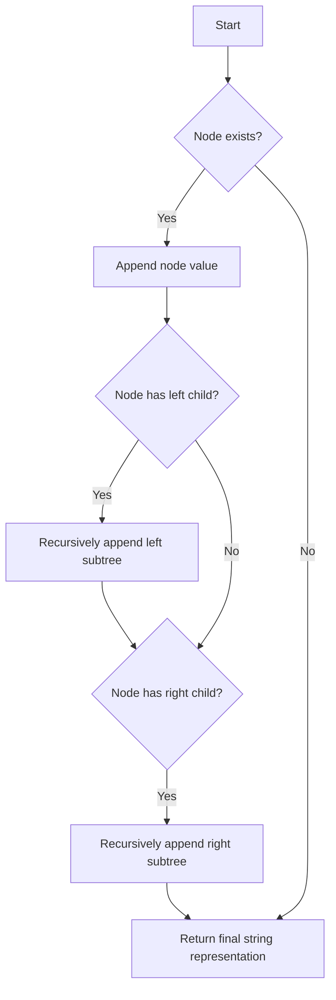

# Construct String from Binary Tree

## Problem Understanding
The problem asks us to construct a string representation of a binary tree, where each node's value is enclosed in parentheses if it has children. The key constraint is that if a node has a right child but no left child, we still need to append an empty left subtree. This problem is non-trivial because a naive approach might not handle the case where a node has a right child but no left child correctly. The problem requires a recursive approach to traverse the tree and construct the string representation.

## Approach
The algorithm strategy is to use recursive tree traversal to construct the string representation of the binary tree. The intuition behind this approach is to start with the root node's value and then recursively append the string representations of its left and right subtrees. We use a recursive function to traverse the tree, and we use string concatenation to build the final string representation. The approach handles the key constraint by checking if a node has a left child before appending its string representation, and if not, appending an empty left subtree if the node has a right child.

## Complexity Analysis
| Metric | Value | Detailed Reason |
|--------|-------|----------------|
| Time   | O(n)  | We visit each node exactly once, where n is the number of nodes in the tree. The recursive function calls are proportional to the number of nodes, resulting in a linear time complexity. |
| Space  | O(n)  | The maximum depth of the recursive call stack is equal to the height of the tree, which can be n in the worst case (when the tree is skewed). Additionally, we store the string representation of the tree, which can also be of length n. |

## Algorithm Walkthrough
```
Input: 
    1
   / \
  2   3
   \
    4
Step 1: Start with the root node's value: "1"
Step 2: Recursively append the left subtree's string representation: "1(2(4)())"
Step 3: Recursively append the right subtree's string representation: "1(2(4)())(3)"
Output: "1(2(4))(3)"
```
This example demonstrates how the algorithm constructs the string representation of a binary tree.

## Visual Flow

This flowchart illustrates the decision flow of the algorithm.

## Key Insight
> **Tip:** The key insight is to handle the case where a node has a right child but no left child by appending an empty left subtree, ensuring the correct string representation of the binary tree.

## Edge Cases
- **Empty/null input**: If the input tree is empty, the algorithm returns an empty string. This is because the base case of the recursive function checks if the node exists, and if not, returns an empty string.
- **Single element**: If the input tree has only one node, the algorithm returns the node's value as a string. This is because the recursive function starts with the root node's value and does not append any subtrees.
- **Tree with only left children**: If the input tree has only left children, the algorithm correctly constructs the string representation by recursively appending the left subtrees.

## Common Mistakes
- **Mistake 1**: Not handling the case where a node has a right child but no left child, resulting in incorrect string representation. → To avoid this, always check if a node has a left child before appending its string representation, and if not, append an empty left subtree if the node has a right child.
- **Mistake 2**: Not using recursive function calls to traverse the tree, resulting in incorrect string representation. → To avoid this, use recursive function calls to traverse the tree and construct the string representation.

## Interview Follow-ups
> **Interview:** These are the exact follow-up questions interviewers ask:
- "What if the input is sorted?" → The algorithm does not assume any specific ordering of the input tree, so it will still work correctly even if the input is sorted.
- "Can you do it in O(1) space?" → No, the algorithm requires O(n) space to store the string representation of the tree, where n is the number of nodes in the tree.
- "What if there are duplicates?" → The algorithm does not assume any uniqueness of node values, so it will still work correctly even if there are duplicates in the input tree.

## Python Solution

```python
# Problem: Construct String from Binary Tree
# Language: python
# Difficulty: Easy
# Time Complexity: O(n) — visiting each node exactly once
# Space Complexity: O(n) — string representation of the tree
# Approach: Recursive tree traversal — traversing the tree and appending node values to the result string

class TreeNode:
    def __init__(self, x):
        self.val = x
        self.left = None
        self.right = None

class Solution:
    def tree2str(self, root: TreeNode) -> str:
        # Base case: empty tree → return empty string
        if not root:
            return ""
        
        # Start with the root node's value
        result = str(root.val)
        
        # If the node has a left child, recursively append its string representation
        if root.left:
            # Append the left subtree's string representation enclosed in parentheses
            result += "(" + self.tree2str(root.left) + ")"
        
        # If the node has a right child, recursively append its string representation
        if root.right:
            # If the node doesn't have a left child, we still need to append an empty left subtree
            if not root.left:
                result += "()"
            # Append the right subtree's string representation enclosed in parentheses
            result += "(" + self.tree2str(root.right) + ")"
        
        # Return the final string representation of the tree
        return result
```
