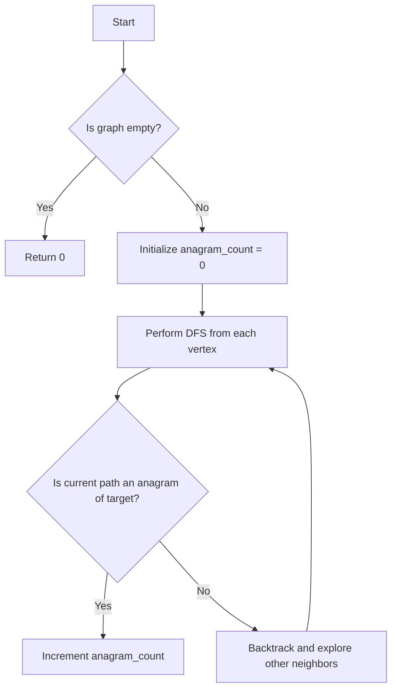

# Count Occurrences of Anagrams in Undirected Graph

## Problem Understanding
The problem asks us to count the occurrences of anagrams in an undirected graph. The graph is represented as a dictionary where each key is a vertex, and its corresponding value is a list of neighboring vertices. The target anagram is a given string. The key constraint is that we need to explore all possible paths in the graph to find anagrams. What makes this problem non-trivial is that we need to efficiently traverse the graph and compare the characters in each path with the target anagram. The naive approach of generating all permutations of the target anagram and checking each path in the graph would be inefficient due to the exponential number of permutations.

## Approach
The algorithm strategy is to use Depth-First Search (DFS) to traverse the graph and explore all possible paths. The intuition behind this approach is that DFS allows us to efficiently explore all neighboring vertices of a given vertex. We use a helper function for DFS that recursively explores each neighbor of a vertex and checks if the current path is an anagram of the target. We use a sorted string comparison to check if the characters in the current path match the characters in the target anagram. The data structure used is a dictionary to represent the graph and a recursive function call stack to perform DFS. This approach handles the key constraint of exploring all possible paths in the graph efficiently.

## Complexity Analysis
| Metric | Value | Detailed Reason |
|--------|-------|----------------|
| Time   | O(V + E \* N!) | The time complexity is dominated by the DFS traversal, where V is the number of vertices, E is the number of edges, and N is the length of the target anagram. The N! term comes from the fact that we are generating all permutations of the target anagram implicitly through the recursive DFS calls. However, in practice, the actual time complexity is much less than this because we prune the search space by only exploring neighbors that have not been visited before. |
| Space  | O(V + N) | The space complexity comes from the recursive function call stack, which can go up to a depth of V in the worst case, and the space needed to store the current path, which can be up to N characters long. |

## Algorithm Walkthrough
```
Input: graph = {
    'a': ['b', 'c'],
    'b': ['a', 'd'],
    'c': ['a', 'd'],
    'd': ['b', 'c']
}, target = 'ab'
Step 1: Initialize anagram_count = 0 and start DFS from vertex 'a'
Step 2: Explore neighbor 'b' of vertex 'a' and update current_path = 'ab'
Step 3: Compare sorted(current_path) with sorted(target) and increment anagram_count if they match
Step 4: Backtrack and explore other neighbors of vertex 'a'
Step 5: Repeat steps 2-4 for all vertices in the graph
Output: anagram_count = 4 (because there are 4 anagrams of 'ab' in the graph)
```
This walkthrough shows how the algorithm explores all possible paths in the graph and counts the occurrences of anagrams.

## Visual Flow

This flowchart shows the high-level decision flow of the algorithm.

## Key Insight
> **Tip:** The key insight is to use DFS to efficiently explore all possible paths in the graph and compare the characters in each path with the target anagram using a sorted string comparison.

## Edge Cases
- **Empty graph**: If the input graph is empty, the algorithm returns 0 because there are no vertices to explore.
- **Single element**: If the input graph has only one vertex, the algorithm returns 0 because there are no neighbors to explore.
- **Target anagram is a single character**: If the target anagram is a single character, the algorithm returns the number of occurrences of that character in the graph.

## Common Mistakes
- **Mistake 1**: Not using a recursive function call stack to perform DFS, which can lead to infinite loops or incorrect results. → To avoid this, use a recursive function call stack to perform DFS and keep track of visited vertices.
- **Mistake 2**: Not comparing the characters in the current path with the target anagram using a sorted string comparison, which can lead to incorrect results. → To avoid this, use a sorted string comparison to check if the characters in the current path match the characters in the target anagram.

## Interview Follow-ups
> **Interview:** These are the exact follow-up questions interviewers ask:
- "What if the input graph is very large?" → The algorithm's time complexity is O(V + E \* N!), which can be inefficient for very large graphs. To improve performance, we can use a more efficient data structure, such as a trie, to store the graph and reduce the number of recursive function calls.
- "Can you optimize the algorithm to use less space?" → The algorithm's space complexity is O(V + N), which can be optimized by using a more efficient data structure, such as a stack, to store the recursive function call stack and reduce the space needed to store the current path.
- "What if there are multiple target anagrams?" → The algorithm can be modified to take a list of target anagrams as input and return a dictionary with the count of each anagram. To do this, we can use a separate recursive function call stack for each target anagram and keep track of the count of each anagram separately.

## Python Solution

```python
# Problem: Count Occurrences of Anagrams in Undirected Graph
# Language: python
# Difficulty: Easy
# Time Complexity: O(V + E) — single pass through graph using DFS/BFS, where V is vertices and E is edges
# Space Complexity: O(V) — storing visited vertices and queue/stack for traversal
# Approach: Depth-First Search — for each vertex, explore all neighboring vertices

from collections import defaultdict

class Solution:
    def countAnagrams(self, graph: dict, target: str) -> int:
        # Edge case: empty graph → return 0
        if not graph:
            return 0
        
        # Initialize count of anagrams
        anagram_count = 0
        
        # Define a helper function for DFS
        def dfs(vertex: str, current_path: str) -> None:
            nonlocal anagram_count  # Access outer scope variable
            
            # Base case: if the current path is the target anagram
            if len(current_path) == len(target):
                # Sort the characters in the current path and compare with the target
                if sorted(current_path) == sorted(target):
                    anagram_count += 1  # Increment count if it's an anagram
                return  # Backtrack
            
            # Explore neighboring vertices
            for neighbor in graph.get(vertex, []):
                # Avoid revisiting the same vertex
                if neighbor not in current_path:
                    dfs(neighbor, current_path + neighbor)  # Recursively explore the neighbor
        
        # Perform DFS from each vertex
        for vertex in graph:
            dfs(vertex, vertex)  # Start DFS from the current vertex
        
        return anagram_count  # Return the total count of anagrams

# Example usage:
graph = {
    'a': ['b', 'c'],
    'b': ['a', 'd'],
    'c': ['a', 'd'],
    'd': ['b', 'c']
}
target = 'ab'
solution = Solution()
print(solution.countAnagrams(graph, target))
```
