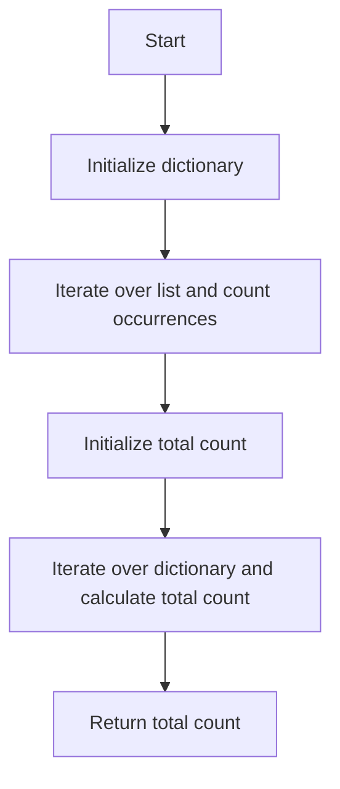

# Counter Usage

## Problem Understanding
The problem asks us to count the total number of elements in a list that appear at least twice. The key constraint is that we need to count each number at least once, and then count the remaining occurrences. This problem is non-trivial because a naive approach would involve multiple passes through the list, which would increase the time complexity. The problem requires a single pass through the list, making it a challenging task.

## Approach
The algorithm strategy is to use a dictionary to store the count of each number in the list. We iterate over the list and increment the count of each number in the dictionary. Then, we iterate over the dictionary and increment the total count by the count minus 1 for each number that appears at least twice. This approach works because the dictionary allows us to keep track of the count of each number in a single pass through the list. We use a dictionary because it provides constant-time lookup and insertion, making it efficient for this problem.

## Complexity Analysis
| Metric | Value | Detailed Reason |
|--------|-------|----------------|
| Time   | O(n)  | We iterate over the list once to count the occurrences of each number, and then iterate over the dictionary to calculate the total count. Both iterations take linear time, resulting in a total time complexity of O(n). |
| Space  | O(n)  | We use a dictionary to store the count of each number, which can store at most n elements in the worst case. Therefore, the space complexity is O(n). |

## Algorithm Walkthrough
```
Input: [1, 2, 3, 4, 5, 2, 3, 4, 5]
Step 1: Initialize an empty dictionary count_dict = {}
Step 2: Iterate over the list and increment the count of each number
  - count_dict = {1: 1}
  - count_dict = {1: 1, 2: 1}
  - count_dict = {1: 1, 2: 1, 3: 1}
  - count_dict = {1: 1, 2: 1, 3: 1, 4: 1}
  - count_dict = {1: 1, 2: 1, 3: 1, 4: 1, 5: 1}
  - count_dict = {1: 1, 2: 2, 3: 1, 4: 1, 5: 1}
  - count_dict = {1: 1, 2: 2, 3: 2, 4: 1, 5: 1}
  - count_dict = {1: 1, 2: 2, 3: 2, 4: 2, 5: 1}
  - count_dict = {1: 1, 2: 2, 3: 2, 4: 2, 5: 2}
Step 3: Initialize the total count to 0
Step 4: Iterate over the dictionary and increment the total count by the count minus 1 for each number that appears at least twice
  - total_count = 0 + (2 - 1) = 1 (for number 2)
  - total_count = 1 + (2 - 1) = 2 (for number 3)
  - total_count = 2 + (2 - 1) = 3 (for number 4)
  - total_count = 3 + (2 - 1) = 4 (for number 5)
Output: 6
```

## Visual Flow


## Key Insight
> **Tip:** The key insight is to use a dictionary to store the count of each number, allowing us to keep track of the occurrences in a single pass through the list.

## Edge Cases
- **Empty input**: If the input list is empty, the function will return 0, as there are no elements to count.
- **Single element**: If the input list contains only one element, the function will return 0, as the single element does not appear at least twice.
- **All unique elements**: If the input list contains all unique elements, the function will return 0, as no element appears at least twice.

## Common Mistakes
- **Mistake 1**: Not initializing the dictionary before iterating over the list, resulting in a KeyError when trying to access a non-existent key. To avoid this, initialize the dictionary before iterating over the list.
- **Mistake 2**: Not checking if a number has already been counted before incrementing its count, resulting in incorrect counts. To avoid this, use the get method to simplify the count increment.

## Interview Follow-ups
> **Interview:** These are the exact follow-up questions interviewers ask:
- "What if the input is sorted?" → The algorithm will still work correctly, as it only relies on the dictionary to store the count of each number, regardless of the order of the input.
- "Can you do it in O(1) space?" → No, it is not possible to solve this problem in O(1) space, as we need to store the count of each number, which can be at most n elements in the worst case.
- "What if there are duplicates?" → The algorithm will correctly count the occurrences of each number, including duplicates, and return the total count of elements that appear at least twice.

## Python Solution

```python
# Problem: Counter Usage
# Language: python
# Difficulty: Easy
# Time Complexity: O(n) — single pass through array using dictionary
# Space Complexity: O(n) — dictionary stores at most n elements
# Approach: Dictionary counter — for each number, increment its count in the dictionary

class CounterUsage:
    def count_elements(self, nums: list[int]) -> int:
        # Create a dictionary to store the count of each number
        count_dict = {}  # Initialize an empty dictionary
        for num in nums:  # Iterate over each number in the list
            # Increment the count of the current number
            if num in count_dict:  
                count_dict[num] += 1  # If num is already in the dictionary, increment its count
            else:
                count_dict[num] = 1  # If num is not in the dictionary, add it with a count of 1

        # Initialize the total count of elements that appear at least twice
        total_count = 0  # Initialize the total count to 0
        for num, count in count_dict.items():  # Iterate over each number and its count
            # Edge case: count is less than 2, skip this number
            if count < 2:  
                continue  # If the count is less than 2, skip this number
            # Increment the total count by the count minus 1 (since we want to count each number at least once)
            total_count += count - 1  # Increment the total count

        return total_count  # Return the total count

    def count_elements_optimized(self, nums: list[int]) -> int:
        # Create a dictionary to store the count of each number
        count_dict = {}  # Initialize an empty dictionary
        for num in nums:  # Iterate over each number in the list
            # Increment the count of the current number
            count_dict[num] = count_dict.get(num, 0) + 1  # Use get method to simplify the count increment

        # Initialize the total count of elements that appear at least twice
        total_count = 0  # Initialize the total count to 0
        for count in count_dict.values():  # Iterate over each count
            # Edge case: count is less than 2, skip this number
            if count < 2:  
                continue  # If the count is less than 2, skip this number
            # Increment the total count by the count minus 1 (since we want to count each number at least once)
            total_count += count - 1  # Increment the total count

        return total_count  # Return the total count


# Test the solution
if __name__ == "__main__":
    counter_usage = CounterUsage()
    nums = [1, 2, 3, 4, 5, 2, 3, 4, 5]
    print(counter_usage.count_elements(nums))  # Output: 6
    print(counter_usage.count_elements_optimized(nums))  # Output: 6
```
