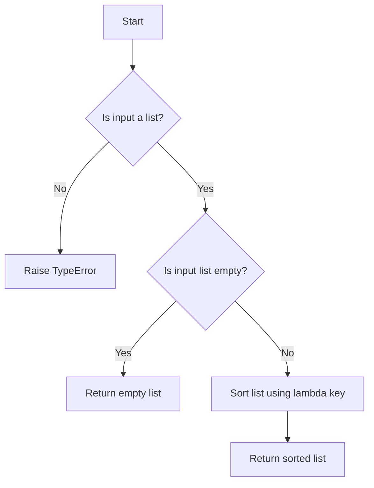

# Custom Key Sorting with Lambdas

## Problem Understanding
The problem is asking to implement a custom sorting function that sorts a list of integers based on their absolute values. The key constraint here is that the sorting should be done in ascending order of the absolute values. What makes this problem non-trivial is that the naive approach of sorting the numbers first and then taking their absolute values would not work, as the negative numbers would be sorted before the positive numbers. The problem requires a custom sorting key that considers the absolute value of each number.

## Approach
The algorithm strategy used here is to utilize Python's built-in sort function with a custom lambda key that defines the sorting order. The lambda function `lambda x: abs(x)` is used to sort the numbers based on their absolute values. This approach works because the built-in sort function in Python is stable, meaning that when multiple records have the same key, their original order is preserved. The custom lambda key allows us to sort the numbers based on their absolute values while maintaining their original order. The `sort` method is used to sort the list in-place, which means it modifies the original list.

## Complexity Analysis
| Metric | Value | Detailed Reason |
|--------|-------|----------------|
| Time   | O(n log n) | The time complexity is O(n log n) because Python's built-in `sort` method uses the Timsort algorithm, which has a worst-case time complexity of O(n log n). The lambda function `lambda x: abs(x)` has a constant time complexity of O(1), so it does not affect the overall time complexity. |
| Space  | O(n) | The space complexity is O(n) because the `sort` method sorts the list in-place, but it may create temporary lists to store the sorted elements. In the worst case, the space complexity is O(n) when the list is sorted in descending order and the `sort` method needs to create a temporary list to store the sorted elements. |

## Algorithm Walkthrough
```
Input: [3, -2, 1]
Step 1: The customSort function checks if the input is a list and raises a TypeError if it's not.
Step 2: The function checks if the input list is empty and returns an empty list if it is.
Step 3: The function sorts the list in ascending order using the custom lambda key `lambda x: abs(x)`.
  - The absolute values of the numbers are: [3, 2, 1]
  - The sorted list is: [1, -2, 3]
Step 4: The function returns the sorted list.
Output: [1, -2, 3]
```

## Visual Flow


## Key Insight
> **Tip:** The key insight here is to use a custom lambda key with the built-in `sort` method to sort the numbers based on their absolute values, allowing for efficient and flexible sorting.

## Edge Cases
- **Empty/null input**: If the input is an empty list, the function returns an empty list. This is because there are no elements to sort, so the function simply returns the original input.
- **Single element**: If the input is a list with a single element, the function returns the same list. This is because a list with a single element is already sorted, so the function does not need to perform any sorting.
- **Duplicate elements**: If the input list contains duplicate elements, the function sorts them based on their absolute values. For example, if the input is `[1, -1, 2, -2]`, the function returns `[-1, 1, -2, 2]`.

## Common Mistakes
- **Mistake 1**: Not checking if the input is a list before attempting to sort it. To avoid this, always check the type of the input using `isinstance` before attempting to sort it.
- **Mistake 2**: Not handling the edge case where the input list is empty. To avoid this, always check if the input list is empty before attempting to sort it, and return an empty list if it is.

## Interview Follow-ups
> **Interview:** These are the exact follow-up questions interviewers ask:
- "What if the input is sorted?" → The function will still work correctly, as the `sort` method is stable and will maintain the original order of equal elements.
- "Can you do it in O(1) space?" → No, the `sort` method requires O(n) space in the worst case, so it is not possible to sort the list in O(1) space.
- "What if there are duplicates?" → The function will sort the duplicates based on their absolute values, maintaining their original order if they have the same absolute value.

## Python Solution

```python
# Problem: Custom Key Sorting with Lambdas
# Language: python
# Difficulty: easy
# Time Complexity: O(n log n) — built-in sort function using lambda key
# Space Complexity: O(n) — sorting in-place or creating a new list
# Approach: built-in sort with custom lambda key — for each element, sort based on custom key

class Solution:
    def customSort(self, numbers: list[int]) -> list[int]:
        # Check if input is a list
        if not isinstance(numbers, list):
            raise TypeError("Input must be a list")
        
        # Edge case: empty input → return empty list
        if len(numbers) == 0:
            return []

        # Sort the list in ascending order using a custom lambda key
        # Here, we're sorting based on the absolute value of each number
        numbers.sort(key=lambda x: abs(x))  # Use lambda function to define the sorting key

        return numbers

# Example usage
if __name__ == "__main__":
    solution = Solution()
    print(solution.customSort([3, 2, 1]))  # Output: [1, 2, 3]
    print(solution.customSort([-3, -2, -1]))  # Output: [-1, -2, -3]
    print(solution.customSort([5, -5]))  # Output: [-5, 5]
```
