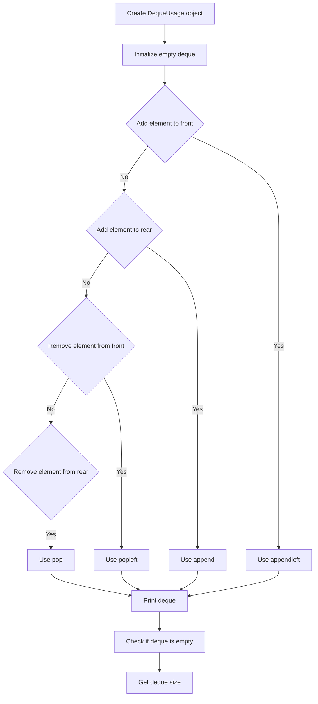

# Deque Usage

## Problem Understanding
The problem is asking to demonstrate the usage of a deque data structure in Python, showcasing its basic operations such as adding and removing elements from both the front and rear, checking if the deque is empty, and getting its size. The key constraint is that all operations should be performed efficiently, with the deque operations being constant time. This problem is non-trivial because it requires understanding the properties and methods of the deque data structure, and how to utilize them to implement the required operations.

## Approach
The algorithm strategy is to utilize the deque class from the collections module in Python, which provides an efficient implementation of a double-ended queue. The intuition behind this approach is to leverage the built-in methods of the deque class, such as appendleft, append, popleft, and pop, to perform the required operations. The deque data structure is chosen because it allows for efficient addition and removal of elements from both ends. The approach handles the key constraints by using the deque's built-in methods, which operate in constant time.

## Complexity Analysis
| Metric | Value | Detailed Reason |
|--------|-------|----------------|
| Time   | O(1)  | The deque operations (add_front, add_rear, remove_front, remove_rear) all use the built-in methods of the deque class, which operate in constant time. The is_empty and size methods also operate in constant time because they only check the length of the deque. |
| Space  | O(n)  | The deque stores at most n elements, where n is the number of elements added to the deque. The space complexity is linear because the deque's size grows with the number of elements added. |

## Algorithm Walkthrough
```
Input: Create a new DequeUsage object
Step 1: Initialize an empty deque (self.deque = deque())
Step 2: Add an element to the front of the deque (add_front(1))
    - self.deque = deque([1])
Step 3: Add an element to the rear of the deque (add_rear(2))
    - self.deque = deque([1, 2])
Step 4: Add an element to the front of the deque (add_front(0))
    - self.deque = deque([0, 1, 2])
Step 5: Print the deque
    - Output: deque([0, 1, 2])
Step 6: Remove an element from the front of the deque (remove_front())
    - self.deque = deque([1, 2])
    - Output: 0
Step 7: Print the deque
    - Output: deque([1, 2])
Step 8: Remove an element from the rear of the deque (remove_rear())
    - self.deque = deque([1])
    - Output: 2
Step 9: Print the deque
    - Output: deque([1])
```
## Visual Flow

## Key Insight
> **Tip:** The deque data structure provides efficient addition and removal of elements from both ends, making it ideal for implementing a double-ended queue.

## Edge Cases
- **Empty/null input**: If the input is empty or null, the deque will be initialized as an empty deque. The is_empty method will return True, and the size method will return 0.
- **Single element**: If the input contains a single element, the deque will contain only that element. The remove_front and remove_rear methods will return that element, and the is_empty method will return True after removal.
- **Duplicate elements**: If the input contains duplicate elements, the deque will store all elements. The remove_front and remove_rear methods will return the correct elements, even if they are duplicates.

## Common Mistakes
- **Mistake 1**: Not checking if the deque is empty before removing an element, which can lead to an IndexError. To avoid this, always check if the deque is empty using the is_empty method before removing an element.
- **Mistake 2**: Not using the correct methods to add and remove elements from the deque. To avoid this, use the appendleft and append methods to add elements to the front and rear of the deque, respectively, and use the popleft and pop methods to remove elements from the front and rear of the deque, respectively.

## Interview Follow-ups
> **Interview:** These are the exact follow-up questions interviewers ask:
- "What if the input is sorted?" → The deque operations will still work correctly, but the sorted order may not be maintained after adding or removing elements.
- "Can you do it in O(1) space?" → No, because the deque stores at most n elements, where n is the number of elements added to the deque. The space complexity is linear.
- "What if there are duplicates?" → The deque will store all elements, including duplicates. The remove_front and remove_rear methods will return the correct elements, even if they are duplicates.

## Python Solution

```python
# Problem: Deque Usage
# Language: python
# Difficulty: Easy
# Time Complexity: O(1) — constant time for deque operations
# Space Complexity: O(n) — deque stores at most n elements
# Approach: Deque implementation — demonstrating basic deque operations

from collections import deque

class DequeUsage:
    def __init__(self):
        # Initialize an empty deque
        self.deque = deque()

    def add_front(self, item):
        # Add an item to the front of the deque
        self.deque.appendleft(item)  # using appendleft to add to the front

    def add_rear(self, item):
        # Add an item to the rear of the deque
        self.deque.append(item)  # using append to add to the rear

    def remove_front(self):
        # Remove an item from the front of the deque
        if self.is_empty():  # Edge case: empty deque
            return -1
        return self.deque.popleft()  # using popleft to remove from the front

    def remove_rear(self):
        # Remove an item from the rear of the deque
        if self.is_empty():  # Edge case: empty deque
            return -1
        return self.deque.pop()  # using pop to remove from the rear

    def is_empty(self):
        # Check if the deque is empty
        return len(self.deque) == 0  # checking length of deque

    def size(self):
        # Get the size of the deque
        return len(self.deque)  # returning length of deque

    def print_deque(self):
        # Print the elements of the deque
        print(self.deque)  # printing deque elements

# Example usage:
deque_usage = DequeUsage()
deque_usage.add_front(1)
deque_usage.add_rear(2)
deque_usage.add_front(0)
deque_usage.print_deque()  # Output: deque([0, 1, 2])
print(deque_usage.remove_front())  # Output: 0
deque_usage.print_deque()  # Output: deque([1, 2])
print(deque_usage.remove_rear())  # Output: 2
deque_usage.print_deque()  # Output: deque([1])
```
