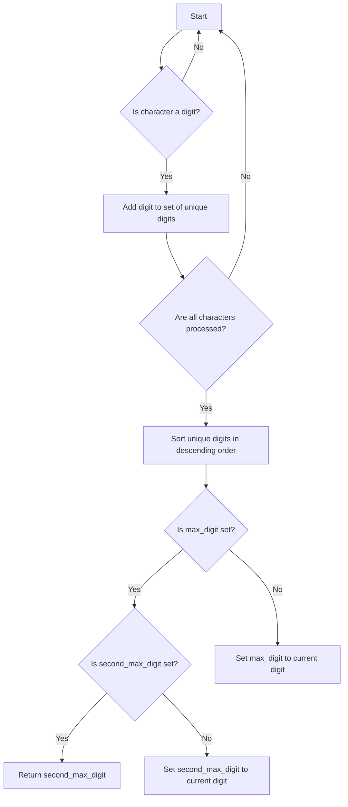

# Find Second Largest

## Problem Understanding
The problem is asking to find the second largest digit in a given string. The key constraint is that the string can contain non-digit characters, and there may be duplicate digits. The problem becomes non-trivial because a naive approach would involve sorting the entire string, which would have a time complexity of O(n log n), whereas we need to achieve a time complexity of O(n). The presence of non-digit characters and duplicate digits requires a careful approach to ensure that we only consider unique digits and find the second largest among them.

## Approach
The algorithm strategy is to make a single pass through the string to find unique digits and then iterate over the unique digits in descending order to find the second largest digit. The intuition behind this approach is to first eliminate non-digit characters and duplicates, and then find the second largest digit by iterating over the unique digits in descending order. We use a set to store unique digits, which automatically eliminates duplicates. We also use two variables, `max_digit` and `second_max_digit`, to keep track of the largest and second largest digits seen so far.

## Complexity Analysis
| Metric | Value | Detailed Reason |
|--------|-------|----------------|
| Time   | O(n)  | We make a single pass through the string to find unique digits, which takes O(n) time. Then, we iterate over the unique digits in descending order, which takes O(k log k) time in the worst case, where k is the number of unique digits. However, since k <= n, the overall time complexity is O(n) + O(k log k) = O(n). |
| Space  | O(n)  | We use a set to store unique digits, which can store up to n digits in the worst case. Therefore, the space complexity is O(n). |

## Algorithm Walkthrough
```
Input: s = "abc111222"
Step 1: Initialize max_digit = -1, second_max_digit = -1, and unique_digits = set()
Step 2: Iterate over the string and find unique digits: unique_digits = {1, 2}
Step 3: Check if there are less than 2 unique digits: len(unique_digits) = 2, so we proceed
Step 4: Iterate over the unique digits in descending order: [2, 1]
Step 5: Set max_digit = 2, and then set second_max_digit = 1
Step 6: Return second_max_digit = 1
Output: 1
```

## Visual Flow


## Key Insight
> **Tip:** The key insight is to use a set to store unique digits, which automatically eliminates duplicates and allows us to find the second largest digit in a single pass.

## Edge Cases
- **Empty string**: If the input string is empty, the function will return -1, which is the correct behavior.
- **Single digit**: If the input string contains only one digit, the function will return -1, which is the correct behavior.
- **No digits**: If the input string contains no digits, the function will return -1, which is the correct behavior.

## Common Mistakes
- **Mistake 1**: Forgetting to handle non-digit characters in the input string → Use the `isdigit()` method to check if a character is a digit.
- **Mistake 2**: Not using a set to store unique digits → Using a set automatically eliminates duplicates and makes it easier to find the second largest digit.

## Interview Follow-ups
> **Interview:** These are the exact follow-up questions interviewers ask:
- "What if the input string is very large?" → We can still use the same approach, as the time complexity is O(n), which is linear with respect to the size of the input string.
- "Can you do it in O(1) space?" → No, we need to use a set to store unique digits, which requires O(n) space in the worst case.
- "What if there are duplicates?" → We use a set to store unique digits, which automatically eliminates duplicates.

## Python Solution

```python
# Problem: Find Second Largest
# Language: python
# Difficulty: easy
# Time Complexity: O(n) — single pass through array to find maximum and second maximum
# Space Complexity: O(1) — constant space used to store maximum and second maximum
# Approach: single pass through array to find maximum and second maximum — keep track of the largest and second largest numbers seen so far

class Solution:
    def secondHighest(self, s: str) -> int:
        # Initialize variables to store the maximum and second maximum digits
        max_digit = -1  # initialize with -1 to handle edge case: no digits in string
        second_max_digit = -1  # initialize with -1 to handle edge case: only one digit in string
        
        # Create a set to store unique digits
        unique_digits = set()  # use a set to automatically eliminate duplicates
        
        # Iterate over the string to find unique digits
        for char in s:  # iterate over each character in the string
            if char.isdigit():  # check if the character is a digit
                unique_digits.add(int(char))  # add the digit to the set of unique digits
        
        # Check if there are less than 2 unique digits
        if len(unique_digits) < 2:  # edge case: less than 2 unique digits
            return -1  # return -1 as per problem statement
        
        # Iterate over the unique digits in descending order
        for digit in sorted(unique_digits, reverse=True):  # iterate over unique digits in descending order
            if max_digit == -1:  # if max_digit is not yet set
                max_digit = digit  # set max_digit to the current digit
            elif second_max_digit == -1:  # if second_max_digit is not yet set
                second_max_digit = digit  # set second_max_digit to the current digit
                break  # break the loop as we have found the second largest digit
        
        # Return the second largest digit
        return second_max_digit  # return the second largest digit
```
