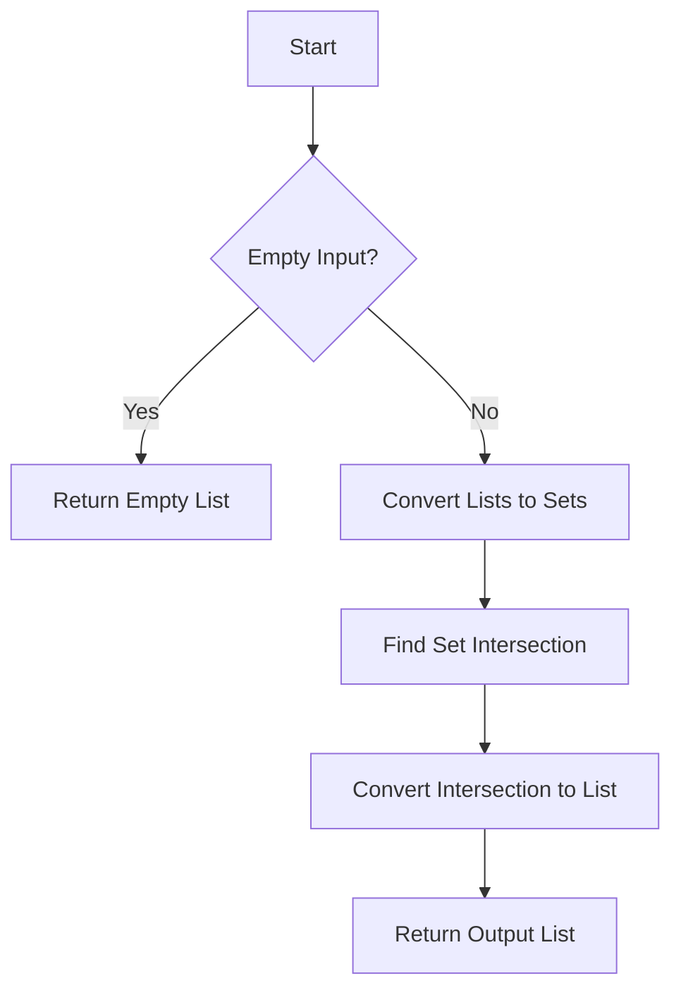

# Finding List Intersection

## Problem Understanding
The problem is asking to find the intersection of two lists, which means identifying the elements that are common to both lists. The key constraint is that the input lists may contain duplicate elements, and the output should only include unique elements. What makes this problem non-trivial is the need to handle duplicates and ensure efficient lookup, as a naive approach using nested loops would result in a time complexity of O(n*m), where n and m are the lengths of the input lists. The problem requires a more efficient solution that can handle large input lists.

## Approach
The algorithm strategy is to use set intersection, which takes advantage of Python's built-in set data structure for efficient lookup and intersection operations. The intuition behind this approach is that sets automatically eliminate duplicates and provide O(1) lookup time, making it an ideal data structure for finding intersections. The approach works by first converting the input lists to sets, then using the set intersection operator (&) to find the common elements. The resulting intersection set is then converted back to a list for output. This approach handles the key constraint of duplicates by leveraging the set data structure's automatic duplicate elimination.

## Complexity Analysis
| Metric | Value | Detailed Reason |
|--------|-------|----------------|
| Time   | O(n + m) | The time complexity is O(n + m) because we iterate through both lists to convert them to sets, which takes O(n) and O(m) time respectively. The set intersection operation itself takes O(min(n, m)) time, but this is dominated by the set conversion time. |
| Space  | O(n + m) | The space complexity is O(n + m) because we store the input lists as sets, which requires O(n) and O(m) space respectively. The output list also requires O(min(n, m)) space to store the intersection, but this is dominated by the input set space. |

## Algorithm Walkthrough
```
Input: list1 = [1, 2, 3, 4, 5], list2 = [4, 5, 6, 7, 8]
Step 1: Convert list1 to set1 = {1, 2, 3, 4, 5}
Step 2: Convert list2 to set2 = {4, 5, 6, 7, 8}
Step 3: Find the intersection of set1 and set2 = {4, 5}
Step 4: Convert the intersection set to a list = [4, 5]
Output: [4, 5]
```
This walkthrough demonstrates the main logic path of the algorithm, including set conversion, intersection, and output list conversion.

## Visual Flow

This visual flowchart illustrates the decision flow and data transformation steps of the algorithm, including handling empty input, set conversion, intersection, and output list conversion.

## Key Insight
> **Tip:** The key insight is to leverage Python's built-in set data structure for efficient lookup and intersection operations, which enables a time complexity of O(n + m) and eliminates duplicates automatically.

## Edge Cases
- **Empty/null input**: If either input list is empty, the algorithm returns an empty list, as there are no elements to intersect.
- **Single element**: If one or both input lists contain only a single element, the algorithm still works correctly, returning a list containing the common element if it exists, or an empty list otherwise.
- **Duplicate elements**: If the input lists contain duplicate elements, the algorithm eliminates duplicates automatically using the set data structure, ensuring that the output list only contains unique elements.

## Common Mistakes
- **Mistake 1**: Not handling empty input correctly, which can lead to errors or incorrect results. To avoid this, always check for empty input and return an empty list if necessary.
- **Mistake 2**: Not using the set data structure for efficient lookup and intersection operations, which can result in a time complexity of O(n*m) and poor performance for large input lists. To avoid this, always use sets for lookup and intersection operations.

## Interview Follow-ups
> **Interview:** These are the exact follow-up questions interviewers ask:
- "What if the input is sorted?" → In this case, we can use a two-pointer technique to find the intersection in O(n + m) time, but this requires additional logic to handle duplicates and edge cases.
- "Can you do it in O(1) space?" → No, we cannot achieve O(1) space complexity because we need to store the input lists as sets, which requires O(n + m) space. However, we can optimize the space complexity by using a single set to store the intersection and iterating through the input lists only once.
- "What if there are duplicates?" → The algorithm already handles duplicates correctly by using the set data structure, which eliminates duplicates automatically. However, if we need to preserve the original order of elements or handle duplicates differently, we may need to modify the algorithm accordingly.

## Python Solution

```python
# Problem: Finding List Intersection
# Language: python
# Difficulty: Easy
# Time Complexity: O(n + m) — iterating through both lists to find intersection
# Space Complexity: O(n + m) — storing the intersection in a new list
# Approach: set intersection — using python's built-in set intersection method

class Solution:
    def findIntersection(self, list1, list2):
        # Check if either list is empty
        if not list1 or not list2:  # Edge case: empty input → return empty list
            return []

        # Convert lists to sets for efficient lookup
        set1 = set(list1)  # converting list to set for O(1) lookup
        set2 = set(list2)  # converting list to set for O(1) lookup

        # Find the intersection of the two sets
        intersection = set1 & set2  # using python's built-in set intersection method

        # Convert the intersection set back to a list
        intersection_list = list(intersection)  # converting set back to list

        return intersection_list

    def findIntersectionAlternative(self, list1, list2):
        # Check if either list is empty
        if not list1 or not list2:  # Edge case: empty input → return empty list
            return []

        # Initialize an empty list to store the intersection
        intersection_list = []  # initializing empty list to store intersection

        # Iterate through the first list
        for element in list1:  # iterating through the first list
            # Check if the element exists in the second list
            if element in list2 and element not in intersection_list:  # checking for existence and avoiding duplicates
                intersection_list.append(element)  # adding element to intersection list

        return intersection_list

# Example usage
solution = Solution()
list1 = [1, 2, 3, 4, 5]
list2 = [4, 5, 6, 7, 8]
print(solution.findIntersection(list1, list2))  # Output: [4, 5]
print(solution.findIntersectionAlternative(list1, list2))  # Output: [4, 5]
```
