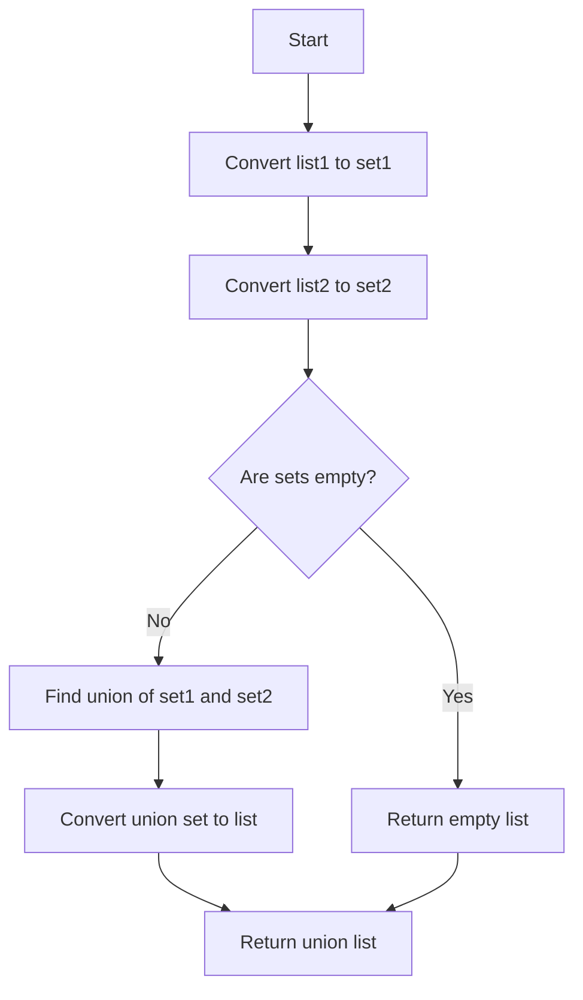

# Finding List Union

## Problem Understanding
The problem is asking to find the union of two lists, which means combining all unique elements from both lists into a single list. The key constraint here is that the resulting list should only contain unique elements, with no duplicates. This problem is non-trivial because a naive approach, such as simply concatenating the two lists, would result in duplicates if the lists have common elements. The problem requires an efficient way to eliminate these duplicates.

## Approach
The algorithm strategy used here is to leverage the built-in set data structure in Python, which automatically eliminates duplicate elements. By converting the input lists to sets, we can easily find the union of the two sets using the `union` method. This approach works because sets in Python are implemented as hash tables, allowing for efficient membership testing and union operations. The `set1.union(set2)` operation returns a new set containing all elements that are in either `set1` or `set2`. We then convert this resulting set back to a list to obtain the final union of the two input lists.

## Complexity Analysis
| Metric | Value | Detailed Reason |
|--------|-------|----------------|
| Time   | O(n + m) | The time complexity is linear because we iterate over both lists to convert them to sets, and then perform a set union operation, which also takes linear time. Here, `n` and `m` are the lengths of the input lists. |
| Space  | O(n + m) | The space complexity is also linear because we store all unique elements from both lists in the resulting set and then convert it back to a list. |

## Algorithm Walkthrough
```
Input: list1 = [1, 2, 3, 4], list2 = [3, 4, 5, 6]
Step 1: set1 = set(list1) = {1, 2, 3, 4}
Step 2: set2 = set(list2) = {3, 4, 5, 6}
Step 3: union_set = set1.union(set2) = {1, 2, 3, 4, 5, 6}
Step 4: union_list = list(union_set) = [1, 2, 3, 4, 5, 6]
Output: [1, 2, 3, 4, 5, 6]
```
This walkthrough demonstrates how the algorithm handles the example input by converting the lists to sets, finding their union, and then converting the resulting set back to a list.

## Visual Flow

This flowchart illustrates the decision flow of the algorithm, showing how it handles the conversion of lists to sets, the union operation, and the conversion back to a list, as well as the edge case where both input lists are empty.

## Key Insight
> **Tip:** The key insight here is to utilize the set data structure for efficient elimination of duplicates and union operation, allowing the algorithm to achieve a linear time complexity.

## Edge Cases
- **Empty/null input**: If both input lists are empty, the algorithm correctly returns an empty list, as demonstrated in the walkthrough.
- **Single element**: If one or both of the input lists contain only a single element, the algorithm still works correctly, converting the lists to sets and finding their union without issues.
- **Duplicate elements in both lists**: The algorithm handles this case by converting the lists to sets, which automatically eliminates duplicates, and then finding the union of these sets.

## Common Mistakes
- **Mistake 1: Not converting lists to sets**: Failing to convert the input lists to sets would result in a naive approach that does not eliminate duplicates, leading to incorrect results.
- **Mistake 2: Using list concatenation instead of set union**: Simply concatenating the two lists would result in duplicates if the lists have common elements, which is not the desired outcome.

## Interview Follow-ups
> **Interview:** These are the exact follow-up questions interviewers ask:
- "What if the input is sorted?" → The algorithm still works correctly, as the set operations are not dependent on the input being sorted.
- "Can you do it in O(1) space?" → No, because we need to store the unique elements from both lists, which requires additional space proportional to the size of the input.
- "What if there are duplicates?" → The algorithm handles duplicates correctly by converting the lists to sets, which automatically eliminates duplicates.

## Python Solution

```python
# Problem: Finding List Union
# Language: python
# Difficulty: easy
# Time Complexity: O(n + m) — iterating over both lists to find unique elements
# Space Complexity: O(n + m) — storing unique elements in a set
# Approach: Set union — using built-in set data structure to find unique elements

class Solution:
    def findUnion(self, list1, list2):
        # Edge case: both lists are empty → return empty list
        if not list1 and not list2:
            return []
        
        # Convert lists to sets to automatically eliminate duplicates
        set1 = set(list1)  # creating a set from list1
        set2 = set(list2)  # creating a set from list2
        
        # Use set union operation to find unique elements
        union_set = set1.union(set2)  # finding union of two sets
        
        # Convert the resulting set back to a list
        union_list = list(union_set)  # converting set to list
        
        return union_list

# Example usage:
solution = Solution()
list1 = [1, 2, 3, 4]
list2 = [3, 4, 5, 6]
print(solution.findUnion(list1, list2))  # Output: [1, 2, 3, 4, 5, 6]
```
