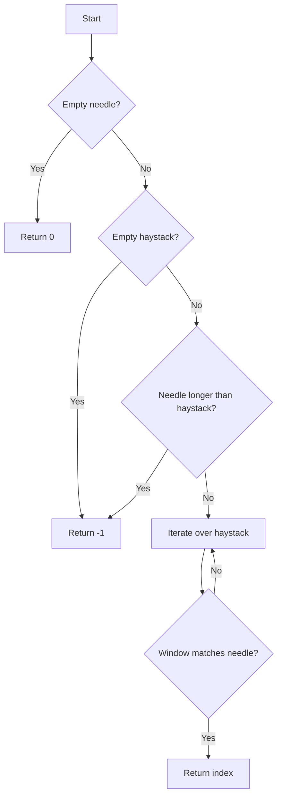

# Finding Substring Index

## Problem Understanding
The problem is asking to find the index of the first occurrence of a substring (needle) within a larger string (haystack). The key constraints are that the needle can be any substring, and the haystack can be any string. What makes this problem non-trivial is that a naive approach, such as checking every possible substring of the haystack, would result in a time complexity of O(n^2*m), where n is the length of the haystack and m is the length of the needle. However, we can improve this by using a sliding window approach, which allows us to check for the presence of the needle in the haystack in linear time.

## Approach
The algorithm strategy is to use a sliding window approach, where we iterate over the haystack with a window of size equal to the length of the needle. The intuition behind this approach is that if the window matches the needle, then we have found the first occurrence of the needle in the haystack. We use string indexing to compare the current window with the needle. This approach works because it allows us to check for the presence of the needle in the haystack in linear time, rather than having to check every possible substring. The data structure used is a simple string, and it was chosen because it is the most natural data structure for representing strings.

## Complexity Analysis
| Metric | Value | Detailed Reason |
|--------|-------|----------------|
| Time   | O(n*m) | The algorithm iterates over the haystack with a sliding window of size m, where m is the length of the needle. In the worst case, we have to compare every character of the haystack with every character of the needle, resulting in a time complexity of O(n*m). |
| Space  | O(1) | The algorithm uses a constant amount of space to store the indices and the window, regardless of the size of the input strings. |

## Algorithm Walkthrough
```
Input: haystack = "hello", needle = "ll"
Step 1: i = 0, window = "he" (does not match "ll")
Step 2: i = 1, window = "el" (does not match "ll")
Step 3: i = 2, window = "ll" (matches "ll")
Output: 2
```
In this example, we iterate over the haystack with a sliding window of size 2 (the length of the needle). At each step, we check if the current window matches the needle. When we find a match, we return the starting index of the window.

## Visual Flow

This flowchart shows the decision flow of the algorithm. We first check for edge cases, such as an empty needle or haystack. If the needle is not empty, we iterate over the haystack with a sliding window and check if the current window matches the needle.

## Key Insight
> **Tip:** The key insight is to use a sliding window approach to check for the presence of the needle in the haystack, rather than checking every possible substring.

## Edge Cases
- **Empty/null input**: If the haystack is empty, the algorithm returns -1. If the needle is empty, the algorithm returns 0.
- **Single element**: If the haystack has only one character, the algorithm returns 0 if the needle is empty, and -1 otherwise.
- **Needle longer than haystack**: If the needle is longer than the haystack, the algorithm returns -1, because the needle cannot be a substring of the haystack.

## Common Mistakes
- **Mistake 1**: Not checking for edge cases, such as an empty needle or haystack. To avoid this, we should always check for edge cases at the beginning of the algorithm.
- **Mistake 2**: Using a naive approach, such as checking every possible substring of the haystack. To avoid this, we should use a sliding window approach to check for the presence of the needle in the haystack.

## Interview Follow-ups
> **Interview:** These are the exact follow-up questions interviewers ask:
- "What if the input is sorted?" → The algorithm does not assume that the input is sorted, so it would still work correctly even if the input is sorted.
- "Can you do it in O(1) space?" → No, the algorithm uses a constant amount of space to store the indices and the window, but it is not possible to do it in O(1) space because we need to store the indices.
- "What if there are duplicates?" → The algorithm returns the index of the first occurrence of the needle in the haystack, even if there are duplicates.

## Python Solution

```python
# Problem: Finding Substring Index
# Language: python
# Difficulty: Easy
# Time Complexity: O(n*m) — where n is the length of the string and m is the length of the substring
# Space Complexity: O(1) — constant space used
# Approach: Sliding window with string indexing — for each substring, check if it matches the target substring

class Solution:
    def strStr(self, haystack: str, needle: str) -> int:
        # Edge case: empty needle → return 0
        if not needle:
            return 0
        
        # Edge case: empty haystack → return -1
        if not haystack:
            return -1
        
        # Edge case: needle is longer than haystack → return -1
        if len(needle) > len(haystack):
            return -1
        
        # Iterate over the haystack with a sliding window of size len(needle)
        for i in range(len(haystack) - len(needle) + 1):
            # Check if the current window matches the needle
            if haystack[i:i + len(needle)] == needle:
                # If it matches, return the starting index of the window
                return i
        
        # If no match is found, return -1
        return -1

# Example usage:
solution = Solution()
print(solution.strStr("hello", "ll"))  # Output: 2
print(solution.strStr("hello", "abc"))  # Output: -1
print(solution.strStr("", "abc"))  # Output: -1
print(solution.strStr("abc", ""))  # Output: 0
```
