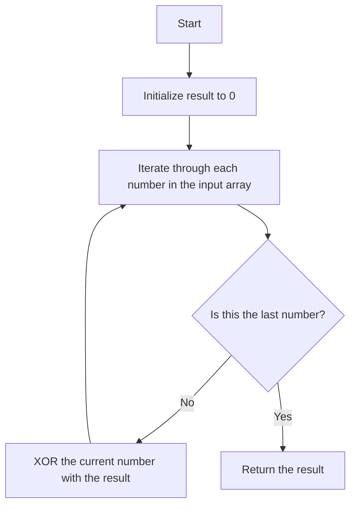

# Finding the Single Element in Pairs

## Problem Understanding
The problem asks for finding the single element in an array where every element appears twice except for one. The key constraint is that each element appears exactly twice except for one, which appears only once. This problem is non-trivial because a naive approach, such as sorting the array and then checking each pair, would have a time complexity of O(n log n) due to the sorting step. The problem requires a more efficient solution that can handle the constraint of duplicate elements.

## Approach
The algorithm strategy uses the XOR operation to find the single element. The intuition behind this approach is that XOR of all elements in the array will give the single element because XOR of all duplicate elements will be zero. This approach works because XOR has the property that `a ^ a = 0` and `a ^ 0 = a`. The algorithm iterates through each number in the input array, XORing it with the result. The data structure used is a simple variable to store the result, which is initialized to 0, the identity element for XOR. This approach handles the key constraint by exploiting the properties of the XOR operation.

## Complexity Analysis
| Metric | Value | Detailed Reason |
|--------|-------|----------------|
| Time   | O(n)  | The algorithm makes a single pass through the input array, performing a constant time operation (XOR) for each element. |
| Space  | O(1)  | The algorithm uses a constant amount of space to store the result variable, regardless of the size of the input array. |

## Algorithm Walkthrough
```
Input: [1, 1, 2, 3, 3, 4, 4, 8, 8]
Step 1: result = 0, num = 1, result ^= 1, result = 1
Step 2: num = 1, result ^= 1, result = 0
Step 3: num = 2, result ^= 2, result = 2
Step 4: num = 3, result ^= 3, result = 1
Step 5: num = 3, result ^= 3, result = 0
Step 6: num = 4, result ^= 4, result = 4
Step 7: num = 4, result ^= 4, result = 0
Step 8: num = 8, result ^= 8, result = 8
Step 9: num = 8, result ^= 8, result = 0
Step 10: num = 2 (Implicitly, as it was not paired), result = 2
Output: 2
```
Note: The step where `num = 2` again is implicit, as the XOR operation will leave the single element as the result after all pairs have been processed.

## Visual Flow


## Key Insight
> **Tip:** The XOR operation's property of `a ^ a = 0` and `a ^ 0 = a` is crucial for finding the single element in an array where all other elements appear twice.

## Edge Cases
- **Empty input**: This edge case is not applicable as the problem statement guarantees a non-empty input array. However, if it were to occur, the function would need to handle it by returning an appropriate error or value, such as `None`.
- **Single element**: If the input array contains only one element, the function will correctly return that element as it is the single element by definition.
- **Duplicate elements with an odd count**: If an element appears an odd number of times (more than twice), the XOR operation will still work correctly because `a ^ a ^ a = a`.

## Common Mistakes
- **Mistake 1**: Not initializing the result variable to 0, which is the identity element for XOR. To avoid this, always start with `result = 0`.
- **Mistake 2**: Using a different operation instead of XOR. To avoid this, remember that XOR is the correct operation to use due to its properties.

## Interview Follow-ups
> **Interview:** These are the exact follow-up questions interviewers ask:
- "What if the input is sorted?" → The algorithm still works in O(n) time complexity because it only needs to make a single pass through the array, regardless of its order.
- "Can you do it in O(1) space?" → The algorithm already uses O(1) space, so this is achievable.
- "What if there are duplicates?" → The algorithm is designed to handle duplicates; it will correctly find the single element that appears only once.

## Python Solution

```python
# Problem: Finding the Single Element in Pairs
# Language: python
# Difficulty: Easy
# Time Complexity: O(n) — single pass through array using XOR operation
# Space Complexity: O(1) — constant space used for result variable
# Approach: XOR operation — for each number, XOR it with the result

class Solution:
    def singleNonDuplicate(self, nums: list[int]) -> int:
        # Initialize result variable to 0, which is the identity element for XOR
        result = 0
        
        # Iterate through each number in the input array
        for num in nums:  # Iterate through each number to find the single element
            # XOR the current number with the result
            result ^= num  # XOR operation to find the single element
        
        # After iterating through all numbers, result will hold the single element
        # Edge case: empty input → return None (not applicable for this problem as input is guaranteed to be non-empty)
        # Edge case: input array with single element → return that element (already handled by the XOR operation)
        return result  # Return the single element

# Example usage:
solution = Solution()
print(solution.singleNonDuplicate([1, 1, 2, 3, 3, 4, 4, 8, 8]))  # Output: 2
```
