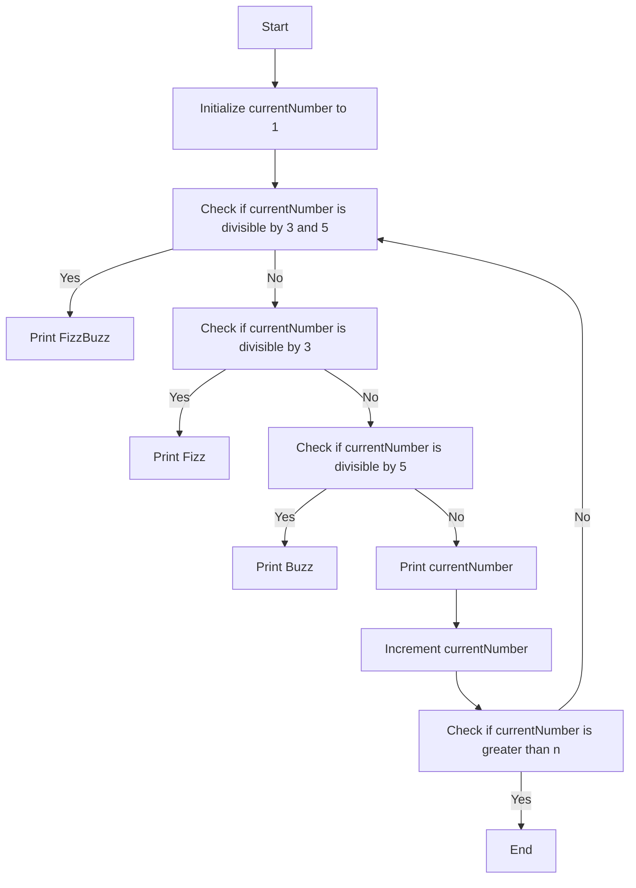

# FizzBuzz

## Problem Understanding
The FizzBuzz problem is a classic interview question that asks to print numbers from 1 to a given number `n`, replacing multiples of 3 with "Fizz", multiples of 5 with "Buzz", and multiples of both 3 and 5 with "FizzBuzz". The key constraint is to iterate over the range of numbers only once, making it a non-trivial problem because a naive approach might involve multiple passes or unnecessary complexity. The problem requires a simple yet efficient solution that handles the divisibility checks correctly.

## Approach
The algorithm strategy used here is an iterative loop that checks each number in the range from 1 to `n` for divisibility by 3 and 5. The intuition behind this approach is to take advantage of the modulo operator (`%`) to check for divisibility, which is a constant-time operation. The algorithm uses a simple if-elif-else statement to determine what to print for each number, making it efficient and easy to understand. The approach handles the key constraints by only iterating over the range once and using constant space to store the result.

## Complexity Analysis
| Metric | Value | Detailed Reason |
|--------|-------|----------------|
| Time   | O(n)  | The algorithm iterates over the range from 1 to `n` once, performing a constant amount of work for each number. The modulo operations and print statements take constant time, so the overall time complexity is linear with respect to `n`. |
| Space  | O(1)  | The algorithm uses a constant amount of space to store the loop variable `currentNumber` and does not allocate any additional memory that scales with `n`, making the space complexity constant. |

## Algorithm Walkthrough
```
Input: n = 15
Step 1: currentNumber = 1, print: 1
Step 2: currentNumber = 2, print: 2
Step 3: currentNumber = 3, print: Fizz
Step 4: currentNumber = 4, print: 4
Step 5: currentNumber = 5, print: Buzz
Step 6: currentNumber = 6, print: Fizz
Step 7: currentNumber = 7, print: 7
Step 8: currentNumber = 8, print: 8
Step 9: currentNumber = 9, print: Fizz
Step 10: currentNumber = 10, print: Buzz
Step 11: currentNumber = 11, print: 11
Step 12: currentNumber = 12, print: Fizz
Step 13: currentNumber = 13, print: 13
Step 14: currentNumber = 14, print: 14
Step 15: currentNumber = 15, print: FizzBuzz
Output: The FizzBuzz sequence up to 15
```
This walkthrough demonstrates how the algorithm iterates over the range and prints the correct output for each number.

## Visual Flow

This flowchart illustrates the decision-making process and the flow of the algorithm.

## Key Insight
> **Tip:** The key insight is to use the modulo operator (`%`) to efficiently check for divisibility by 3 and 5, allowing the algorithm to make a single pass through the range of numbers.

## Edge Cases
- **Empty/null input**: If `n` is not provided or is `None`, the algorithm will not run and will not produce any output.
- **Single element**: If `n` is 1, the algorithm will print only the number 1.
- **Negative input**: If `n` is negative, the algorithm will not run and will not produce any output, as the loop condition will not be met.

## Common Mistakes
- **Mistake 1**: Using a recursive approach, which can lead to a stack overflow for large values of `n`. To avoid this, use an iterative approach instead.
- **Mistake 2**: Using multiple loops to check for divisibility by 3 and 5 separately, which can lead to unnecessary complexity. To avoid this, use a single loop with conditional statements to check for divisibility.

## Interview Follow-ups
> **Interview:** These are the exact follow-up questions interviewers ask:
- "What if the input is sorted?" → The algorithm will still work correctly, as it only depends on the value of `n` and not the order of the input.
- "Can you do it in O(1) space?" → The algorithm already uses O(1) space, as it only stores a constant amount of data.
- "What if there are duplicates?" → The algorithm will still work correctly, as it checks each number in the range individually and does not rely on the presence or absence of duplicates.

## Python Solution

```python
# Problem: FizzBuzz
# Language: python
# Difficulty: easy
# Time Complexity: O(n) — single pass through the range of numbers
# Space Complexity: O(1) — constant space used to store the result
# Approach: iterative loop — for each number, print or add Fizz/Buzz accordingly

class Solution:
    def fizzBuzz(self, n: int) -> None:
        # Edge case: n is less than or equal to 0 → do nothing
        if n <= 0:
            return
        
        # Iterate over the range from 1 to n (inclusive)
        for currentNumber in range(1, n + 1):
            # Check if the current number is divisible by both 3 and 5
            if currentNumber % 3 == 0 and currentNumber % 5 == 0:
                print("FizzBuzz")  # Print FizzBuzz if divisible by both
            # Check if the current number is divisible by 3
            elif currentNumber % 3 == 0:
                print("Fizz")  # Print Fizz if divisible by 3
            # Check if the current number is divisible by 5
            elif currentNumber % 5 == 0:
                print("Buzz")  # Print Buzz if divisible by 5
            else:
                print(currentNumber)  # Print the number itself if not divisible by either

# Example usage:
solution = Solution()
solution.fizzBuzz(15)
```
