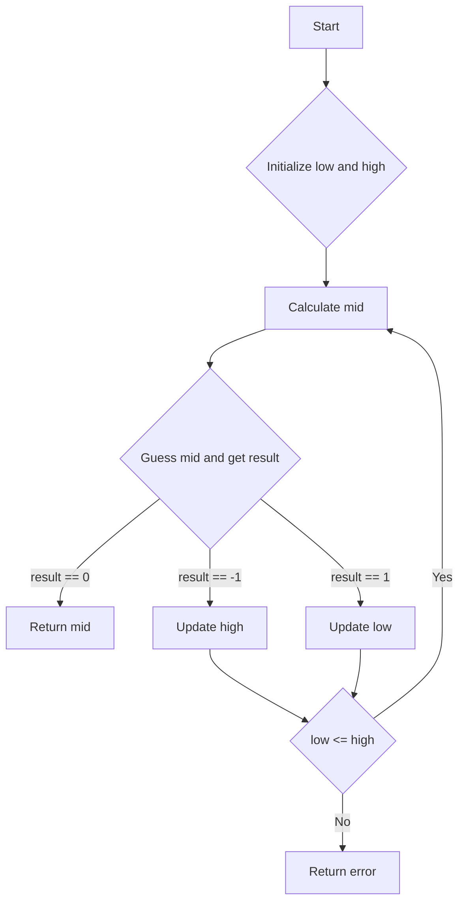

# Guess Number Higher or Lower

## Problem Understanding
The problem is asking to guess a number between 1 and n, where n is a given integer, by repeatedly guessing a number and getting feedback in the form of -1 (too low), 1 (too high), or 0 (correct). The key constraint is that we need to find the correct number in as few guesses as possible. What makes this problem non-trivial is that a naive approach, such as guessing numbers sequentially, would result in a time complexity of O(n), which is inefficient for large values of n. The problem requires a more efficient algorithm to find the correct number.

## Approach
The algorithm strategy used here is binary search, which is an efficient method for finding an item from a sorted list of items. The intuition behind this approach is to repeatedly divide the search interval in half, which reduces the number of possible locations of the target value. This approach works because the feedback provided after each guess allows us to eliminate half of the possible range. We use a simple iterative approach, maintaining two variables, low and high, which represent the current range of possible values. We calculate the midpoint of the current range and simulate a guess at this midpoint. Based on the result of the guess, we update the search range by adjusting the low and high variables. This approach handles the key constraint of minimizing the number of guesses.

## Complexity Analysis
| Metric | Value | Detailed Reason |
|--------|-------|----------------|
| Time   | O(log n) | The algorithm uses binary search to narrow down the range, which reduces the search space by half with each iteration. The number of iterations required to find the correct number is proportional to the number of times we can divide the initial range in half, which is log(n). |
| Space  | O(1) | The algorithm uses a constant amount of space, as we only need to store a few variables (low, high, and mid) to keep track of the search range. The space usage does not grow with the input size n. |

## Algorithm Walkthrough
```
Input: n = 10
Step 1: low = 1, high = 10
Step 2: mid = (1 + 10) // 2 = 5, guess(5) returns -1 (too low)
Step 3: low = mid + 1 = 6, high = 10
Step 4: mid = (6 + 10) // 2 = 8, guess(8) returns 1 (too high)
Step 5: low = 6, high = mid - 1 = 7
Step 6: mid = (6 + 7) // 2 = 6, guess(6) returns 0 (correct)
Output: 6
```
This example demonstrates how the algorithm narrows down the search range by repeatedly dividing it in half and adjusting the low and high variables based on the result of the guess.

## Visual Flow

This flowchart illustrates the decision flow of the algorithm, showing how the search range is updated based on the result of the guess.

## Key Insight
> **Tip:** The key to solving this problem efficiently is to use binary search, which reduces the search space by half with each iteration, allowing us to find the correct number in O(log n) time.

## Edge Cases
- **Empty input**: Not applicable, as the input is a positive integer n.
- **Single element**: If n = 1, the algorithm will return 1 immediately, as there is only one possible value.
- **Duplicate numbers**: Not applicable, as the problem assumes that each number is unique.

## Common Mistakes
- **Mistake 1**: Using a sequential search approach, which would result in a time complexity of O(n). To avoid this, use binary search to reduce the search space.
- **Mistake 2**: Failing to update the search range correctly based on the result of the guess. To avoid this, ensure that the low and high variables are updated correctly after each guess.

## Interview Follow-ups
> **Interview:** These are the exact follow-up questions interviewers ask:
- "What if the input is sorted?" → The algorithm still works, as binary search does not require the input to be sorted. However, if the input is already sorted, a simple iterative approach could also be used.
- "Can you do it in O(1) space?" → Yes, the algorithm already uses O(1) space, as we only need to store a few variables to keep track of the search range.
- "What if there are duplicates?" → The problem assumes that each number is unique, so duplicates are not a concern. However, if duplicates were allowed, the algorithm would need to be modified to handle this case.

## Python Solution

```python
# Problem: Guess Number Higher or Lower
# Language: python
# Difficulty: Easy
# Time Complexity: O(log n) — using binary search to narrow down the range
# Space Complexity: O(1) — using a constant amount of space
# Approach: Binary search — repeatedly divide the search interval in half

class Solution:
    def guessNumber(self, n: int) -> int:
        # Initialize the lowest and highest possible values
        low = 1  # Lowest possible number
        high = n  # Highest possible number

        # Continue searching until we find the correct number
        while low <= high:
            # Calculate the midpoint of the current range
            mid = (low + high) // 2  # Avoid overflow by using integer division

            # Simulate the guess and get the result
            result = self.__guess(mid)  # Assume this method is implemented

            # Update the search range based on the result
            if result == 0:  # The guessed number is correct
                return mid  # Return the correct number
            elif result == -1:  # The guessed number is too high
                high = mid - 1  # Update the highest possible value
            else:  # The guessed number is too low
                low = mid + 1  # Update the lowest possible value

        # Edge case: the number is not found (should not happen)
        return -1  # Return an error value


    # Simulate the guess and get the result
    def __guess(self, num: int) -> int:
        # This method is a placeholder and should be replaced with the actual implementation
        # For example, in LeetCode, this method is already implemented and available as "guess"
        pass
```
