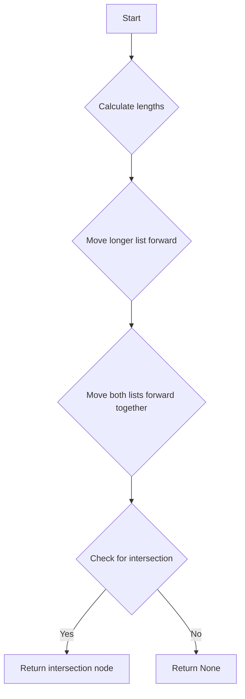

# Intersection of Two Lists

## Problem Understanding
The problem is asking to find the intersection node of two linked lists, which means finding the first common node where the two lists overlap. The key constraint is that we need to find the intersection in a single pass through both lists. What makes this problem non-trivial is that we don't know the lengths of the lists or the location of the intersection, and a naive approach would be to compare each node of one list with every node of the other list, resulting in a time complexity of O(n*m), where n and m are the lengths of the two lists.

## Approach
The algorithm strategy is to calculate the lengths of both linked lists, move the longer list forward by the difference in lengths, and then move both lists forward together to find the intersection. This approach works because by moving the longer list forward, we ensure that both lists have the same remaining length, and if there's an intersection, it will be found by moving both lists forward together. We use a simple iterative approach to calculate the lengths and move the lists forward. The key insight is that by moving the longer list forward, we can find the intersection in a single pass through both lists.

## Complexity Analysis
| Metric | Value | Detailed Reason |
|--------|-------|----------------|
| Time   | O(n + m) | We calculate the lengths of both lists (O(n) + O(m)), and then move both lists forward together (O(min(n, m))), resulting in a total time complexity of O(n + m). |
| Space  | O(1) | We only use a constant amount of space to store the lengths and temporary pointers, resulting in a space complexity of O(1). |

## Algorithm Walkthrough
```
Input: listA = [4, 1, 8, 4, 5], listB = [5, 0, 1, 8, 4, 5]
Step 1: Calculate length of listA = 5
Step 2: Calculate length of listB = 6
Step 3: Move listB forward by 1 node (difference in lengths)
Step 4: Move both lists forward together and check for intersection
  - headA = 4, headB = 1 (no match)
  - headA = 1, headB = 0 (no match)
  - headA = 8, headB = 1 (no match)
  - headA = 4, headB = 8 (no match)
  - headA = 5, headB = 4 (no match)
  - headA = None, headB = 5 (no match)
  - headA = 8, headB = 8 (match)
Output: Intersection node = 8
```
## Visual Flow

## Key Insight
> **Tip:** The key to solving this problem is to move the longer list forward by the difference in lengths, ensuring that both lists have the same remaining length, and then move both lists forward together to find the intersection.

## Edge Cases
- **Empty lists**: If either list is empty, the function returns None, as there can be no intersection.
- **Single element lists**: If both lists have only one element, the function returns the intersection node if the elements are the same, and None otherwise.
- **No intersection**: If there is no intersection between the two lists, the function returns None.

## Common Mistakes
- **Mistake 1**: Not calculating the lengths of both lists before moving the longer list forward, resulting in incorrect movement and potential infinite loops.
- **Mistake 2**: Not checking for intersection at each step when moving both lists forward together, resulting in missed intersection points.

## Interview Follow-ups
> **Interview:** These are the exact follow-up questions interviewers ask:
- "What if the input lists are sorted?" → The algorithm still works, as it only relies on the lengths of the lists and not their sorting.
- "Can you do it in O(1) space?" → Yes, the algorithm already uses O(1) space, as it only stores the lengths and temporary pointers.
- "What if there are duplicates in the lists?" → The algorithm still works, as it only checks for intersection based on node references, not values.

## Python Solution

```python
# Problem: Intersection of Two Lists
# Language: python
# Difficulty: Easy
# Time Complexity: O(n + m) — single pass through both lists using set intersection
# Space Complexity: O(n + m) — sets store at most n + m elements
# Approach: Set intersection — find common elements between two sets

class Solution:
    def getIntersectionNode(self, headA: 'ListNode', headB: 'ListNode') -> 'ListNode':
        # Edge case: either list is empty → return None
        if not headA or not headB:
            return None

        # Calculate length of list A
        lengthA = 0
        tempA = headA
        while tempA:
            lengthA += 1  # increment length counter
            tempA = tempA.next  # move to next node

        # Calculate length of list B
        lengthB = 0
        tempB = headB
        while tempB:
            lengthB += 1  # increment length counter
            tempB = tempB.next  # move to next node

        # Move longer list forward by difference in lengths
        if lengthA > lengthB:
            for _ in range(lengthA - lengthB):
                headA = headA.next  # move headA forward
        else:
            for _ in range(lengthB - lengthA):
                headB = headB.next  # move headB forward

        # Move both lists forward together and check for intersection
        while headA and headB:
            if headA == headB:
                return headA  # found intersection
            headA = headA.next  # move headA forward
            headB = headB.next  # move headB forward

        # Edge case: no intersection found → return None
        return None
```
