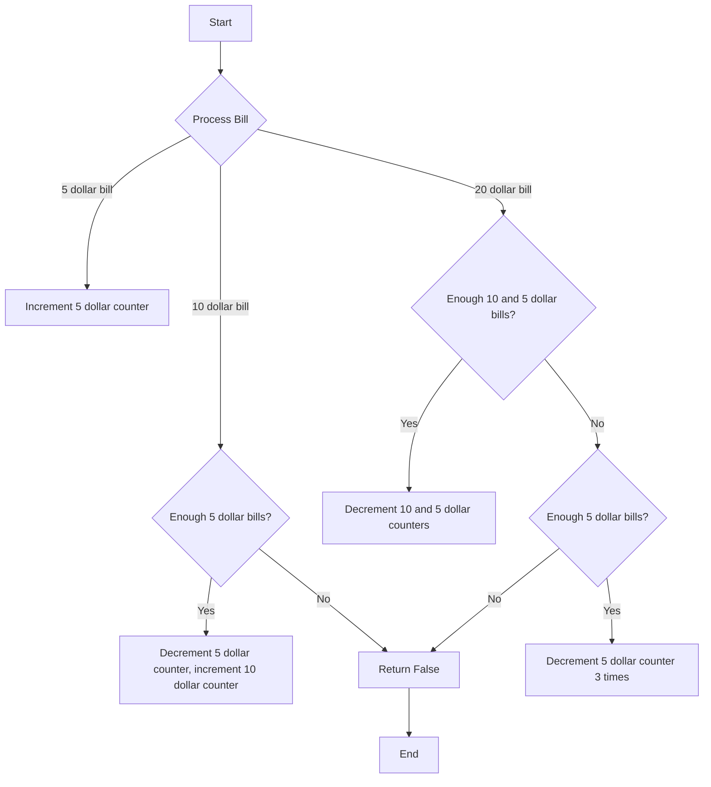

# Lemonade Change

## Problem Understanding
The problem is asking whether a lemonade stand can make change for all customers given a list of bills (5, 10, or 20 dollars) it receives. The key constraint is that the stand can only make change using the bills it has already received, and it must always be able to make change for the next customer. This problem is non-trivial because a naive approach, such as simply keeping track of the total amount of money received, would not work. The stand needs to carefully manage its bills to ensure it can always make change.

## Approach
The algorithm strategy is to use counters to track the number of 5 and 10 dollar bills received. This approach works because the stand only needs to make change for 10 and 20 dollar bills, and it can use the counters to determine whether it has enough bills to make change. The counters are used to track the number of 5 and 10 dollar bills because these are the only bills that can be used to make change for 10 and 20 dollar bills. The approach handles the key constraints by checking whether the stand has enough 5 dollar bills to make change for 10 dollar bills and whether it has enough 5 and 10 dollar bills to make change for 20 dollar bills.

## Complexity Analysis
| Metric | Value | Detailed Reason |
|--------|-------|----------------|
| Time   | O(n)  | The algorithm processes each bill in the list once, where n is the number of bills. The processing time for each bill is constant, so the total time complexity is linear. |
| Space  | O(1)  | The algorithm uses a constant amount of space to store the counters for 5 and 10 dollar bills, regardless of the size of the input list. |

## Algorithm Walkthrough
```
Input: [5, 5, 10, 20]
Step 1: five_dollar_bills = 1, ten_dollar_bills = 0 (process 5 dollar bill)
Step 2: five_dollar_bills = 2, ten_dollar_bills = 0 (process 5 dollar bill)
Step 3: five_dollar_bills = 1, ten_dollar_bills = 1 (process 10 dollar bill, make change using 1 5 dollar bill)
Step 4: five_dollar_bills = 0, ten_dollar_bills = 0 (process 20 dollar bill, make change using 1 10 dollar bill and 1 5 dollar bill)
Output: True (all transactions processed successfully)
```
This example shows how the algorithm handles a list of bills and makes change for each bill.

## Visual Flow

This flowchart shows the decision flow of the algorithm.

## Key Insight
> **Tip:** The key to solving this problem is to recognize that the stand only needs to make change for 10 and 20 dollar bills, and it can use the counters to determine whether it has enough bills to make change.

## Edge Cases
- **Empty input**: The algorithm will return True because there are no transactions to process.
- **Single 5 dollar bill**: The algorithm will return True because it can always make change for a 5 dollar bill.
- **Single 10 dollar bill**: The algorithm will return False because it cannot make change for a 10 dollar bill without a 5 dollar bill.

## Common Mistakes
- **Mistake 1**: Not checking whether there are enough 5 dollar bills to make change for a 10 dollar bill. To avoid this, add a check before decrementing the 5 dollar counter.
- **Mistake 2**: Not considering the case where there are not enough 10 and 5 dollar bills to make change for a 20 dollar bill. To avoid this, add a check for this case and decrement the 5 dollar counter 3 times.

## Interview Follow-ups
> **Interview:** These are the exact follow-up questions interviewers ask:
- "What if the input is sorted?" → The algorithm will still work correctly because it only depends on the current state of the counters, not the order of the bills.
- "Can you do it in O(1) space?" → Yes, the algorithm already uses O(1) space because it only uses a constant amount of space to store the counters.
- "What if there are duplicates?" → The algorithm will still work correctly because it only depends on the current state of the counters, not the specific bills.

## Python Solution

```python
# Problem: Lemonade Change
# Language: python
# Difficulty: Easy
# Time Complexity: O(n) — single pass through transactions
# Space Complexity: O(1) — constant space used for counters
# Approach: Counter-based transaction processing — track counts of 5 and 10 dollar bills

class Solution:
    def lemonadeChange(self, bills: list[int]) -> bool:
        # Initialize counters for 5 and 10 dollar bills
        five_dollar_bills = 0  # count of 5 dollar bills
        ten_dollar_bills = 0   # count of 10 dollar bills

        # Process each transaction (bill) in the list
        for bill in bills:
            # If the bill is 5 dollars, increment the counter
            if bill == 5:
                five_dollar_bills += 1  # increment 5 dollar bill counter
            # If the bill is 10 dollars, decrement the 5 dollar counter and increment the 10 dollar counter
            elif bill == 10:
                # Edge case: not enough 5 dollar bills to make change
                if five_dollar_bills == 0:
                    return False  # not enough 5 dollar bills
                five_dollar_bills -= 1  # decrement 5 dollar bill counter (make change)
                ten_dollar_bills += 1   # increment 10 dollar bill counter
            # If the bill is 20 dollars, make change using 5 and 10 dollar bills
            elif bill == 20:
                # Edge case: not enough 10 dollar bills and 5 dollar bills to make change
                if ten_dollar_bills > 0 and five_dollar_bills > 0:
                    ten_dollar_bills -= 1  # decrement 10 dollar bill counter (make change)
                    five_dollar_bills -= 1  # decrement 5 dollar bill counter (make change)
                # Edge case: not enough 10 dollar bills, but enough 5 dollar bills to make change
                elif five_dollar_bills >= 3:
                    five_dollar_bills -= 3  # decrement 5 dollar bill counter (make change)
                else:
                    return False  # not enough bills to make change
        # If all transactions are processed without returning False, return True
        return True  # all transactions processed successfully
```
