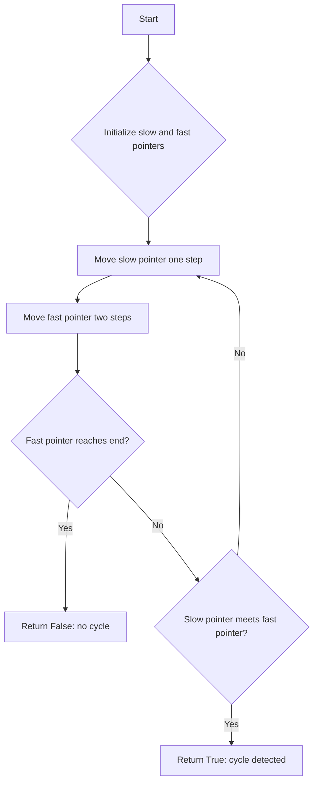

# Linked List Cycle Detection

## Problem Understanding
The problem is asking to detect whether a linked list contains a cycle, which is a loop where a node points back to a previous node. The key constraint is that we need to use a space-efficient solution, as the space complexity should be O(1). This problem is non-trivial because a naive approach, such as using a hash set to store visited nodes, would require O(n) space, where n is the number of nodes in the linked list. The problem becomes challenging when trying to find a solution that uses constant space.

## Approach
The algorithm strategy used here is Floyd's Tortoise and Hare algorithm, also known as the "slow and fast pointers" technique. The intuition behind it is that if a cycle exists, the fast pointer will eventually catch up to the slow pointer within the cycle. The slow pointer moves one step at a time, while the fast pointer moves two steps at a time. This approach works because if there is a cycle, the fast pointer will enter the cycle and then eventually meet the slow pointer, which will also be in the cycle. The data structure used is a simple linked list node class, and two pointers (slow and fast) are used to traverse the list.

## Complexity Analysis
| Metric | Value | Detailed Reason |
|--------|-------|----------------|
| Time   | O(n)  | The algorithm makes a single pass through the linked list. In the worst case, it needs to traverse the entire list, which takes O(n) time. The while loop runs until the fast pointer reaches the end of the list or meets the slow pointer, which happens in O(n) time. |
| Space  | O(1)  | The algorithm uses a constant amount of space to store the slow and fast pointers, regardless of the size of the input linked list. |

## Algorithm Walkthrough
```
Input: head = 1 -> 2 -> 3 -> 4 -> 5 -> 3 (cycle)
Step 1: slow = head (1), fast = head.next (2)
Step 2: slow = slow.next (2), fast = fast.next.next (4)
Step 3: slow = slow.next (3), fast = fast.next.next (3)
Step 4: slow = slow.next (4), fast = fast.next.next (2)
Step 5: slow = slow.next (5), fast = fast.next.next (3)
Step 6: slow = slow.next (3), fast = fast.next.next (5)
Step 7: slow = slow.next (4), fast = fast.next.next (3)
Step 8: slow = slow.next (5), fast = fast.next.next (4)
Step 9: slow = slow.next (3), fast = fast.next.next (5)
Step 10: slow = slow.next (4), fast = fast.next.next (3)
Since slow == fast, we return True, indicating a cycle.
Output: True
```
This walkthrough demonstrates the algorithm's behavior on a linked list with a cycle.

## Visual Flow

This flowchart illustrates the decision-making process and the loop structure of the algorithm.

## Key Insight
> **Tip:** The key insight here is that if there is a cycle, the fast pointer will eventually catch up to the slow pointer within the cycle, allowing us to detect the cycle using constant space.

## Edge Cases
- **Empty/null input**: If the input linked list is empty or null, the algorithm returns False, indicating no cycle. This is because an empty list cannot contain a cycle.
- **Single element**: If the input linked list contains only one element, the algorithm returns False, indicating no cycle. This is because a single-element list cannot contain a cycle.
- **Cycle at the beginning**: If the cycle starts at the beginning of the linked list (i.e., the head node points to itself), the algorithm still detects the cycle correctly.

## Common Mistakes
- **Mistake 1**: Not checking for the edge case where the input linked list is empty or null. To avoid this, we need to add a simple check at the beginning of the algorithm to return False in these cases.
- **Mistake 2**: Not moving the fast pointer two steps at a time. To avoid this, we need to make sure to update the fast pointer correctly in each iteration of the loop.

## Interview Follow-ups
> **Interview:** These are the exact follow-up questions interviewers ask:
- "What if the input is sorted?" → The algorithm still works correctly, as the sorting of the input linked list does not affect the cycle detection.
- "Can you do it in O(1) space?" → The algorithm already uses O(1) space, as it only uses a constant amount of space to store the slow and fast pointers.
- "What if there are duplicates?" → The algorithm still works correctly, as the presence of duplicate values in the linked list does not affect the cycle detection.

## Python Solution

```python
# Problem: Linked List Cycle Detection
# Language: python
# Difficulty: Easy
# Time Complexity: O(n) — single pass through the linked list
# Space Complexity: O(1) — using two pointers with constant space
# Approach: Floyd's Tortoise and Hare algorithm — two pointers moving at different speeds

class ListNode:
    def __init__(self, x):
        self.val = x
        self.next = None

class Solution:
    def hasCycle(self, head: ListNode) -> bool:
        # Edge case: empty linked list → return False
        if not head or not head.next:
            return False
        
        # Initialize two pointers: slow and fast
        slow = head  # slow pointer moves one step at a time
        fast = head.next  # fast pointer moves two steps at a time
        
        # Loop until the fast pointer reaches the end of the linked list
        while slow != fast:
            # Edge case: fast pointer reaches the end → no cycle
            if not fast or not fast.next:
                return False  # no cycle detected
            
            # Move slow pointer one step
            slow = slow.next  # move slow pointer to the next node
            
            # Move fast pointer two steps
            fast = fast.next.next  # move fast pointer two steps ahead
        
        # If the loop ends, it means a cycle is detected
        return True  # cycle detected
```
