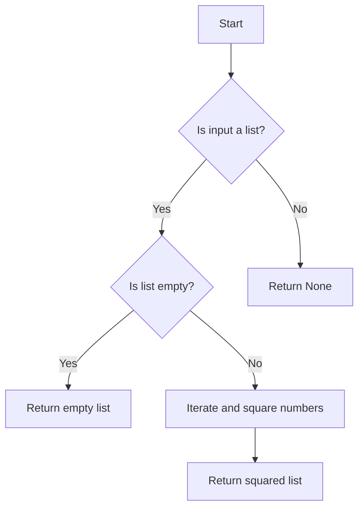

# List Comprehensions

## Problem Understanding
The problem asks to create a function that takes a list of numbers as input and returns a new list where each number is the square of the corresponding number in the input list. The key constraint is to achieve this using list comprehensions in Python. What makes this problem non-trivial is understanding how to utilize list comprehensions effectively to create a new list with transformed values while handling edge cases such as non-list inputs or empty lists. The problem requires a concise and efficient approach to squared number calculation.

## Approach
The algorithm strategy involves using list comprehension to iterate over each number in the input list and calculate its square. This approach works because list comprehensions provide a concise syntax for creating lists based on existing lists or other iterables, allowing for efficient transformation of data. The mathematical reasoning behind this is straightforward: for each number `num` in the input list, calculate `num ** 2` to get the square, and collect these results in a new list. The data structure chosen is a list, as it is the most natural fit for the problem's requirements, allowing for easy iteration and creation of a new list with transformed values. The approach handles key constraints by first checking if the input is a list and then checking for an empty list, ensuring the function behaves correctly in these edge cases.

## Complexity Analysis
| Metric | Value | Detailed Reason |
|--------|-------|----------------|
| Time   | O(n)  | The algorithm iterates over the input list once. Each iteration involves a constant-time operation (squaring a number), so the overall time complexity is linear, where n is the number of elements in the input list. |
| Space  | O(n)  | The algorithm creates a new list that can store up to n elements (where n is the number of elements in the input list), hence the space complexity is also linear. |

## Algorithm Walkthrough
```
Input: [1, 2, 3, 4, 5]
Step 1: Check if input is a list - True
Step 2: Check if list is empty - False
Step 3: Initialize an empty list to store squared values
Step 4: Iterate over input list:
    - For num = 1, calculate 1 ** 2 = 1, append to squaredList
    - For num = 2, calculate 2 ** 2 = 4, append to squaredList
    - For num = 3, calculate 3 ** 2 = 9, append to squaredList
    - For num = 4, calculate 4 ** 2 = 16, append to squaredList
    - For num = 5, calculate 5 ** 2 = 25, append to squaredList
Step 5: Return squaredList = [1, 4, 9, 16, 25]
Output: [1, 4, 9, 16, 25]
```
This walkthrough demonstrates how the algorithm processes the input list to produce the desired output.

## Visual Flow

This flowchart illustrates the decision-making process and flow of the algorithm, including how it handles different edge cases.

## Key Insight
> **Tip:** The key insight here is leveraging Python's list comprehension feature to elegantly and efficiently transform the input list into a new list with squared values, showcasing the power of concise syntax in data transformation tasks.

## Edge Cases
- **Empty/null input**: If the input list is empty, the function returns an empty list, as there are no numbers to square.
- **Single element**: If the input list contains a single element, the function returns a list with the square of that element, demonstrating the algorithm's ability to handle lists of any size.
- **Non-list input**: If the input is not a list, the function returns `None`, indicating an invalid input type and preventing potential errors.

## Common Mistakes
- **Mistake 1**: Failing to check if the input is a list before attempting to iterate over it, which can lead to a TypeError. To avoid this, always validate the input type at the beginning of the function.
- **Mistake 2**: Not handling the case where the input list is empty, which might result in unnecessary computations or errors. To avoid this, explicitly check for an empty list and return an appropriate result.

## Interview Follow-ups
> **Interview:** These are the exact follow-up questions interviewers ask:
- "What if the input is sorted?" → The algorithm's efficiency remains the same, as it only depends on the number of elements in the list, not their order.
- "Can you do it in O(1) space?" → No, because we need to store the squared values in a new list, which requires additional space proportional to the input size.
- "What if there are duplicates?" → The algorithm treats each number in the input list independently, so duplicates are squared and included in the output list just like any other number.

## Python Solution

```python
# Problem: List Comprehensions
# Language: python
# Difficulty: Easy
# Time Complexity: O(n) — single pass through input list
# Space Complexity: O(n) — output list stores at most n elements
# Approach: List comprehension — concise syntax for creating lists

class Solution:
    def listComprehension(self, inputList):
        # Check if input is a list: Edge case: input is not a list → return None
        if not isinstance(inputList, list):
            return None
        
        # Check if list is empty: Edge case: empty input list → return empty list
        if len(inputList) == 0:
            return []
        
        # Use list comprehension to create a new list with squared values
        # For each number in the input list, calculate its square
        squaredList = [num ** 2 for num in inputList]  # using list comprehension
        
        return squaredList

# Example usage:
solution = Solution()
inputList = [1, 2, 3, 4, 5]
result = solution.listComprehension(inputList)
print(result)  # Output: [1, 4, 9, 16, 25]
```
