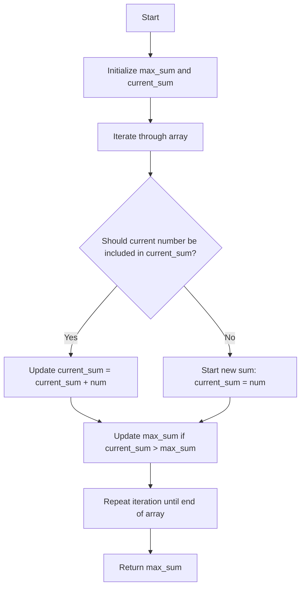

# Maximum Subarray Kadane

## Problem Understanding
The Maximum Subarray problem asks to find the maximum contiguous subarray (a subarray is a contiguous part of an array) within a one-dimensional array of numbers. The key constraint is that the subarray must be contiguous, meaning its elements are next to each other in the array. This problem is non-trivial because a naive approach, such as checking all possible subarrays, would result in a time complexity of O(n^3), which is inefficient for large inputs. The problem requires a more efficient algorithm to solve in linear time.

## Approach
The algorithm strategy used here is Kadane's algorithm, which is a dynamic programming approach. The intuition behind it is to keep track of the maximum sum ending at each position in the array. This is achieved by maintaining two variables: `max_sum` to store the maximum sum found so far, and `current_sum` to store the maximum sum ending at the current position. The algorithm iterates through the array, at each step deciding whether to include the current number in the `current_sum` or start a new sum from the current number. This approach works because it ensures that all possible subarrays are considered, and the maximum sum is updated accordingly. The data structure used is simply a few variables, making the space complexity constant.

## Complexity Analysis
| Metric | Value | Detailed Reason |
|--------|-------|----------------|
| Time   | O(n)  | The algorithm makes a single pass through the array, where n is the number of elements. Each operation inside the loop takes constant time, hence the overall time complexity is linear. |
| Space  | O(1)  | The algorithm uses a constant amount of space to store the variables `max_sum`, `current_sum`, and the loop variable, regardless of the input size. |

## Algorithm Walkthrough
```
Input: nums = [-2,1,-3,4,-1,2,1,-5,4]
Step 1: max_sum = -inf, current_sum = 0, num = -2
         current_sum = max(-2, 0 + (-2)) = -2
         max_sum = max(-inf, -2) = -2
Step 2: num = 1
         current_sum = max(1, -2 + 1) = 1
         max_sum = max(-2, 1) = 1
Step 3: num = -3
         current_sum = max(-3, 1 + (-3)) = -2
         max_sum = max(1, -2) = 1
Step 4: num = 4
         current_sum = max(4, -2 + 4) = 4
         max_sum = max(1, 4) = 4
Step 5: num = -1
         current_sum = max(-1, 4 + (-1)) = 3
         max_sum = max(4, 3) = 4
Step 6: num = 2
         current_sum = max(2, 3 + 2) = 5
         max_sum = max(4, 5) = 5
Step 7: num = 1
         current_sum = max(1, 5 + 1) = 6
         max_sum = max(5, 6) = 6
Step 8: num = -5
         current_sum = max(-5, 6 + (-5)) = 1
         max_sum = max(6, 1) = 6
Step 9: num = 4
         current_sum = max(4, 1 + 4) = 5
         max_sum = max(6, 5) = 6
Output: max_sum = 6
```

## Visual Flow


## Key Insight
> **Tip:** The key insight is to realize that the maximum sum of a subarray ending at the current position can be either the current number itself or the sum of the current number and the maximum sum of the subarray ending at the previous position.

## Edge Cases
- **Empty/null input**: If the input array is empty, the function returns 0 as per the problem definition. This is handled by the initial check `if not nums`.
- **Single element**: If the input array contains a single element, the function returns that element because the maximum sum of a single-element subarray is the element itself.
- **All negative numbers**: If the input array contains all negative numbers, the function returns the maximum of these negative numbers, which is the number closest to zero. This is because the maximum sum of a subarray in such a case is the largest single negative number.

## Common Mistakes
- **Mistake 1**: Not handling the edge case of an empty input array. To avoid this, always check for empty input at the beginning of the function and return the appropriate value.
- **Mistake 2**: Initializing `max_sum` and `current_sum` with 0 instead of negative infinity. This mistake can lead to incorrect results if all numbers in the array are negative, as the function would incorrectly return 0 instead of the maximum negative number.

## Interview Follow-ups
> **Interview:** These are the exact follow-up questions interviewers ask:
- "What if the input is sorted?" → The algorithm still works in O(n) time complexity because it iterates through the array once, regardless of the order of the elements.
- "Can you do it in O(1) space?" → The current solution already uses O(1) space, as it only uses a constant amount of space to store the variables `max_sum`, `current_sum`, and the loop variable.
- "What if there are duplicates?" → The presence of duplicates does not affect the algorithm's time or space complexity. It still iterates through the array once and uses a constant amount of space. The maximum sum of a subarray is determined based on the values of the numbers, not their uniqueness.

## Python Solution

```python
# Problem: Maximum Subarray Kadane
# Language: python
# Difficulty: Easy
# Time Complexity: O(n) — single pass through array using dynamic programming
# Space Complexity: O(1) — constant space usage for variables
# Approach: Kadane's algorithm — keep track of maximum sum ending at each position

class Solution:
    def maxSubArray(self, nums: list[int]) -> int:
        # Handle edge case: empty input → return 0 (as per LeetCode problem definition)
        if not nums:
            return 0
        
        # Initialize variables to store maximum sum and current sum
        max_sum = float('-inf')  # initialize with negative infinity
        current_sum = 0
        
        # Iterate through the array
        for num in nums:
            # Update current sum by adding the current number
            current_sum = max(num, current_sum + num)  # choose the maximum between including and excluding the current number
            
            # Update maximum sum if current sum is greater
            max_sum = max(max_sum, current_sum)
        
        # Return the maximum sum found
        return max_sum
```
