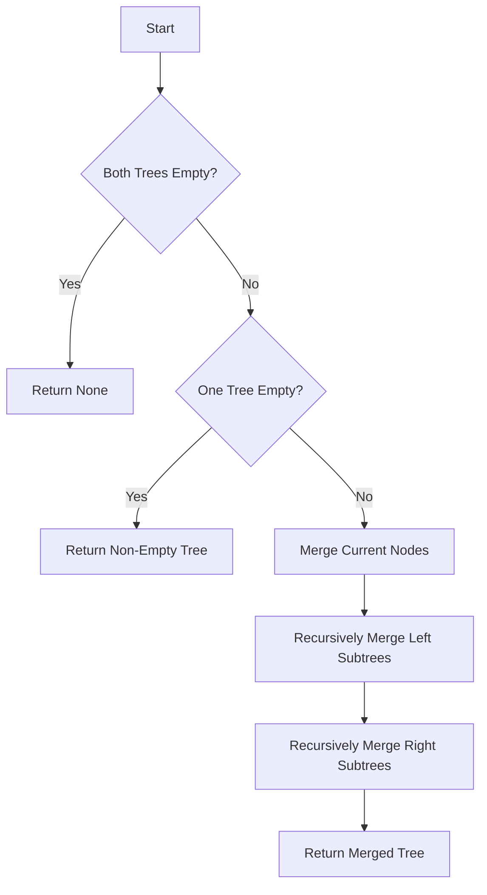

# Merge Two Binary Trees

## Problem Understanding
The problem is asking to merge two binary trees, where each node in the resulting tree is the sum of the corresponding nodes in the original trees. A key constraint is that the trees may have different structures, and some nodes may not have counterparts in the other tree. This problem is non-trivial because a naive approach of simply concatenating the trees would not work, as it would not handle the case where nodes have different parents or children. The problem requires a recursive approach to handle the merging of trees with varying structures.

## Approach
The algorithm strategy is to use recursive tree traversal, merging trees by combining corresponding nodes. This approach works because it ensures that all nodes in both trees are visited and merged correctly, even if the trees have different structures. The mathematical reasoning behind this approach is based on the definition of a binary tree, where each node has a value and two child nodes (left and right). By recursively merging the left and right subtrees, we ensure that all nodes are properly merged. The data structure used is a binary tree node, which is chosen because it naturally represents the structure of the input trees. The approach handles the key constraints by checking for empty trees and merging nodes accordingly.

## Complexity Analysis
| Metric | Value | Detailed Reason |
|--------|-------|----------------|
| Time   | O(n)  | The algorithm visits each node in both trees once, where n is the total number of nodes in both trees. This is because the recursive function calls itself for each node in the trees, resulting in a linear time complexity. |
| Space  | O(n)  | In the worst case, when the trees are completely unbalanced (i.e., each node has only one child), the recursive call stack can grow up to the height of the trees, which is n. This results in a linear space complexity. |

## Algorithm Walkthrough
```
Input: 
t1 =      1
       /   \
      3     2
     / \
    5   3

t2 =     2
       /   \
      1     3
     / \
    4   5

Step 1: Merge the roots of the two trees
  Merged Node: 3 (1 + 2)

Step 2: Recursively merge the left subtrees
  t1.left = 3, t2.left = 1
  Merged Node: 4 (3 + 1)
  t1.left.left = 5, t2.left.left = 4
  Merged Node: 9 (5 + 4)
  t1.left.right = 3, t2.left.right = 5
  Merged Node: 8 (3 + 5)

Step 3: Recursively merge the right subtrees
  t1.right = 2, t2.right = 3
  Merged Node: 5 (2 + 3)

Output: 
       3
      / \
     4   5
    / \
   9   8
```
This walkthrough shows how the algorithm merges the two input trees, node by node, to produce the resulting merged tree.

## Visual Flow

This flowchart shows the decision flow of the algorithm, including the base cases and the recursive calls.

## Key Insight
> **Tip:** The key to this solution is to recursively merge the trees, node by node, to ensure that all nodes are properly combined.

## Edge Cases
- **Empty/null input**: If both input trees are empty, the algorithm returns None. This is because there are no nodes to merge, and the resulting tree should be empty.
- **Single element**: If one of the input trees has only one node, the algorithm merges that node with the corresponding node in the other tree (if it exists). If the other tree is empty, the algorithm returns the single-node tree.
- **Unbalanced trees**: If the input trees are highly unbalanced (i.e., one tree has a much larger height than the other), the algorithm still works correctly. However, the recursive call stack may grow larger, potentially leading to a stack overflow for very large inputs.

## Common Mistakes
- **Mistake 1**: Not checking for empty trees before attempting to merge them. → To avoid this, always check for empty trees at the beginning of the function.
- **Mistake 2**: Not recursively merging the left and right subtrees. → To avoid this, make sure to call the function recursively for each subtree.

## Interview Follow-ups
> **Interview:** These are the exact follow-up questions interviewers ask:
- "What if the input is sorted?" → The algorithm still works correctly, as it only depends on the structure of the trees, not the values of the nodes.
- "Can you do it in O(1) space?" → No, the algorithm requires O(n) space in the worst case, as it needs to store the recursive call stack.
- "What if there are duplicates?" → The algorithm still works correctly, as it merges nodes based on their positions in the trees, not their values.

## Python Solution

```python
# Problem: Merge Two Binary Trees
# Language: python
# Difficulty: easy
# Time Complexity: O(n) — visiting each node in both trees once
# Space Complexity: O(n) — in the worst case, when the trees are completely unbalanced
# Approach: recursive tree traversal — merging trees by combining corresponding nodes

class TreeNode:
    def __init__(self, x):
        self.val = x
        self.left = None
        self.right = None

class Solution:
    def mergeTrees(self, t1: TreeNode, t2: TreeNode) -> TreeNode:
        # Edge case: both trees are empty → return None
        if not t1 and not t2:
            return None
        
        # Edge case: one of the trees is empty → return the non-empty tree
        if not t1:
            return t2  # t2 is not empty
        if not t2:
            return t1  # t1 is not empty
        
        # Merge the values of the current nodes
        merged_node = TreeNode(t1.val + t2.val)  # sum the values of the current nodes
        
        # Recursively merge the left and right subtrees
        merged_node.left = self.mergeTrees(t1.left, t2.left)  # merge left subtrees
        merged_node.right = self.mergeTrees(t1.right, t2.right)  # merge right subtrees
        
        return merged_node
```
