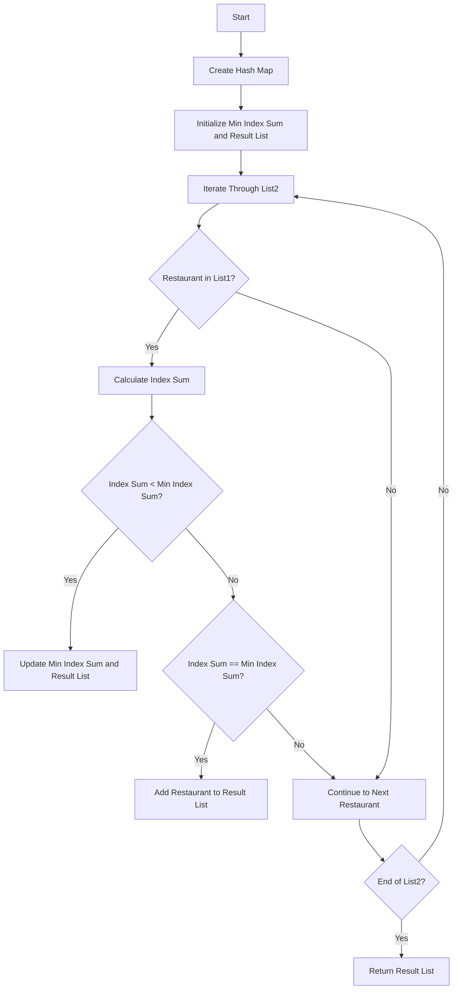

# Minimum Index Sum of Two Lists

## Problem Understanding
The problem is asking to find the minimum index sum of two lists, where the index sum is the sum of the indices of a common restaurant in both lists. The key constraint is that the lists contain restaurant names, and the goal is to find the restaurants with the minimum index sum. This problem is non-trivial because a naive approach would involve iterating through both lists and checking every pair of restaurants, resulting in a time complexity of O(n^2 * m), where n and m are the lengths of the lists.

## Approach
The algorithm strategy is to use a hash map to store the index of each restaurant in the first list, and then iterate through the second list to find the minimum index sum. The intuition behind this approach is to take advantage of the constant-time lookup in a hash map to quickly find the index of a restaurant in the first list. This approach works because it allows us to iterate through both lists only once, resulting in a time complexity of O(m + n), where m and n are the lengths of the lists. The hash map is used to store the index of each restaurant in the first list, and a result list is used to store the restaurants with the minimum index sum.

## Complexity Analysis
| Metric | Value | Detailed Reason |
|--------|-------|----------------|
| Time   | O(m + n) | The algorithm iterates through both lists once: O(m) to create the hash map and O(n) to iterate through the second list. The hash map lookup is O(1) on average. |
| Space  | O(m) | The hash map stores the index of each restaurant in the first list, resulting in a space complexity of O(m), where m is the length of the first list. |

## Algorithm Walkthrough
```
Input: list1 = ["Shogun", "Tapioca Express", "Burger King", "KFC"], list2 = ["Piatti", "The Grill at Torrey Pines", "Hungry Hunter Steakhouse", "Shogun"]
Step 1: Create a hash map to store the index of each restaurant in list1: list1_map = {"Shogun": 0, "Tapioca Express": 1, "Burger King": 2, "KFC": 3}
Step 2: Initialize the minimum index sum and the result list: min_index_sum = float('inf'), result = []
Step 3: Iterate through list2 to find the minimum index sum:
    - Iterate through list2: for index, restaurant in enumerate(list2)
    - Check if the current restaurant exists in list1: if restaurant in list1_map
    - Calculate the index sum: index_sum = index + list1_map[restaurant]
    - Update the minimum index sum and the result list if necessary: if index_sum < min_index_sum, min_index_sum = index_sum, result = [restaurant]; elif index_sum == min_index_sum, result.append(restaurant)
Output: ["Shogun"]
```

## Visual Flow


## Key Insight
> **Tip:** The key insight is to use a hash map to store the index of each restaurant in the first list, allowing for constant-time lookup and reducing the time complexity from O(n^2 * m) to O(m + n).

## Edge Cases
- **Empty List1**: If list1 is empty, the function returns an empty list because there are no restaurants to compare.
- **Empty List2**: If list2 is empty, the function returns an empty list because there are no restaurants to compare.
- **No Common Restaurants**: If there are no common restaurants between list1 and list2, the function returns an empty list because there are no restaurants to compare.

## Common Mistakes
- **Mistake 1: Not Handling Empty Lists**: Not checking if either list is empty before iterating through them can result in an error. To avoid this, add a check at the beginning of the function to return an empty list if either list is empty.
- **Mistake 2: Not Using a Hash Map**: Using a linear search to find the index of a restaurant in the first list can result in a time complexity of O(n^2 * m). To avoid this, use a hash map to store the index of each restaurant in the first list.

## Interview Follow-ups
> **Interview:** These are the exact follow-up questions interviewers ask:
- "What if the input lists are sorted?" → The algorithm still works correctly, and the time complexity remains O(m + n) because the hash map lookup is independent of the order of the lists.
- "Can you do it in O(1) space?" → No, it's not possible to solve this problem in O(1) space because we need to store the index of each restaurant in the first list, which requires O(m) space.
- "What if there are duplicates?" → The algorithm still works correctly, and the time complexity remains O(m + n) because we're using a hash map to store the index of each restaurant. If there are duplicates, we'll simply store the index of the first occurrence of each restaurant.

## Python Solution

```python
# Problem: Minimum Index Sum of Two Lists
# Language: python
# Difficulty: Easy
# Time Complexity: O(m + n) — iterating through both lists and their corresponding hash maps
# Space Complexity: O(m + n) — storing elements in hash maps
# Approach: Hash map lookup — for each element in one list, find its index in the other list

class Solution:
    def findRestaurant(self, list1: list[str], list2: list[str]) -> list[str]:
        # Edge case: either list is empty → return empty list
        if not list1 or not list2:
            return []

        # Create a hash map to store the index of each restaurant in list1
        list1_map = {restaurant: index for index, restaurant in enumerate(list1)}  # O(m)
        
        # Initialize the minimum index sum and the result list
        min_index_sum = float('inf')  # Initialize with positive infinity
        result = []

        # Iterate through list2 to find the minimum index sum
        for index, restaurant in enumerate(list2):  # O(n)
            # Check if the current restaurant exists in list1
            if restaurant in list1_map:
                # Calculate the index sum
                index_sum = index + list1_map[restaurant]
                
                # Update the minimum index sum and the result list if necessary
                if index_sum < min_index_sum:
                    min_index_sum = index_sum  # Update the minimum index sum
                    result = [restaurant]  # Reset the result list
                elif index_sum == min_index_sum:
                    result.append(restaurant)  # Add the restaurant to the result list

        return result
```
