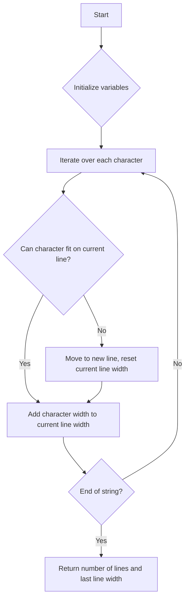

# Number of Lines To Write String

## Problem Understanding
The problem requires finding the number of lines needed to write a given string, where each character has a specific width. The constraint is that each line can have a maximum width of 100. The problem is non-trivial because a naive approach would be to simply divide the total width of the string by 100, but this would not account for the fact that characters cannot be split across lines. The key constraint is that each character must be placed on a single line, and the width of each line cannot exceed 100.

## Approach
The algorithm strategy is to use a cumulative sum approach, keeping track of the current line width as we iterate over each character in the string. We use a constant amount of space to store the number of lines and the current line width. The approach works by iterating over each character, checking if it can fit on the current line, and if not, moving to a new line. We use the `ord` function to get the width of each character from the `widths` array. The key insight is that we can use a simple iterative approach to solve this problem efficiently.

## Complexity Analysis
| Metric | Value | Detailed Reason |
|--------|-------|----------------|
| Time   | O(n)  | We iterate over each character in the string once, where n is the length of the string. The operations inside the loop are constant time, so the overall time complexity is linear. |
| Space  | O(1)  | We use a constant amount of space to store the number of lines and the current line width, regardless of the input size. |

## Algorithm Walkthrough
```
Input: widths = [10, 10, 10, 10, 10, 10, 10, 10, 10, 10, 10, 10, 10, 10, 10, 10, 10, 10, 10, 10, 10, 10, 10, 10, 10, 10], s = "abcdefghijklmnopqrstuvwxyz"
Step 1: num_lines = 1, current_width = 0
Step 2: char = 'a', char_width = 10, current_width = 10
Step 3: char = 'b', char_width = 10, current_width = 20
...
Step 26: char = 'z', char_width = 10, current_width = 100, num_lines = 2, current_width = 10 (new line)
Output: [2, 10]
```
## Visual Flow


## Key Insight
> **Tip:** The key to solving this problem is to keep track of the current line width and move to a new line when the current line is full, ensuring that each character is placed on a single line.

## Edge Cases
- **Empty/null input**: If the input string is empty, the function should return [0, 0] because no lines are needed to write an empty string.
- **Single element**: If the input string has only one character, the function should return [1, width] where width is the width of the character.
- **String with all characters having the same width**: If all characters have the same width, the function should return [number of lines, width of the last line] where the number of lines is the total width of the string divided by 100, rounded up.

## Common Mistakes
- **Mistake 1**: Not checking if the input string is empty before iterating over it. To avoid this, add a simple check at the beginning of the function to return [0, 0] if the input string is empty.
- **Mistake 2**: Not resetting the current line width when moving to a new line. To avoid this, set the current line width to the width of the character that caused the line break.

## Interview Follow-ups
> **Interview:** 
- "What if the input is sorted?" → The algorithm still works because it only depends on the width of each character and the current line width.
- "Can you do it in O(1) space?" → No, because we need to keep track of the number of lines and the current line width, which requires a constant amount of space.
- "What if there are duplicates?" → The algorithm still works because it only depends on the width of each character, not on whether the characters are duplicates or not.

## Python Solution

```python
# Problem: Number of Lines To Write String
# Language: python
# Difficulty: easy
# Time Complexity: O(n) — single pass through the widths array
# Space Complexity: O(1) — constant space used to store variables
# Approach: cumulative sum — keep track of the current line width

class Solution:
    def numberOfLines(self, widths: list[int], s: str) -> list[int]:
        # Initialize variables to keep track of the number of lines and the current line width
        num_lines = 1
        current_width = 0
        
        # Iterate over each character in the string
        for char in s:
            # Get the width of the current character
            char_width = widths[ord(char) - ord('a')]  # ord('a') is the ASCII value of 'a'
            
            # If the current character can fit on the current line, add its width to the current line width
            if current_width + char_width <= 100:  
                current_width += char_width  # add the character width to the current line width
            # Otherwise, move to a new line and reset the current line width to the width of the current character
            else:
                num_lines += 1  # increment the number of lines
                current_width = char_width  # reset the current line width to the character width
        
        # Return the number of lines and the last line width
        return [num_lines, current_width]

    # Edge case: empty input → return [0, 0]
    def numberOfLinesEdgeCase(self, widths: list[int], s: str) -> list[int]:
        if not s:  # check if the input string is empty
            return [0, 0]
        return self.numberOfLines(widths, s)

# Example usage
solution = Solution()
widths = [10, 10, 10, 10, 10, 10, 10, 10, 10, 10, 10, 10, 10, 10, 10, 10, 10, 10, 10, 10, 10, 10, 10, 10, 10, 10]
s = "abcdefghijklmnopqrstuvwxyz"
print(solution.numberOfLines(widths, s))
```
