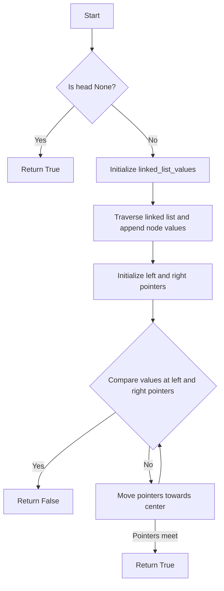

# Palindrome Linked List

## Problem Understanding
The problem asks to determine if a singly linked list is a palindrome. A palindrome is a sequence that reads the same backwards as forwards. The key constraint is that we are dealing with a linked list, which means we can only traverse the list in one direction. What makes this problem non-trivial is that we cannot directly compare the first and last elements of the list, as we can only access the next node from any given node. The naive approach of trying to compare the first and last elements directly fails because we cannot access the last element without traversing the entire list.

## Approach
The algorithm strategy used here is to convert the linked list into a Python list and then use the two-pointer technique to check if the list is a palindrome. The intuition behind this approach is that by converting the linked list into a Python list, we can access any element in the list directly, allowing us to compare the first and last elements, and then move the pointers towards the center of the list. This approach works because it allows us to take advantage of the random access capabilities of Python lists, which are not available in linked lists. The data structure used is a Python list, which is chosen because it provides efficient random access to its elements.

## Complexity Analysis
| Metric | Value | Detailed Reason |
|--------|-------|----------------|
| Time   | O(n)  | The algorithm makes two passes through the linked list: one to convert the linked list into a Python list, and another to compare the elements using the two-pointer technique. Each pass takes O(n) time, where n is the number of elements in the linked list. Therefore, the total time complexity is O(n) + O(n) = O(2n), which simplifies to O(n). |
| Space  | O(n)  | The algorithm uses a Python list to store the elements of the linked list, which requires O(n) space. The two pointers used in the algorithm require O(1) space, which is negligible compared to the space required by the Python list. Therefore, the total space complexity is O(n). |

## Algorithm Walkthrough
```
Input: 1 -> 2 -> 3 -> 2 -> 1 (a palindrome linked list)
Step 1: Initialize an empty list linked_list_values to store the linked list values.
Step 2: Traverse the linked list and append the node values to linked_list_values: [1, 2, 3, 2, 1].
Step 3: Initialize two pointers, left_pointer and right_pointer, to the start and end of linked_list_values, respectively.
Step 4: Compare the values at the left and right pointers:
    - left_pointer = 0, right_pointer = 4: linked_list_values[0] == linked_list_values[4] (1 == 1).
    - left_pointer = 1, right_pointer = 3: linked_list_values[1] == linked_list_values[3] (2 == 2).
    - left_pointer = 2, right_pointer = 2: linked_list_values[2] == linked_list_values[2] (3 == 3).
Step 5: Since all comparisons pass, return True, indicating that the linked list is a palindrome.
Output: True
```

## Visual Flow


## Key Insight
> **Tip:** The key insight is to convert the linked list into a Python list, allowing us to use the two-pointer technique to efficiently check if the list is a palindrome.

## Edge Cases
- **Empty/null input**: If the input linked list is empty (i.e., head is None), the algorithm returns True, as an empty list is considered a palindrome.
- **Single element**: If the input linked list contains only one element, the algorithm returns True, as a single-element list is considered a palindrome.
- **Palindrome with even number of elements**: If the input linked list has an even number of elements and is a palindrome (e.g., 1 -> 2 -> 2 -> 1), the algorithm returns True.

## Common Mistakes
- **Mistake 1**: Not checking for the empty input case, which can lead to a runtime error. To avoid this, always check if the head is None before proceeding with the algorithm.
- **Mistake 2**: Not initializing the pointers correctly, which can lead to incorrect results. To avoid this, make sure to initialize the left pointer to 0 and the right pointer to the last index of the list.

## Interview Follow-ups
> **Interview:** These are the exact follow-up questions interviewers ask:
- "What if the input is sorted?" → The algorithm still works correctly, as it only checks if the list is a palindrome, regardless of the order of the elements.
- "Can you do it in O(1) space?" → No, it's not possible to solve this problem in O(1) space, as we need to store the elements of the linked list in a data structure to check if it's a palindrome.
- "What if there are duplicates?" → The algorithm still works correctly, as it checks if the list is a palindrome by comparing the elements at the left and right pointers, regardless of whether there are duplicates or not.

## Python Solution

```python
# Problem: Palindrome Linked List
# Language: python
# Difficulty: Easy
# Time Complexity: O(n) — two passes through the linked list
# Space Complexity: O(n) — list stores at most n elements
# Approach: Two-pointer technique with list conversion — convert linked list to list and check for palindrome

class Solution:
    def isPalindrome(self, head: Optional[ListNode]) -> bool:
        # Edge case: empty linked list → return True
        if not head:
            return True
        
        # Initialize an empty list to store the linked list values
        linked_list_values = []
        
        # Traverse the linked list and append the node values to the list
        current_node = head  # Initialize the current node to the head of the linked list
        while current_node:  # Continue traversal until the end of the linked list
            linked_list_values.append(current_node.val)  # Append the current node value to the list
            current_node = current_node.next  # Move to the next node in the linked list
        
        # Initialize two pointers, one at the start and one at the end of the list
        left_pointer = 0  # Left pointer at the start of the list
        right_pointer = len(linked_list_values) - 1  # Right pointer at the end of the list
        
        # Compare the values at the left and right pointers
        while left_pointer < right_pointer:  # Continue comparison until the pointers meet
            if linked_list_values[left_pointer] != linked_list_values[right_pointer]:  # If the values do not match
                return False  # Return False, as the linked list is not a palindrome
            left_pointer += 1  # Move the left pointer to the right
            right_pointer -= 1  # Move the right pointer to the left
        
        # If the loop completes without returning False, the linked list is a palindrome
        return True
```
