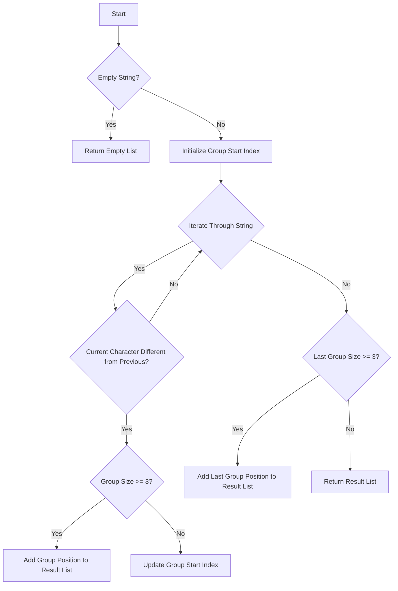

# Positions of Large Groups

## Problem Understanding
The problem is asking us to find all positions of large groups in a given string, where a large group is defined as a sequence of at least 3 identical characters. The key constraint here is that we need to identify the start and end indices of each large group. This problem is non-trivial because a naive approach might involve checking every possible substring, which would be inefficient. The problem requires us to process the string in a way that allows us to efficiently identify large groups without unnecessary comparisons.

## Approach
The algorithm strategy used here is a sliding window approach, where we track the start and end indices of each group of identical characters. This approach works because it allows us to efficiently scan the string and identify large groups in a single pass. We use a result list to store the positions of large groups, and we update this list as we iterate through the string. The key insight behind this approach is that we can identify large groups by comparing adjacent characters and tracking the size of each group. We use a group start index to keep track of the start of each group, and we update this index whenever we encounter a different character or reach the end of the string.

## Complexity Analysis
| Metric | Value | Detailed Reason |
|--------|-------|----------------|
| Time   | O(n)  | The algorithm iterates through the string once, where n is the length of the string. The operations within the loop (comparisons and updates) take constant time, so the overall time complexity is linear. |
| Space  | O(n)  | The result list stores at most n elements, where n is the length of the string. In the worst case, every character could be part of a large group, resulting in a space complexity of O(n). |

## Algorithm Walkthrough
```
Input: "abbxxxxxyy"
Step 1: Initialize result list and group start index (group_start = 0)
Step 2: Iterate through string, comparing adjacent characters
  - At i = 1, s[i] == s[i - 1], so continue
  - At i = 2, s[i] == s[i - 1], so continue
  - At i = 3, s[i] != s[i - 1], so check group size (i - group_start = 2 < 3), update group_start = 3
Step 3: Continue iterating, checking group sizes and updating group_start
  - At i = 10, s[i] != s[i - 1], so check group size (i - group_start = 7 >= 3), add [3, 9] to result list, update group_start = 10
Step 4: Handle last group if it's large enough
  - len(s) - group_start = 2 < 3, so do not add to result list
Output: [[3, 9]]
```
This walkthrough demonstrates how the algorithm identifies large groups in the input string.

## Visual Flow

This flowchart illustrates the decision flow of the algorithm, including the handling of edge cases and the identification of large groups.

## Key Insight
> **Tip:** The key insight behind this solution is to use a sliding window approach to efficiently track the start and end indices of each group of identical characters, allowing us to identify large groups in a single pass through the string.

## Edge Cases
- **Empty/null input**: If the input string is empty, the algorithm returns an empty list, as there are no large groups to identify.
- **Single element**: If the input string contains only one character, the algorithm returns an empty list, as a single character does not constitute a large group.
- **String with only large groups**: If the input string consists only of large groups (e.g., "aaaabbbbcccc"), the algorithm correctly identifies all large groups and returns their positions.

## Common Mistakes
- **Mistake 1**: Failing to handle the last group in the string, which can result in missing large groups. To avoid this, we need to explicitly check the last group after iterating through the string.
- **Mistake 2**: Incorrectly calculating the group size, which can lead to incorrect results. To avoid this, we need to carefully update the group start index and calculate the group size based on the correct indices.

## Interview Follow-ups
> **Interview:** These are the exact follow-up questions interviewers ask:
- "What if the input is sorted?" → The algorithm still works correctly, as it only relies on comparing adjacent characters, not on the overall order of the string.
- "Can you do it in O(1) space?" → No, the algorithm requires O(n) space to store the result list, as we need to store the positions of all large groups.
- "What if there are duplicates?" → The algorithm handles duplicates correctly, as it only considers groups of identical characters. If there are duplicates, they will be treated as part of the same group.

## Python Solution

```python
# Problem: Positions of Large Groups
# Language: python
# Difficulty: Easy
# Time Complexity: O(n) — single pass through string
# Space Complexity: O(n) — result list stores at most n elements
# Approach: sliding window — track the start and end indices of each group

class Solution:
    def largeGroupPositions(self, s: str):
        # Initialize result list
        result = []
        
        # Edge case: empty string → return empty list
        if not s:
            return result
        
        # Initialize group start index
        group_start = 0
        
        # Iterate through string
        for i in range(1, len(s)):
            # If current character is different from previous one or we've reached the end of string
            if s[i] != s[i - 1] or i == len(s) - 1:
                # If group size is 3 or more, add its position to result list
                if i - group_start >= 2:
                    result.append([group_start, i - 1])  # Include the last index of the group
                # Update group start index
                group_start = i
        
        # Handle the last group if it's large enough
        if len(s) - group_start >= 3:
            result.append([group_start, len(s) - 1])
        
        return result
```
