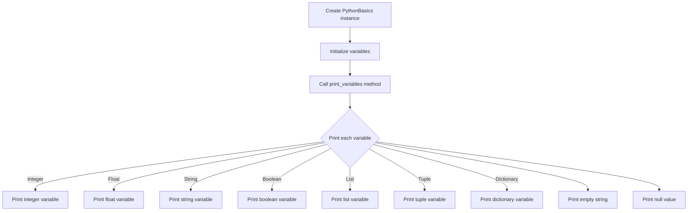

# Python Basics: Variables Types and Print

## Problem Understanding
The problem requires demonstrating the basics of Python, including variable types and print statements. The key constraints are that the solution should cover various variable types, such as integers, floats, strings, booleans, lists, tuples, and dictionaries. What makes this problem non-trivial is the need to understand the different data types in Python and how to declare and print them. The problem also involves handling edge cases, such as empty strings and null values.

## Approach
The algorithm strategy is to declare variables of different types and then print them using Python's print function. The intuition behind this approach is to demonstrate the basic syntax and data types of Python. This approach works because Python's print function can handle various data types, including strings, integers, floats, and more complex data structures like lists, tuples, and dictionaries. The data structures used are classes and methods, which are chosen to organize the code and make it reusable. The approach handles key constraints by covering all the required variable types and edge cases.

## Complexity Analysis
| Metric | Value | Detailed Reason |
|--------|-------|----------------|
| Time   | O(1)  | The time complexity is constant because the number of print statements is fixed and does not depend on the input size. The print function itself has a constant time complexity for simple data types. |
| Space  | O(1)  | The space complexity is also constant because the amount of memory used does not grow with the input size. The variables declared have a fixed size, and the print function does not allocate additional memory that scales with the input. |

## Algorithm Walkthrough
```
Input: None (example usage)
Step 1: Create an instance of the PythonBasics class
  - python_basics = PythonBasics()
Step 2: Initialize variables in the __init__ method
  - self.integer_variable = 10
  - self.float_variable = 10.5
  - self.string_variable = "Hello, World!"
  - self.boolean_variable = True
  - self.list_variable = [1, 2, 3, 4, 5]
  - self.tuple_variable = (1, 2, 3, 4, 5)
  - self.dictionary_variable = {"name": "John", "age": 30}
Step 3: Call the print_variables method
  - python_basics.print_variables()
Step 4: Print each variable
  - print("Integer variable:", self.integer_variable)
  - print("Float variable:", self.float_variable)
  - ...
Output: 
Integer variable: 10
Float variable: 10.5
String variable: Hello, World!
Boolean variable: True
List variable: [1, 2, 3, 4, 5]
Tuple variable: (1, 2, 3, 4, 5)
Dictionary variable: {'name': 'John', 'age': 30}
Empty string: 
Null value: None
```

## Visual Flow


## Key Insight
> **Tip:** The key insight is understanding that Python's print function can handle various data types, including complex structures, making it easy to demonstrate variable types and printing in Python.

## Edge Cases
- **Empty/null input**: The code handles empty strings and null values by printing them as is, demonstrating how Python represents these cases.
- **Single element**: If the list or tuple contains a single element, it will still be printed correctly, showing that Python handles these cases as expected.
- **Non-standard data types**: The code does not explicitly handle non-standard data types, but Python's print function is capable of handling most built-in types. For custom classes, the `__str__` or `__repr__` method should be implemented to provide a meaningful string representation.

## Common Mistakes
- **Mistake 1: Incorrect variable declaration**: Not using the correct syntax for variable declaration can lead to errors. To avoid this, ensure you understand Python's syntax for declaring variables of different types.
- **Mistake 2: Not handling edge cases**: Failing to consider edge cases, such as empty strings or null values, can result in unexpected behavior. Always think about how your code will handle these cases.

## Interview Follow-ups
> **Interview:** 
- "What if the input is sorted?" → This question doesn't directly apply to the problem of demonstrating variable types and print statements, but if the context were about processing input, a sorted input might allow for more efficient algorithms.
- "Can you do it in O(1) space?" → The solution already achieves O(1) space complexity because it uses a fixed amount of space to store the variables, regardless of the input.
- "What if there are duplicates?" → This question is more relevant to problems involving data processing or algorithms. In the context of variable types and printing, duplicates would simply mean printing the same value multiple times, which does not affect the basic demonstration of variable types.

## Python Solution

```python
# Problem: Python Basics: Variables Types and Print
# Language: python
# Difficulty: easy
# Time Complexity: O(1) — constant time complexity for printing variables
# Space Complexity: O(1) — constant space complexity for storing variables
# Approach: basic variable declaration and print statements — demonstrating variable types and printing in python

class PythonBasics:
    def __init__(self):
        # Declare variables of different types
        self.integer_variable = 10  # integer variable
        self.float_variable = 10.5  # float variable
        self.string_variable = "Hello, World!"  # string variable
        self.boolean_variable = True  # boolean variable
        self.list_variable = [1, 2, 3, 4, 5]  # list variable
        self.tuple_variable = (1, 2, 3, 4, 5)  # tuple variable
        self.dictionary_variable = {"name": "John", "age": 30}  # dictionary variable

    def print_variables(self):
        # Print variables
        print("Integer variable:", self.integer_variable)  # print integer variable
        print("Float variable:", self.float_variable)  # print float variable
        print("String variable:", self.string_variable)  # print string variable
        print("Boolean variable:", self.boolean_variable)  # print boolean variable
        print("List variable:", self.list_variable)  # print list variable
        print("Tuple variable:", self.tuple_variable)  # print tuple variable
        print("Dictionary variable:", self.dictionary_variable)  # print dictionary variable

        # Edge case: empty string
        empty_string = ""
        print("Empty string:", empty_string)  # print empty string
        # Edge case: null or none value
        null_value = None
        print("Null value:", null_value)  # print null value

# Example usage
if __name__ == "__main__":
    python_basics = PythonBasics()
    python_basics.print_variables()
```
