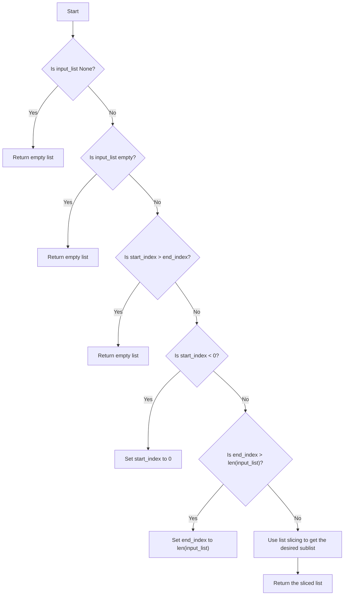

# Python List Slicing Basics

## Problem Understanding
The problem asks to implement a function in Python that slices a given list from a specified start index to an end index. The key constraints are that the function should handle edge cases such as an empty input list, a start index greater than the end index, and indices that are out of bounds. What makes this problem non-trivial is that it requires handling these edge cases while also ensuring that the function works correctly for valid inputs. The problem also requires understanding of Python's list slicing feature and how to use it to create a new list containing a subset of the original list.

## Approach
The algorithm strategy used here is to utilize Python's built-in list slicing feature, which creates a new list containing a subset of the original list. This approach works because Python's list slicing is a well-defined and efficient operation that can handle a wide range of input scenarios. The function first checks for edge cases such as an empty input list or invalid indices, and then uses list slicing to create a new list containing the desired subset of the original list. The function uses a simple and intuitive approach, making it easy to understand and implement.

## Complexity Analysis
| Metric | Value | Detailed Reason |
|--------|-------|----------------|
| Time   | O(k)  | The time complexity is O(k), where k is the number of elements in the sliced list, because creating a new list of size k takes linear time. |
| Space  | O(k)  | The space complexity is O(k), where k is the number of elements in the sliced list, because storing the sliced list of size k requires linear space. |

## Algorithm Walkthrough
```
Input: input_list = [1, 2, 3, 4, 5], start_index = 1, end_index = 4
Step 1: Check if input_list is None → input_list is not None
Step 2: Check if input_list is empty → input_list is not empty
Step 3: Check if start_index > end_index → start_index is not greater than end_index
Step 4: Check if start_index < 0 → start_index is not less than 0
Step 5: Check if end_index > len(input_list) → end_index is not greater than len(input_list)
Step 6: Use list slicing to get the desired sublist → return input_list[1:4] = [2, 3, 4]
Output: [2, 3, 4]
```

## Visual Flow


## Key Insight
> **Tip:** The key insight to this problem is to understand how to use Python's list slicing feature to create a new list containing a subset of the original list, and to handle edge cases such as invalid indices and empty input lists.

## Edge Cases
- **Empty/null input**: If the input list is empty or None, the function returns an empty list. This is because there are no elements to slice, and returning an empty list is the most intuitive and consistent behavior.
- **Single element**: If the input list has only one element, the function returns a list containing that element if the start index is 0 and the end index is 1. Otherwise, it returns an empty list.
- **Start index greater than end index**: If the start index is greater than the end index, the function returns an empty list. This is because the slice operation would result in an empty list, and returning an empty list is the most intuitive and consistent behavior.

## Common Mistakes
- **Mistake 1**: Not checking for edge cases such as an empty input list or invalid indices. This can lead to runtime errors or unexpected behavior.
- **Mistake 2**: Not using Python's list slicing feature correctly. This can lead to incorrect results or runtime errors.

## Interview Follow-ups
> **Interview:** These are the exact follow-up questions interviewers ask:
- "What if the input is sorted?" → The function still works correctly, because it uses list slicing, which is a well-defined operation that works regardless of the input order.
- "Can you do it in O(1) space?" → No, because the function creates a new list containing a subset of the original list, which requires linear space.
- "What if there are duplicates?" → The function still works correctly, because it uses list slicing, which preserves the order and duplicates of the original list.

## Python Solution

```python
# Problem: Python List Slicing Basics
# Language: python
# Difficulty: easy
# Time Complexity: O(k) — creating a new list of size k
# Space Complexity: O(k) — storing the sliced list of size k
# Approach: list slicing — using Python's built-in list slicing feature

class ListSlicing:
    def slice_list(self, input_list, start_index, end_index):
        # Check if input_list is None: return empty list
        if input_list is None:
            return []
        
        # Edge case: empty input list → return empty list
        if len(input_list) == 0:
            return []
        
        # Edge case: start_index is greater than end_index → return empty list
        if start_index > end_index:
            return []
        
        # Edge case: start_index is less than 0 → set start_index to 0
        if start_index < 0:
            start_index = 0
        
        # Edge case: end_index is greater than length of list → set end_index to length of list
        if end_index > len(input_list):
            end_index = len(input_list)
        
        # Use list slicing to get the desired sublist
        return input_list[start_index:end_index]  # return a new list containing elements from start_index to end_index-1

def main():
    list_slicing = ListSlicing()
    input_list = [1, 2, 3, 4, 5]
    start_index = 1
    end_index = 4
    print(list_slicing.slice_list(input_list, start_index, end_index))  # Output: [2, 3, 4]

if __name__ == "__main__":
    main()
```
