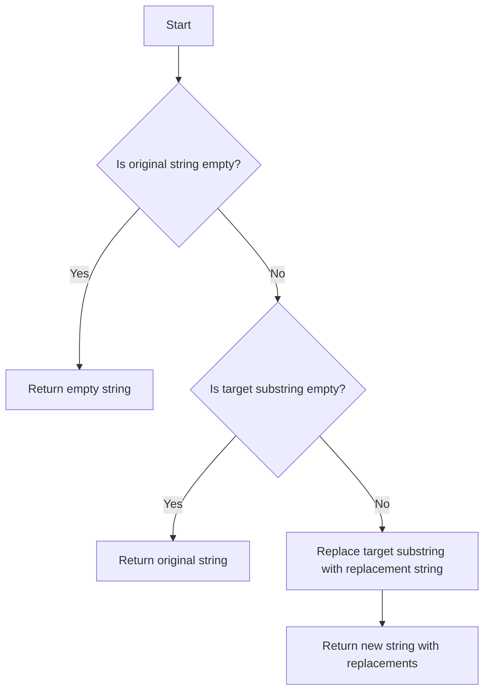

# Replacing Substrings in Python

## Problem Understanding
The problem is asking to replace all occurrences of a given target substring in an original string with a specified replacement string. The key constraint is that the replacement should be done efficiently, considering the time and space complexity. What makes this problem non-trivial is handling edge cases such as empty input strings, empty target substrings, or when the target substring is not found in the original string. A naive approach might involve manual iteration and string concatenation, which can be inefficient and prone to errors.

## Approach
The algorithm strategy used here is to leverage Python's built-in string replace method, which replaces all occurrences of a specified substring with another substring. The intuition behind this approach is that the replace method is implemented in C, making it highly efficient. This approach works because the replace method returns a new string with all occurrences replaced, leaving the original string unchanged. A new string object is created to store the result, which handles the key constraint of not modifying the original string. The chosen data structure is a string, which is suitable for this problem since we are dealing with substrings and replacements.

## Complexity Analysis
| Metric | Value | Detailed Reason |
|--------|-------|----------------|
| Time   | O(n)  | The time complexity is linear because the replace method makes a single pass through the string, where n is the length of the original string. The replacement operation itself does not depend on the size of the input. |
| Space  | O(n)  | The space complexity is also linear because a new string object is created to store the result, which in the worst case can be as large as the original string if no replacements are made. |

## Algorithm Walkthrough
```
Input: original_string = "Hello, world! Hello again!", target_substring = "Hello", replacement_string = "Hi"
Step 1: Check for edge cases - original_string is not empty, target_substring is not empty.
Step 2: Use the replace method to replace all occurrences of "Hello" with "Hi" in the original string.
Step 3: The replace method returns a new string "Hi, world! Hi again!", which is then returned as the result.
Output: "Hi, world! Hi again!"
```

## Visual Flow


## Key Insight
> **Tip:** The most important insight here is that Python's built-in string replace method is highly efficient and should be used instead of manual iteration and replacement to solve this problem.

## Edge Cases
- **Empty input string**: If the original string is empty, the function returns an empty string because there's nothing to replace.
- **Empty target substring**: If the target substring is empty, the function returns the original string unchanged, as replacing an empty string with another string does not make sense in this context.
- **Target substring not found**: If the target substring is not found in the original string, the function returns the original string unchanged, as there are no replacements to be made.

## Common Mistakes
- **Mistake 1: Not checking for edge cases**: Failing to check for empty input strings or target substrings can lead to incorrect results or errors.
- **Mistake 2: Modifying the original string**: Attempting to modify the original string in-place can lead to unexpected behavior, as strings in Python are immutable.

## Interview Follow-ups
> **Interview:** 
- "What if the input is sorted?" → This does not affect the solution since the replace method works regardless of the input's sorted status.
- "Can you do it in O(1) space?" → No, because creating a new string to store the result requires additional space proportional to the input size.
- "What if there are duplicates?" → The solution handles duplicates by replacing all occurrences of the target substring with the replacement string.

## Python Solution

```python
# Problem: Replacing Substrings in Python
# Language: python
# Difficulty: easy
# Time Complexity: O(n) — single pass through string using replace method
# Space Complexity: O(n) — new string object is created
# Approach: String replace method — replaces all occurrences of substring with replacement

class Solution:
    def replace_substring(self, original_string: str, target_substring: str, replacement_string: str) -> str:
        # Edge case: empty input → return empty string
        if not original_string:
            return ""

        # Edge case: target substring is empty → return original string
        if not target_substring:
            return original_string

        # Use the replace method to replace all occurrences of the target substring
        new_string = original_string.replace(target_substring, replacement_string)  # replace method returns a new string

        return new_string  # return the new string with replacements

    def main(self):
        # Test the function
        original_string = "Hello, world! Hello again!"
        target_substring = "Hello"
        replacement_string = "Hi"
        
        result = self.replace_substring(original_string, target_substring, replacement_string)
        print(result)  # Output: "Hi, world! Hi again!"

if __name__ == "__main__":
    solution = Solution()
    solution.main()
```
