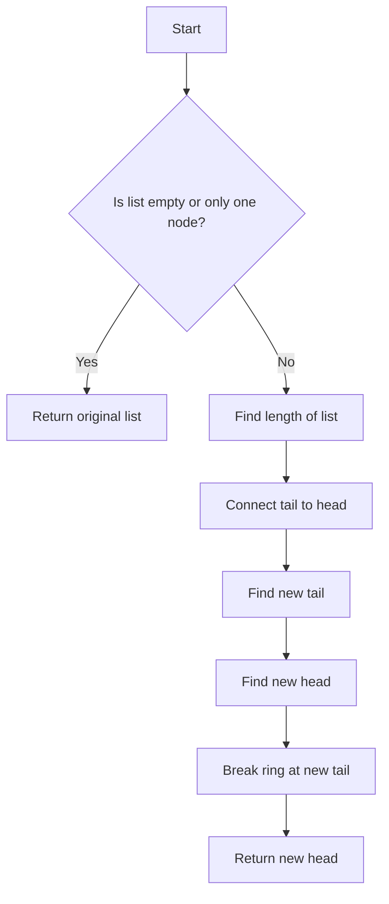

# Rotate List by K

## Problem Understanding
The problem is asking to rotate a linked list to the right by a given number of steps, k. The key constraint is that the rotation should be done in a circular manner, meaning that if k is greater than the length of the list, the rotation should wrap around to the beginning of the list. What makes this problem non-trivial is that the naive approach of simply shifting the nodes k times would result in a time complexity of O(n*k), where n is the length of the list. This is because in the worst-case scenario, k could be equal to n, resulting in a time complexity of O(n^2).

## Approach
The algorithm strategy used here is the two-pointer technique, where we connect the tail of the list to the head to form a ring, and then find the new tail and head of the rotated list. This approach works because by connecting the tail to the head, we can treat the list as a circular array, and then use the modulo operator to find the new tail and head. The data structure used is a linked list, and we use a few variables to keep track of the old tail, new tail, and new head. This approach handles the key constraint of rotating the list in a circular manner by using the modulo operator to wrap around to the beginning of the list.

## Complexity Analysis
| Metric | Value | Detailed Reason |
|--------|-------|----------------|
| Time   | O(n)  | We make two passes through the list: one to find the length, and another to rotate the list. Each pass takes O(n) time, where n is the length of the list. The total time complexity is therefore O(n) + O(n) = O(2n), which simplifies to O(n). |
| Space  | O(1)  | We use a constant amount of space to store the old tail, new tail, and new head pointers, as well as the length of the list. The space complexity is therefore O(1), which means the space usage does not grow with the size of the input. |

## Algorithm Walkthrough
```
Input: head = [1, 2, 3, 4, 5], k = 2
Step 1: Find the length of the list: n = 5
Step 2: Connect the tail to the head: old_tail.next = head
Step 3: Find the new tail: new_tail = head, move new_tail 2 steps (n - k % n - 1) = 2 steps
Step 4: Find the new head: new_head = new_tail.next
Step 5: Break the ring at the new tail: new_tail.next = None
Output: [4, 5, 1, 2, 3]
```
This example shows how the algorithm works by rotating the list [1, 2, 3, 4, 5] to the right by 2 steps.

## Visual Flow

This flowchart shows the decision flow of the algorithm, from checking if the list is empty or only one node, to finding the new head and breaking the ring.

## Key Insight
> **Tip:** The key insight is to connect the tail to the head to form a ring, allowing us to treat the list as a circular array and use the modulo operator to find the new tail and head.

## Edge Cases
- **Empty list**: If the list is empty, the algorithm returns the original list, which is None.
- **Single element**: If the list only has one element, the algorithm returns the original list, which is the same as the input.
- **k is equal to the length of the list**: If k is equal to the length of the list, the algorithm returns the original list, because rotating the list by its own length does not change the list.

## Common Mistakes
- **Mistake 1**: Not handling the case where k is greater than the length of the list. To avoid this, use the modulo operator to wrap around to the beginning of the list.
- **Mistake 2**: Not breaking the ring at the new tail. To avoid this, set new_tail.next to None after finding the new head.

## Interview Follow-ups
> **Interview:** These are the exact follow-up questions interviewers ask:
- "What if the input is sorted?" → The algorithm still works, because it only cares about the length of the list and the value of k, not the order of the elements.
- "Can you do it in O(1) space?" → Yes, the algorithm already uses O(1) space, because it only uses a constant amount of space to store the old tail, new tail, and new head pointers.
- "What if there are duplicates?" → The algorithm still works, because it only cares about the length of the list and the value of k, not the values of the elements.

## Python Solution

```python
# Problem: Rotate List by K
# Language: python
# Difficulty: Easy
# Time Complexity: O(n) — single pass through linked list to find length and then rotate
# Space Complexity: O(1) — only a few variables are used, so constant space
# Approach: Two-pointer technique — connect the tail to the head and find the new tail

class ListNode:
    def __init__(self, val=0, next=None):
        self.val = val  # initialize node value
        self.next = next  # initialize next pointer

class Solution:
    def rotateRight(self, head: ListNode, k: int) -> ListNode:
        # Edge case: empty list or only one node → return original list
        if not head or not head.next:
            return head
        
        # find the length of the linked list
        old_tail = head  # initialize old tail pointer
        n = 1  # initialize length counter
        while old_tail.next:  # traverse to the end of the list
            old_tail = old_tail.next  # move tail pointer
            n += 1  # increment length counter
        
        # connect the tail to the head to form a ring
        old_tail.next = head  # connect tail to head
        
        # find the new tail: (n - k % n - 1)th node
        new_tail = head  # initialize new tail pointer
        for i in range(n - k % n - 1):  # move new tail pointer
            new_tail = new_tail.next  # move new tail pointer
        
        # find the new head: (n - k % n)th node
        new_head = new_tail.next  # new head is next to new tail
        
        # break the ring at the new tail
        new_tail.next = None  # break the ring
        
        return new_head  # return the new head
```
