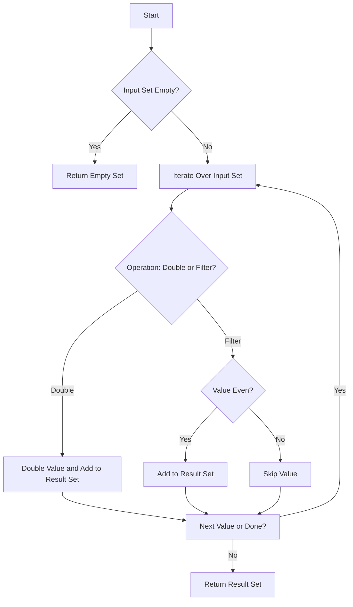

# Set Comprehensions

## Problem Understanding
The problem is asking to use set comprehensions in Python to perform two operations: doubling all values in a given set and filtering out odd values from the set. The key constraints are that the input is a set, and the output should also be a set. What makes this problem non-trivial is understanding how to apply set comprehensions, which are a concise way to create sets in Python, to achieve the desired transformations. The problem requires understanding of set operations and how to use comprehensions to efficiently perform these operations.

## Approach
The algorithm strategy used here is set comprehension, which allows for a concise and expressive way to create new sets by transforming or filtering existing sets. The intuition behind this approach is to iterate over each element in the input set, apply the desired transformation (doubling or filtering), and collect the results in a new set. This approach works because set comprehensions are designed to handle exactly this type of operation, providing a readable and efficient way to perform set transformations. The data structure used is a set, which automatically eliminates duplicates, making it ideal for this problem. The approach handles key constraints by ensuring the output is also a set and by efficiently processing the input set.

## Complexity Analysis
| Metric | Value | Detailed Reason |
|--------|-------|----------------|
| Time   | O(n)  | The algorithm iterates over the input set once for each operation (doubling and filtering), where n is the number of elements in the set. Each operation (doubling or checking if a number is even) takes constant time, so the overall time complexity is linear. |
| Space  | O(n)  | The space complexity is also linear because in the worst-case scenario (all elements are doubled or all are even), the output set can contain as many elements as the input set, requiring space proportional to the size of the input. |

## Algorithm Walkthrough
```
Input: {1, 2, 3, 4, 5}
Step 1: Initialize an empty set to store the results of doubling values.
Step 2: Iterate over each value in the input set:
  - For 1, double it to get 2 and add to the result set.
  - For 2, double it to get 4 and add to the result set.
  - For 3, double it to get 6 and add to the result set.
  - For 4, double it to get 8 and add to the result set.
  - For 5, double it to get 10 and add to the result set.
Step 3: The result set after doubling all values is {2, 4, 6, 8, 10}.
Step 4: Initialize an empty set to store the results of filtering even values.
Step 5: Iterate over each value in the input set:
  - For 1, it's odd, so skip.
  - For 2, it's even, so add to the result set.
  - For 3, it's odd, so skip.
  - For 4, it's even, so add to the result set.
  - For 5, it's odd, so skip.
Step 6: The result set after filtering even values is {2, 4}.
Output: 
- Doubling values: {2, 4, 6, 8, 10}
- Filtering even values: {2, 4}
```

## Visual Flow


## Key Insight
> **Tip:** The key to efficiently using set comprehensions is understanding how to express transformations or filters in a concise, set-based syntax, allowing for readable and efficient set operations.

## Edge Cases
- **Empty/null input**: If the input set is empty, the algorithm correctly returns an empty set for both operations because there are no elements to double or filter.
- **Single element**: If the input set contains a single element, the algorithm works as expected, doubling the value or including it in the output set if it's even.
- **Set with duplicate values**: Since sets automatically eliminate duplicates, the input set will not contain duplicates. However, if we were to consider a scenario where duplicates are present before set creation, the set comprehension would still work correctly, as it operates on the set after duplicates have been removed.

## Common Mistakes
- **Mistake 1: Not checking for empty input set**: Failing to handle the case where the input set is empty can lead to errors or unexpected behavior. To avoid this, always check for an empty input set and return an empty set in such cases.
- **Mistake 2: Incorrectly using set comprehension syntax**: Misusing the syntax for set comprehensions can lead to syntax errors or incorrect results. To avoid this, ensure that the syntax is correctly applied, with the transformation or filter condition correctly specified.

## Interview Follow-ups
> **Interview:** 
- "What if the input is sorted?" → This doesn't affect the algorithm's correctness or efficiency since set operations are not dependent on the order of elements.
- "Can you do it in O(1) space?" → No, because we need to store the results in a new set, which requires space proportional to the input size in the worst case.
- "What if there are duplicates?" → Sets automatically eliminate duplicates, so the algorithm inherently handles duplicates by working with the unique elements of the input set.

## Python Solution

```python
# Problem: Set Comprehensions
# Language: python
# Difficulty: Easy
# Time Complexity: O(n) — single pass through input set
# Space Complexity: O(n) — output set stores transformed elements
# Approach: Set comprehension — for each element, apply transformation and collect results

class SetComprehension:
    def __init__(self, input_set):
        # Initialize with input set
        self.input_set = input_set

    def double_values(self):
        # Edge case: empty input set → return empty set
        if not self.input_set:
            return set()
        
        # Use set comprehension to double each value in the input set
        return {x * 2 for x in self.input_set}  # For each x, double it and collect in a new set

    def filter_even_values(self):
        # Edge case: empty input set → return empty set
        if not self.input_set:
            return set()
        
        # Use set comprehension to filter out odd values from the input set
        return {x for x in self.input_set if x % 2 == 0}  # For each x, keep it if it's even

# Example usage:
input_set = {1, 2, 3, 4, 5}
comprehension = SetComprehension(input_set)
print(comprehension.double_values())  # Output: {2, 4, 6, 8, 10}
print(comprehension.filter_even_values())  # Output: {2, 4}
```
