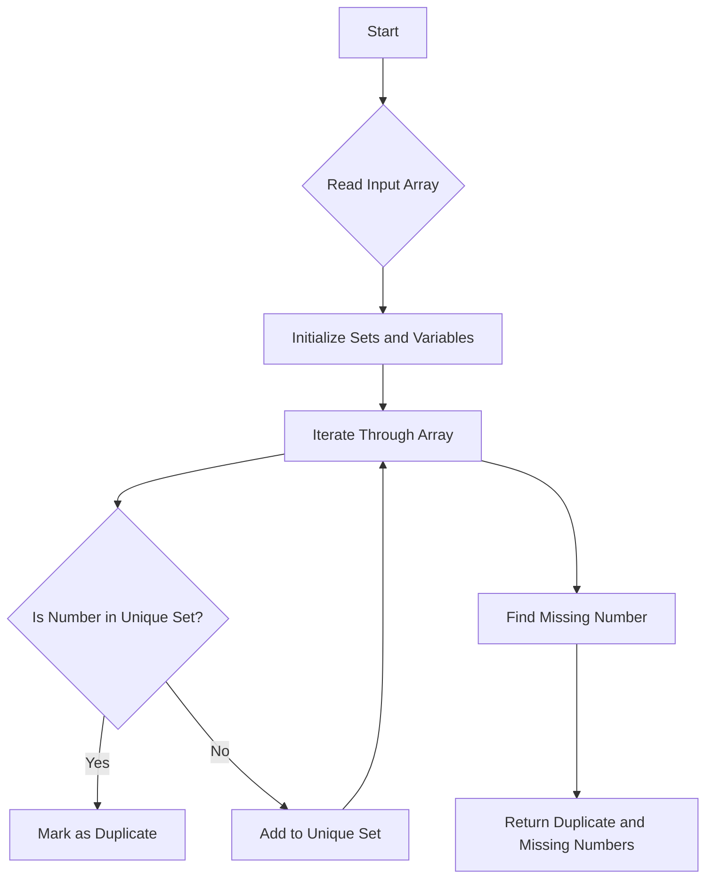

# Set Mismatch

## Problem Understanding
The Set Mismatch problem is asking to find the duplicate and missing numbers in a given array of integers. The key constraint is that the array contains integers from 1 to n, where n is the length of the array, with one duplicate and one missing number. What makes this problem non-trivial is the need to identify both the duplicate and the missing numbers in a single pass through the array, without using any additional data structures that would exceed the space complexity of O(n). The naive approach of sorting the array and then iterating through it to find the duplicate and missing numbers would not meet the space complexity requirement.

## Approach
The algorithm strategy used here is to utilize a HashSet to detect duplicates and missing numbers. The intuition behind this approach is that a HashSet in Python has an average time complexity of O(1) for add and lookup operations, making it efficient for detecting duplicates. By iterating through the array and adding each number to the HashSet, we can identify the duplicate number when we encounter a number that is already in the set. To find the missing number, we create a full set of numbers from 1 to n and then take the difference between this full set and the unique numbers found in the array. This approach works because the HashSet allows us to keep track of unique numbers we've seen so far, and the full set provides a reference for what numbers should be present.

## Complexity Analysis
| Metric | Value | Detailed Reason |
|--------|-------|----------------|
| Time   | O(n)  | The algorithm iterates through the array once, performing constant time operations (HashSet add and lookup) for each element. The set difference operation also takes linear time in the size of the sets involved, which in this case is n. Thus, the overall time complexity is linear. |
| Space  | O(n)  | The algorithm uses a HashSet to store unique numbers and a set to represent the full range of numbers. In the worst case, both of these sets could contain n elements, hence the space complexity is O(n). |

## Algorithm Walkthrough
```
Input: [1, 2, 2, 4]
Step 1: Initialize unique_nums = set(), duplicate_num = -1, missing_num = -1, full_set = {1, 2, 3, 4}
Step 2: Iterate through the array, for num = 1: if num not in unique_nums, add it. unique_nums = {1}
Step 3: For num = 2: if num not in unique_nums, add it. unique_nums = {1, 2}
Step 4: For num = 2 (again): since num is in unique_nums, duplicate_num = 2. unique_nums remains {1, 2}
Step 5: For num = 4: if num not in unique_nums, add it. unique_nums = {1, 2, 4}
Step 6: Find missing number by taking the difference between full_set and unique_nums: missing_nums = {3}
Step 7: Since missing_nums has one element, missing_num = 3
Output: [2, 3]
```

## Visual Flow


## Key Insight
> **Tip:** Utilizing a HashSet for detecting duplicates and a set difference for finding the missing number allows for an efficient solution that meets both time and space complexity requirements.

## Edge Cases
- **Empty/null input**: If the input array is empty or null, the function returns [-1, -1] as there are no numbers to process.
- **Single element**: If the array contains only one element, and assuming the problem constraints still apply (i.e., the array should contain numbers from 1 to n), this would imply that the single element is both the duplicate and the missing number cannot be determined in the conventional sense, as the problem statement implies the presence of at least two numbers (one duplicate, one missing).
- **Array with all unique numbers except for one duplicate**: In this scenario, the algorithm correctly identifies the duplicate number and finds the missing number by comparing the set of unique numbers found in the array against the full set of numbers from 1 to n.

## Common Mistakes
- **Mistake 1**: Not checking for the edge case of an empty input array, which would cause the function to fail or return incorrect results.
- **Mistake 2**: Incorrectly assuming that the missing number must be the smallest or largest number in the range, rather than using the set difference to find it.

## Interview Follow-ups
> **Interview:** These are the exact follow-up questions interviewers ask:
- "What if the input is sorted?" → The algorithm would still work correctly, as it relies on the properties of HashSets and set operations, not on the order of the input.
- "Can you do it in O(1) space?" → No, because we need to store at least the unique numbers found in the array and the full set of numbers from 1 to n, which requires O(n) space.
- "What if there are duplicates of the duplicate number?" → The problem statement implies there is only one duplicate number. If there could be more than one duplicate, the problem would need to be clarified, and the solution might involve counting occurrences of each number rather than just detecting duplicates.

## Python Solution

```python
# Problem: Set Mismatch
# Language: python
# Difficulty: Easy
# Time Complexity: O(n) — single pass through array
# Space Complexity: O(n) — HashSet stores at most n elements
# Approach: HashSet duplicate detection — for each number, check if it exists in the set

class Solution:
    def findErrorNums(self, nums: list[int]) -> list[int]:
        # Initialize a set to store unique numbers
        unique_nums = set()
        
        # Initialize variables to store the duplicate and missing numbers
        duplicate_num = -1
        missing_num = -1
        
        # Initialize a set to store the numbers from 1 to n
        full_set = set(range(1, len(nums) + 1))
        
        # Iterate through the list of numbers
        for num in nums:
            # If the number is already in the set, it's a duplicate
            if num in unique_nums:
                duplicate_num = num  # Found the duplicate number
            else:
                unique_nums.add(num)  # Add the number to the set
        
        # Find the missing number by taking the difference between the full set and the unique numbers
        missing_nums = full_set - unique_nums
        # Since there's only one missing number, we can take the first element of the set
        missing_num = missing_nums.pop()  # Found the missing number
        
        # Edge case: empty input → return [-1, -1]
        if not nums:
            return [-1, -1]
        
        # Return the duplicate and missing numbers
        return [duplicate_num, missing_num]
```
