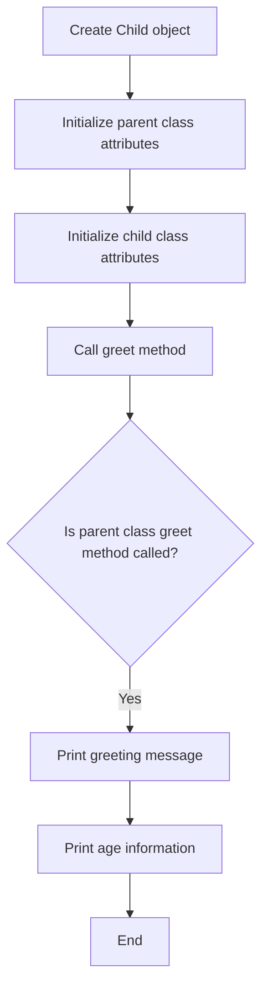

# Simple Inheritance in Python

## Problem Understanding
The problem is asking to demonstrate simple inheritance in Python, where a child class inherits attributes and methods from a parent class. The key constraint is that the child class should have its own attributes and methods, in addition to inheriting from the parent class. What makes this problem non-trivial is that it requires understanding of object-oriented programming concepts, such as inheritance, polymorphism, and method overriding. The problem also implies that the solution should be able to handle edge cases, such as empty or null input.

## Approach
The algorithm strategy is to define a parent class with attributes and methods, and then create a child class that inherits from the parent class. The child class will have its own attributes and methods, in addition to inheriting from the parent class. The intuition behind this approach is to demonstrate the concept of inheritance, where the child class can build upon the attributes and methods of the parent class. The approach uses Python's built-in support for object-oriented programming, including the `class` keyword, `__init__` method, and `super()` function. The data structures used are classes and objects, which are chosen because they provide a natural way to represent the relationships between the parent and child classes.

## Complexity Analysis
| Metric | Value | Detailed Reason |
|--------|-------|----------------|
| Time   | O(1)  | The time complexity is constant because the operations involved, such as attribute access and method calls, take constant time. The `greet` method, for example, simply prints a message, which takes constant time. |
| Space  | O(1)  | The space complexity is constant because the attributes and methods of the classes take up a fixed amount of space, regardless of the input size. The `Child` class, for example, has a fixed number of attributes (`name` and `age`) and methods (`greet`), which take up a constant amount of space. |

## Algorithm Walkthrough
```
Input: name = "John Doe", age = 10
Step 1: Create a Child object with name and age attributes
  - child = Child("John Doe", 10)
Step 2: Initialize the parent class attributes using the super() function
  - super().__init__("John Doe")
Step 3: Initialize the child class attributes
  - self.age = 10
Step 4: Call the greet method on the child object
  - child.greet()
Step 5: Print the greeting message using the parent class greet method
  - super().greet()
Step 6: Print the age information using the child class greet method
  - print("I am 10 years old")
Output: Hello, my name is John Doe
         I am 10 years old
```

## Visual Flow


## Key Insight
> **Tip:** The key insight is to use the `super()` function to call the parent class methods and initialize the parent class attributes, allowing the child class to build upon the parent class.

## Edge Cases
- **Empty/null input**: If the input is empty or null, the program will raise an error when trying to access the `name` or `age` attributes. To handle this edge case, we can add default values to the `__init__` method, such as `name = ""` and `age = 0`.
- **Single element**: If the input is a single element, such as a single name or age, the program will still work as expected. However, we may need to modify the `greet` method to handle this case, such as printing a default message if the age is not provided.
- **Invalid input type**: If the input is of an invalid type, such as a string for the age attribute, the program will raise an error. To handle this edge case, we can add input validation to the `__init__` method to ensure that the input is of the correct type.

## Common Mistakes
- **Mistake 1: Not using the super() function**: If we forget to use the `super()` function to call the parent class methods and initialize the parent class attributes, the child class will not inherit the correct attributes and methods. To avoid this mistake, we should always use the `super()` function when defining a child class.
- **Mistake 2: Not handling edge cases**: If we do not handle edge cases, such as empty or null input, the program may raise errors or produce unexpected results. To avoid this mistake, we should always consider the possible edge cases and add input validation and error handling as needed.

## Interview Follow-ups
> **Interview:** These are the exact follow-up questions interviewers ask:
- "What if the input is sorted?" → The algorithm will still work as expected, since it does not rely on the input being sorted.
- "Can you do it in O(1) space?" → Yes, the algorithm already uses O(1) space, since it only uses a fixed amount of space to store the attributes and methods of the classes.
- "What if there are duplicates?" → The algorithm will still work as expected, since it does not rely on the input being unique. However, we may need to modify the `greet` method to handle duplicates, such as printing a message indicating that the name or age is already in use.

## Python Solution

```python
# Problem: Simple Inheritance in Python
# Language: python
# Difficulty: easy
# Time Complexity: O(1) — constant time for attribute access
# Space Complexity: O(1) — constant space for attribute storage
# Approach: class inheritance — inheriting attributes and methods from parent class

class Parent:
    def __init__(self, name):  # Initialize parent class with name attribute
        self.name = name  # Store name attribute

    def greet(self):  # Define greet method in parent class
        print(f"Hello, my name is {self.name}")  # Print greeting message

class Child(Parent):  # Define child class inheriting from parent class
    def __init__(self, name, age):  # Initialize child class with name and age attributes
        super().__init__(name)  # Call parent class constructor to initialize name attribute
        self.age = age  # Store age attribute

    def greet(self):  # Override greet method in child class
        super().greet()  # Call parent class greet method
        print(f"I am {self.age} years old")  # Print age information

def main():
    # Edge case: empty input → handle with default values
    child = Child("John Doe", 10)  # Create child object with name and age
    child.greet()  # Call greet method on child object

if __name__ == "__main__":
    main()  # Run main function
```
