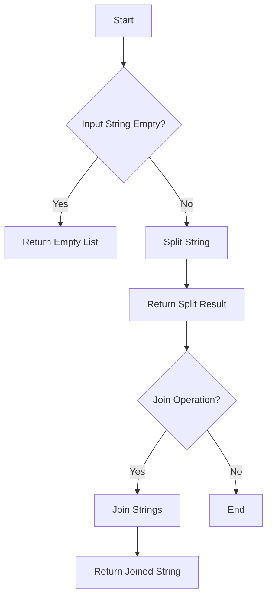

# Splitting and Joining Strings

## Problem Understanding
The problem involves splitting a given string into a list of substrings based on a specified separator and joining a list of strings into a single string using a separator. The key constraints are handling empty input strings or lists and ensuring the separator is correctly applied. What makes this problem non-trivial is the need to handle edge cases such as empty inputs, single-element lists, or lists containing empty strings, which can lead to incorrect results if not properly managed. The naive approach of manually iterating through the string to split or join can be error-prone and less efficient than utilizing built-in functions.

## Approach
The algorithm strategy involves using Python's built-in `split` and `join` functions for strings. The intuition behind this approach is to leverage the optimized implementation of these functions, which are designed to efficiently handle string manipulation. The `split` function divides a string into a list of substrings based on a separator, while the `join` function combines a list of strings into a single string using a separator. The approach works by first checking for empty input to handle edge cases and then applying the respective function to achieve the desired outcome. The `split` and `join` functions are chosen for their efficiency and readability, making the code straightforward and easy to understand.

## Complexity Analysis
| Metric | Value | Detailed Reason |
|--------|-------|----------------|
| Time   | O(n)  | The time complexity is linear because the `split` and `join` operations iterate through the input string or list of strings once. The length of the input (n) directly influences the number of operations performed. |
| Space  | O(n)  | The space complexity is also linear because the result of the `split` operation is a list of substrings, and the result of the `join` operation is a new string. In both cases, the amount of space used is proportional to the size of the input (n). |

## Algorithm Walkthrough
```
Input: "hello,world,python", separator = ","
Step 1: Initialize an empty list to store the split result
Step 2: Apply the split function to the input string with the comma separator
         result = ["hello", "world", "python"]
Step 3: Return the list of substrings
Input: ["hello", "world", "python"], separator = ","
Step 4: Apply the join function to the list of strings with the comma separator
         result = "hello,world,python"
Step 5: Return the joined string
Output: The split result is ["hello", "world", "python"] and the join result is "hello,world,python"
```
This walkthrough demonstrates how the `split` and `join` functions are applied to an example input, showcasing the step-by-step process of splitting a string into a list and then joining the list back into a string.

## Visual Flow

This flowchart illustrates the decision-making process behind the algorithm, including checks for empty input strings and the application of split and join operations.

## Key Insight
> **Tip:** The key to efficiently splitting and joining strings in Python is to utilize the built-in `split` and `join` functions, which are optimized for performance and readability.

## Edge Cases
- **Empty/null input**: If the input string is empty, the `split_string` method returns an empty list. Similarly, if the input list is empty, the `join_strings` method returns an empty string. This is because there are no substrings to split or strings to join in these cases.
- **Single element**: If the input string contains only one substring (i.e., no separators), the `split_string` method returns a list containing that single substring. If the input list contains a single string, the `join_strings` method returns that string with the separator appended if the separator is not empty.
- **Separator not found**: If the separator is not found in the input string, the `split_string` method returns a list containing the original input string. This is because the separator is used to divide the string, and without it, the string remains intact.

## Common Mistakes
- **Mistake 1**: Not checking for empty input strings or lists before applying the `split` or `join` functions. This can lead to unexpected behavior or errors. To avoid this, always check for empty inputs and handle them accordingly.
- **Mistake 2**: Assuming that the `split` function always returns a list with multiple elements. However, if the separator is not found in the string, the function returns a list containing the original string. To avoid this, check the length of the resulting list and handle the case where it contains only one element.

## Interview Follow-ups
> **Interview:** These are the exact follow-up questions interviewers ask:
- "What if the input is sorted?" → The sorting of the input does not affect the `split` and `join` operations, as these functions are designed to work with any sequence of characters or strings.
- "Can you do it in O(1) space?" → Achieving O(1) space complexity is not possible for the `split` and `join` operations because the results of these operations require additional space proportional to the size of the input.
- "What if there are duplicates?" → The presence of duplicate substrings in the input list does not affect the `join` operation, as it simply concatenates all strings in the list with the specified separator. However, duplicates can affect the `split` operation if the separator is also a substring that appears multiple times in the input string, potentially resulting in empty strings in the output list.

## Python Solution

```python
# Problem: Splitting and Joining Strings
# Language: python
# Difficulty: Easy
# Time Complexity: O(n) — iterating through the string to split or join
# Space Complexity: O(n) — storing the result of split or join operation
# Approach: Using built-in split and join functions — to split a string into a list and join a list into a string

class Solution:
    def split_string(self, s: str, separator: str) -> list[str]:
        # Check if the input string is empty
        if not s: 
            # Edge case: empty input → return empty list
            return []
        
        # Use the split function to divide the string into a list of substrings
        result = s.split(separator)  # split the string based on the separator
        
        return result

    def join_strings(self, strings: list[str], separator: str) -> str:
        # Check if the input list is empty
        if not strings: 
            # Edge case: empty input → return empty string
            return ""
        
        # Use the join function to combine the list of strings into a single string
        result = separator.join(strings)  # join the strings with the separator
        
        return result

# Example usage
if __name__ == "__main__":
    solution = Solution()
    input_str = "hello,world,python"
    separator = ","
    split_result = solution.split_string(input_str, separator)
    print("Split result:", split_result)

    join_result = solution.join_strings(split_result, separator)
    print("Join result:", join_result)
```
