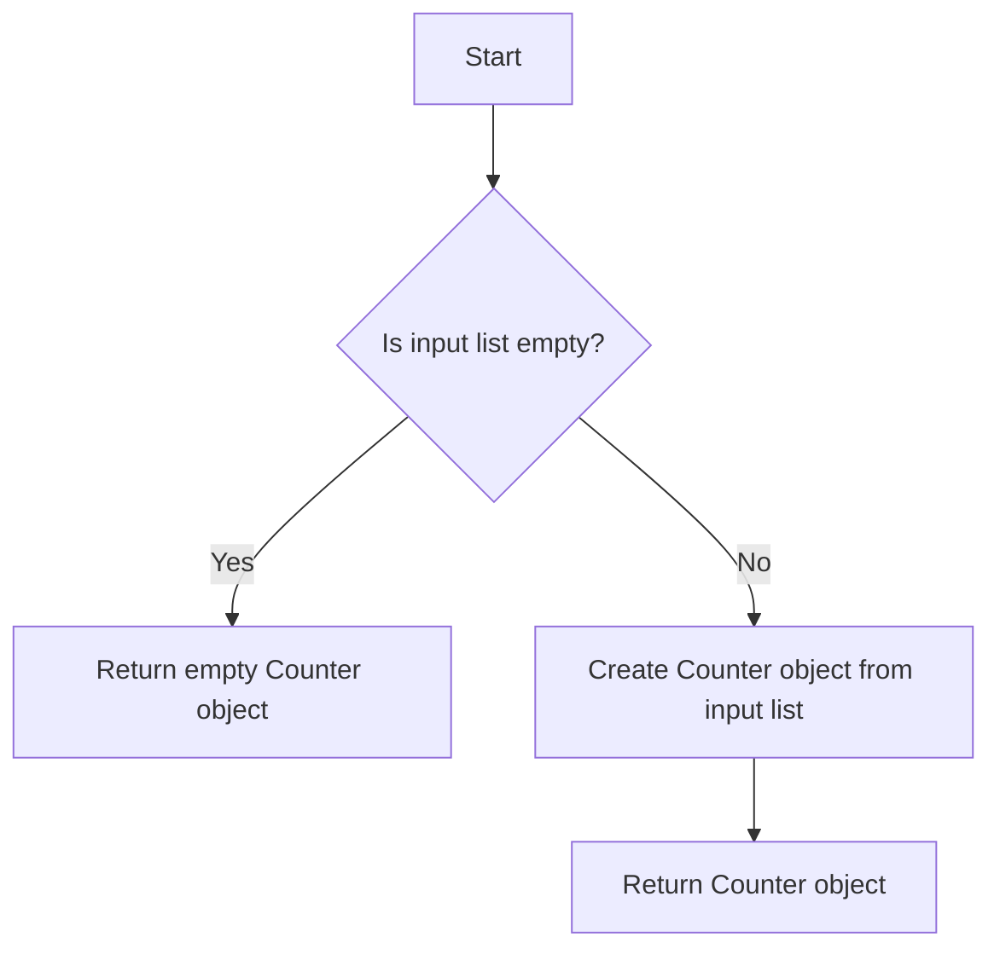

# Using collections.Counter

## Problem Understanding
The problem asks us to utilize the `collections.Counter` class in Python to count the occurrences of each element in a given list. The key constraint is that the input list can be empty or contain duplicate elements, and we need to handle these edge cases appropriately. What makes this problem non-trivial is that a naive approach might involve using a dictionary to manually count the elements, which can be error-prone and less efficient than using the optimized `Counter` class.

## Approach
The algorithm strategy is to create a `Counter` object from the input list, which automatically counts the occurrences of each element. The intuition behind this approach is that the `Counter` class is a dictionary subclass designed specifically for counting hashable objects, making it a perfect fit for this problem. We use the `Counter` object to store the counts of each element, and then return this object as the result. The approach handles the key constraints by checking for an empty input list and returning an empty `Counter` object in that case.

## Complexity Analysis
| Metric | Value | Detailed Reason |
|--------|-------|----------------|
| Time   | O(n)  | We make a single pass through the input list to count the elements, where n is the length of the list. The `Counter` object creation operation has a linear time complexity. |
| Space  | O(n)  | In the worst-case scenario, the `Counter` object stores at most n elements, where n is the length of the input list. This occurs when all elements in the list are unique. |

## Algorithm Walkthrough
```
Input: [1, 2, 2, 3, 3, 3, 4, 4, 4, 4]
Step 1: Create an empty Counter object
Step 2: Iterate through the input list and update the Counter object:
    - 1: Counter({1: 1})
    - 2: Counter({1: 1, 2: 1})
    - 2: Counter({1: 1, 2: 2})
    - 3: Counter({1: 1, 2: 2, 3: 1})
    - 3: Counter({1: 1, 2: 2, 3: 2})
    - 3: Counter({1: 1, 2: 2, 3: 3})
    - 4: Counter({1: 1, 2: 2, 3: 3, 4: 1})
    - 4: Counter({1: 1, 2: 2, 3: 3, 4: 2})
    - 4: Counter({1: 1, 2: 2, 3: 3, 4: 3})
    - 4: Counter({1: 1, 2: 2, 3: 3, 4: 4})
Step 3: Return the Counter object
Output: Counter({4: 4, 3: 3, 2: 2, 1: 1})
```

## Visual Flow


## Key Insight
> **Tip:** The `collections.Counter` class is a powerful tool for counting hashable objects, providing an efficient and Pythonic way to solve this problem.

## Edge Cases
- **Empty/null input**: If the input list is empty, the function returns an empty `Counter` object, which is the expected behavior.
- **Single element**: If the input list contains only one element, the function returns a `Counter` object with a single key-value pair, where the key is the element and the value is 1.
- **Duplicate elements**: If the input list contains duplicate elements, the function correctly counts the occurrences of each element and returns a `Counter` object with the updated counts.

## Common Mistakes
- **Mistake 1**: Not checking for an empty input list, which can lead to a `None` or incorrect result. → To avoid this, add a simple check at the beginning of the function to return an empty `Counter` object if the input list is empty.
- **Mistake 2**: Not using the `Counter` object correctly, which can lead to incorrect counts or a `TypeError`. → To avoid this, make sure to create the `Counter` object from the input list using the `Counter()` constructor, and then return the resulting object.

## Interview Follow-ups
> **Interview:** These are the exact follow-up questions interviewers ask:
- "What if the input is sorted?" → The `Counter` object creation operation has a linear time complexity, regardless of whether the input is sorted or not.
- "Can you do it in O(1) space?" → No, because we need to store the counts of each element, which requires at least O(n) space in the worst-case scenario.
- "What if there are duplicates?" → The `Counter` object correctly handles duplicates by incrementing the count for each occurrence of an element.

## Python Solution

```python
# Problem: Using collections.Counter
# Language: python
# Difficulty: easy
# Time Complexity: O(n) — single pass through the list to count elements
# Space Complexity: O(n) — Counter object stores at most n elements
# Approach: collections.Counter — a dictionary subclass for counting hashable objects

from collections import Counter

def count_elements(lst):
    # Edge case: empty input → return empty Counter object
    if not lst:
        return Counter()
    
    # Create a Counter object to count the occurrences of each element
    counter = Counter(lst)  # Count elements in the list
    
    # Return the Counter object
    return counter

# Example usage:
numbers = [1, 2, 2, 3, 3, 3, 4, 4, 4, 4]
result = count_elements(numbers)
print(result)  # Output: Counter({4: 4, 3: 3, 2: 2, 1: 1})

# Edge case: single-element input
single_element = [5]
result = count_elements(single_element)
print(result)  # Output: Counter({5: 1})

# Edge case: empty input
empty_input = []
result = count_elements(empty_input)
print(result)  # Output: Counter()
```
